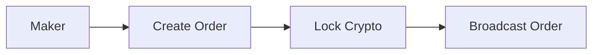
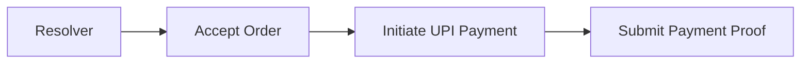
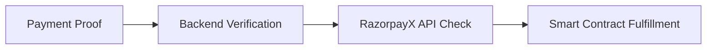

# 🚀 Crypto-to-UPI Payment Protocol

**A decentralized protocol enabling seamless crypto-to-UPI payments with automated order fulfillment and dispute resolution.**

## 📋 Table of Contents

- [Overview](#-overview)
- [How It Works](#-how-it-works)
- [Architecture](#-architecture)
- [Features](#-features)
- [Quick Start](#-quick-start)
- [Installation](#-installation)
- [Configuration](#-configuration)
- [API Documentation](#-api-documentation)
- [Smart Contracts](#-smart-contracts)
- [Development](#-development)
- [Testing](#-testing)
- [Deployment](#-deployment)
- [Troubleshooting](#-troubleshooting)
- [Contributing](#-contributing)

## 🌟 Overview

This protocol bridges the gap between cryptocurrency and traditional Indian payment systems (UPI) by creating a trustless, automated system where:

- **Makers** create orders to send crypto and receive UPI payments
- **Resolvers** accept orders and facilitate UPI transfers
- **Smart contracts** ensure trustless execution and dispute resolution

### 🎯 Use Cases

- **Crypto-to-Fiat Conversion**: Convert cryptocurrency to Indian Rupees via UPI
- **P2P Payments**: Direct peer-to-peer crypto-to-UPI transfers
- **Cross-Border Remittances**: Send crypto globally, receive UPI locally
- **DeFi Integration**: Enable UPI payments for DeFi protocols

## 🔄 How It Works

### 1. **Order Creation (Maker)**


### 2. **Order Acceptance (Resolver)**


### 3. **Order Fulfillment (Automated)**


## 🏗️ Architecture

### System Components

```
┌─────────────────┐    ┌─────────────────┐    ┌─────────────────┐
│   Frontend      │    │   Backend       │    │ Smart Contracts │
│  (Next.js)      │◄──►│  (Express.js)   │◄──►│   (Solidity)    │
└─────────────────┘    └─────────────────┘    └─────────────────┘
                              │
                              ▼
                       ┌─────────────────┐
                       │   Resolver Bot  │
                       │   (Node.js)     │
                       └─────────────────┘
                              │
                              ▼
                       ┌─────────────────┐
                       │  RazorpayX API  │
                       │ (Payment Gateway)│
                       └─────────────────┘
```

### 🛠️ Technology Stack

- **Blockchain**: Base Mainnet (Chain ID: 8453)
- **Smart Contracts**: Solidity with Foundry
- **Backend**: Node.js + Express.js
- **Frontend**: Next.js + React + TypeScript
- **Database**: MongoDB
- **Payment Gateway**: RazorpayX API
- **Development**: Foundry, Viem, Ethers.js

## ✨ Features

### 🔒 **Security Features**
- ✅ Trustless smart contract execution
- ✅ Multi-signature resolver registry
- ✅ Automated payment verification
- ✅ Dispute resolution mechanism
- ✅ Time-based order expiration

### 💰 **Payment Features**
- ✅ Real-time UPI payment processing
- ✅ Automated proof verification
- ✅ Multi-currency support (USDC, ETH)
- ✅ Dynamic pricing with Dutch auctions
- ✅ Gas-optimized transactions

### 🚀 **Developer Features**
- ✅ RESTful API endpoints
- ✅ WebSocket real-time updates
- ✅ Comprehensive test suite
- ✅ Docker containerization
- ✅ CI/CD pipeline ready

## 🚀 Quick Start

### Prerequisites
- Node.js v18+
- MongoDB
- Foundry
- RazorpayX account

### 1. Clone Repository
```bash
git clone https://github.com/yug49/NewDelhiTest.git
cd NewDelhiTest
```

### 2. Install Dependencies
```bash
# Install smart contract dependencies
forge install

# Install backend dependencies
cd backend && npm install

# Install frontend dependencies
cd ../frontend && npm install

# Install resolver bot dependencies
cd ../resolver-bot && npm install
```

### 3. Environment Setup
```bash
# Copy environment templates
cp backend/.env.example backend/.env
cp frontend/.env.example frontend/.env
cp resolver-bot/.env.example resolver-bot/.env
```

### 4. Configure Environment Variables
See [Configuration](#-configuration) section for detailed setup.

### 5. Deploy Smart Contracts
```bash
forge script script/DeployOrderProtocol.s.sol --rpc-url $WORLD_RPC_URL --private-key $PRIVATE_KEY --broadcast
```

### 6. Start Services
```bash
# Terminal 1: Backend
cd backend && npm start

# Terminal 2: Frontend
cd frontend && npm run dev

# Terminal 3: Resolver Bot
cd resolver-bot && npm start
```

## ⚙️ Configuration

### Backend Configuration (`.env`)
```env
# Server Configuration
PORT=5001
NODE_ENV=development

# Database
MONGODB_URI=mongodb://localhost:27017/order-protocol

# Blockchain
RELAYER_PRIVATE_KEY=your_relayer_private_key
CONTRACT_ADDRESS=0xC3dd62f9EE406b43A2f463b3a59BEcDC1579933b
WORLD_RPC_URL=https://worldchain-sepolia.g.alchemy.com/v2/your_key

# RazorpayX API
RAZORPAYX_KEY_ID=rzp_test_your_key_id
RAZORPAYX_KEY_SECRET=your_secret_key
```

### Frontend Configuration (`.env.local`)
```env
# API Configuration
NEXT_PUBLIC_API_URL=http://localhost:5001
NEXT_PUBLIC_CONTRACT_ADDRESS=0xC3dd62f9EE406b43A2f463b3a59BEcDC1579933b
NEXT_PUBLIC_WORLD_RPC_URL=https://worldchain-sepolia.g.alchemy.com/v2/your_key
```

### Resolver Bot Configuration (`.env`)
```env
# Resolver Configuration
PRIVATE_KEY=your_resolver_private_key
RPC_URL=https://worldchain-sepolia.g.alchemy.com/v2/your_key
CONTRACT_ADDRESS=0xC3dd62f9EE406b43A2f463b3a59BEcDC1579933b
BACKEND_URL=http://localhost:5001

# Payment Configuration
RAZORPAYX_KEY_ID=rzp_test_your_key_id
RAZORPAYX_KEY_SECRET=your_secret_key

# Callback Server
RESOLVER_CALLBACK_PORT=3002
```

## 📚 API Documentation

### Order Management

#### Create Order
```http
POST /api/orders
Content-Type: application/json

{
  "makerToken": "0x...",
  "amount": "1000000000000000000",
  "targetPrice": "7500000",
  "upiId": "user@paytm",
  "duration": 3600
}
```

#### Get Orders
```http
GET /api/orders
GET /api/orders/:orderId
```

#### Accept Order
```http
POST /api/orders/:orderId/accept
Content-Type: application/json

{
  "resolverAddress": "0x...",
  "acceptedPrice": "1000000000000000000"
}
```

#### Submit Payment Proof
```http
POST /api/orders/:orderId/fulfill
Content-Type: application/json

{
  "transactionId": "pout_RKh1zwbPL0pq9a"
}
```

### Resolver Management

#### Register Resolver Callback
```http
POST /api/orders/resolver/register
Content-Type: application/json

{
  "resolverAddress": "0x...",
  "callbackUrl": "http://localhost:3002/callback/order-accepted"
}
```

## 📝 Smart Contracts

### Core Contracts

#### OrderProtocol.sol
- **Purpose**: Main protocol contract handling order lifecycle
- **Address**: `0xC3dd62f9EE406b43A2f463b3a59BEcDC1579933b`
- **Key Functions**:
  - `createOrder()`: Create new payment order
  - `acceptOrder()`: Accept order (relayer only)
  - `fullfillOrder()`: Complete order with payment proof
  - `getOrder()`: Retrieve order details

#### MakerRegistry.sol
- **Purpose**: Manage maker registrations and permissions
- **Key Functions**:
  - `registerMaker()`: Register new maker
  - `updateMakerStatus()`: Update maker status

#### ResolverRegistry.sol
- **Purpose**: Manage resolver registrations and reputation
- **Key Functions**:
  - `registerResolver()`: Register new resolver
  - `updateResolverReputation()`: Update resolver reputation

### Contract Interaction Examples

```solidity
// Create order
function createOrder(
    address _makerToken,
    uint256 _amount,
    uint256 _targetPrice,
    string memory _upiId,
    uint256 _duration
) external;

// Accept order (relayer only)
function acceptOrder(
    bytes32 _orderId,
    address _resolver,
    uint256 _acceptedPrice
) external relayerOnly;

// Fulfill order (relayer only)
function fullfillOrder(
    bytes32 _orderId,
    string memory _proof
) external relayerOnly;
```

## 🛠️ Development

### Project Structure
```
├── backend/                 # Express.js API server
│   ├── routes/             # API route handlers
│   ├── models/             # Database models
│   └── server.js           # Main server file
├── frontend/               # Next.js frontend
│   ├── src/app/           # App router pages
│   ├── src/components/    # React components
│   └── src/lib/           # Utility libraries
├── resolver-bot/          # Automated resolver bot
│   └── index.js           # Main bot logic
├── src/                   # Smart contracts
│   ├── OrderProtocol.sol  # Main protocol contract
│   ├── MakerRegistry.sol  # Maker management
│   └── ResolverRegistry.sol # Resolver management
├── script/                # Deployment scripts
├── test/                  # Contract tests
└── lib/                   # External libraries
```

### Smart Contract Development

#### Build Contracts
```bash
forge build
```

#### Run Tests
```bash
forge test
forge test --match-contract OrderProtocolTest
forge test --match-test test_CreateOrder
```

#### Deploy Contracts
```bash
forge script script/DeployOrderProtocol.s.sol \
  --rpc-url $WORLD_RPC_URL \
  --private-key $PRIVATE_KEY \
  --broadcast \
  --verify
```

#### Contract Verification
```bash
forge verify-contract \
  --chain-id 8453 \
  --compiler-version v0.8.19 \
  $CONTRACT_ADDRESS \
  src/OrderProtocol.sol:OrderProtocol \
  --etherscan-api-key $ETHERSCAN_API_KEY
```

## 🧪 Testing

### Smart Contract Tests
```bash
# Run all tests
forge test

# Run specific test file
forge test --match-contract OrderProtocolTest

# Run with gas reporting
forge test --gas-report

# Run with coverage
forge coverage
```

### Backend Tests
```bash
cd backend
npm test
```

### Frontend Tests
```bash
cd frontend
npm test
```

### Integration Tests
```bash
# Test complete payment flow
node test-real-payout.js

# Test contract interactions
node test-contract-call.js

# Test proof submission
node test-proof-submission.js
```

## 🚀 Deployment

### Production Deployment

#### 1. Smart Contracts (Mainnet)
```bash
# Deploy to mainnet
forge script script/DeployOrderProtocol.s.sol \
  --rpc-url $MAINNET_RPC_URL \
  --private-key $DEPLOYER_PRIVATE_KEY \
  --broadcast \
  --verify
```

#### 2. Backend (AWS/GCP/Digital Ocean)
```bash
# Build Docker image
docker build -t order-protocol-backend ./backend

# Deploy with Docker Compose
docker-compose up -d
```

#### 3. Frontend (Vercel/Netlify)
```bash
# Build for production
cd frontend
npm run build

# Deploy to Vercel
vercel --prod
```

### Environment Variables (Production)
- Update all `.env` files with production values
- Use environment-specific RPC URLs
- Configure production database URLs
- Set up monitoring and logging

## 🔧 Troubleshooting

### Common Issues

#### 1. Callback Registration Failed
```bash
# Check resolver bot logs
cd resolver-bot && npm start

# Verify backend is running
curl http://localhost:5001/health
```

#### 2. Contract Transaction Reverted
```bash
# Check contract state
cast call $CONTRACT_ADDRESS "getOrder(bytes32)" $ORDER_ID --rpc-url $WORLD_RPC_URL

# Verify account permissions
cast call $CONTRACT_ADDRESS "i_relayerAddress()" --rpc-url $WORLD_RPC_URL
```

#### 3. Payment Verification Failed
```bash
# Test RazorpayX API
curl -u $RAZORPAYX_KEY_ID:$RAZORPAYX_KEY_SECRET \
  https://api.razorpay.com/v1/payouts/$PAYOUT_ID
```

### Debug Mode
```bash
# Enable verbose logging
export DEBUG=true
export LOG_LEVEL=debug
```

## 🤝 Contributing

### Development Workflow
1. Fork the repository
2. Create feature branch (`git checkout -b feature/amazing-feature`)
3. Commit changes (`git commit -m 'Add amazing feature'`)
4. Push to branch (`git push origin feature/amazing-feature`)
5. Open Pull Request

### Code Standards
- Follow Solidity style guide for smart contracts
- Use ESLint/Prettier for JavaScript/TypeScript
- Write comprehensive tests for new features
- Update documentation for API changes

### Testing Requirements
- All smart contract functions must have unit tests
- API endpoints must have integration tests
- Minimum 80% code coverage required

## 📄 License

This project is licensed under the MIT License - see the [LICENSE](LICENSE) file for details.

## 🆘 Support

- **Documentation**: [Full Documentation](https://docs.your-domain.com)
- **Discord**: [Join our community](https://discord.gg/your-server)
- **Issues**: [GitHub Issues](https://github.com/yug49/NewDelhiTest/issues)
- **Email**: support@your-domain.com

## 🙏 Acknowledgments

- **Worldchain** - For providing the blockchain infrastructure
- **RazorpayX** - For payment gateway integration
- **Foundry** - For smart contract development toolkit
- **EthGlobal** - For hackathon inspiration and support

---

**Built with ❤️ for the future of decentralized payments**
