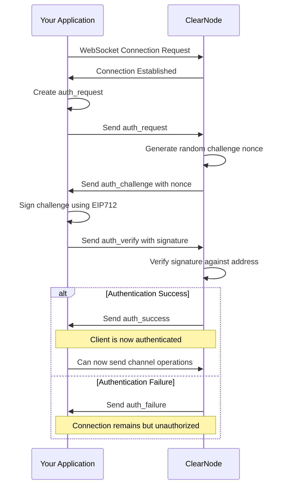
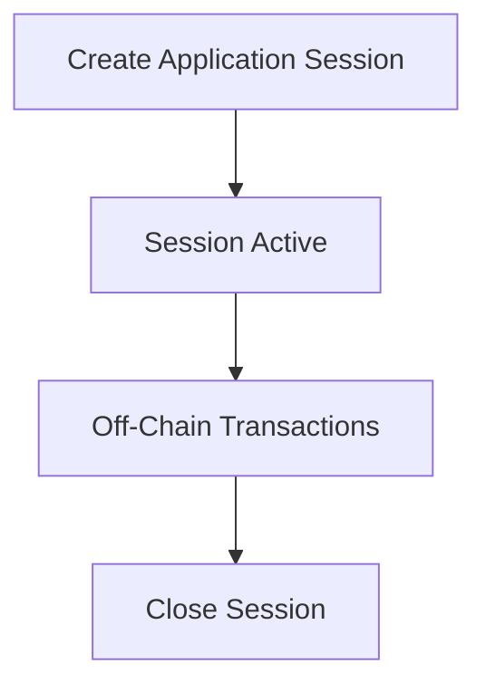
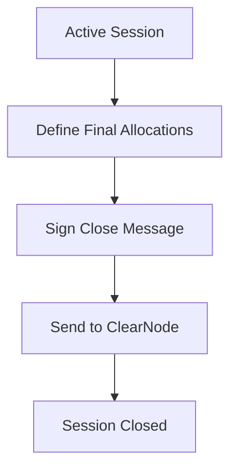
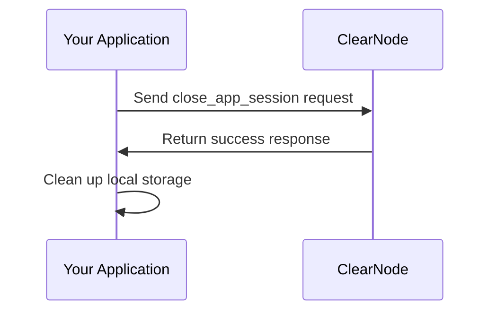
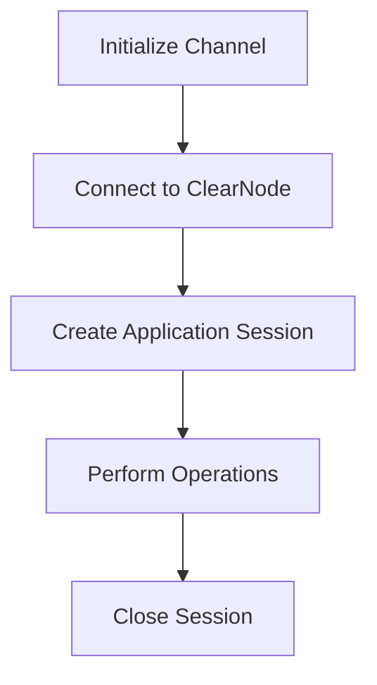
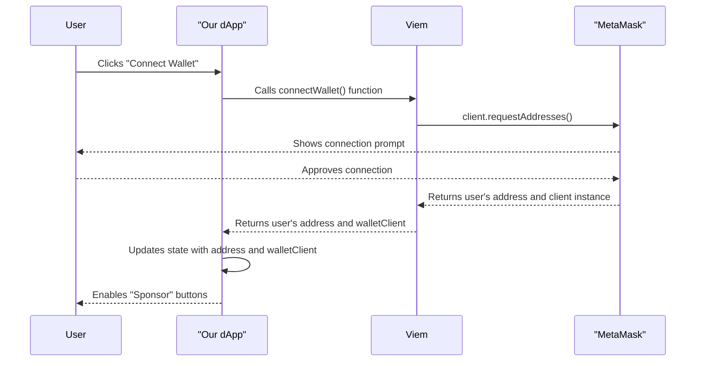

# Yellow Network (Nitrolite) Integration Guide

## 🎯 Key Insights from Nitrolite SDK Analysis

### Critical Implementation Details

#### 1. **Authentication Parameter Structure** (CRITICAL)
Based on SDK analysis, the auth request MUST use this exact structure:

```javascript
const authParams = {
  address: walletAddress,           // Main wallet address
  session_key: sessionKeyAddress,   // Session key for security
  app_name: 'YuPI',                // Application name
  allowances: [],                   // Array of allowances (usually empty)
  expire: timestampString,          // Expiration as string
  scope: 'console',                 // Scope for console access
  application: contractAddress      // Application contract address
};
```

**❌ WRONG**: Using `wallet`, `participant` parameters
**✅ CORRECT**: Using `address`, `session_key` parameters

#### 2. **Session Key Pattern** (SECURITY)
- Use a separate session key for signing, not the main wallet
- Session key provides security isolation
- Main wallet only used for identification

```javascript
this.wallet = new ethers.Wallet(process.env.PRIVATE_KEY);      // Main wallet
this.sessionKey = ethers.Wallet.createRandom();               // Session key
```

#### 3. **App Session Creation Structure**
App sessions use this exact parameter format:

```javascript
const sessionParams = [{
  definition: {
    protocol: 'NitroRPC/0.2',        // Fixed protocol version
    participants: [addr1, addr2, addr3], // Participant addresses
    weights: [34, 33, 33],           // Weight distribution (must sum to 100)
    quorum: 67,                      // Percentage needed for consensus
    challenge: 0,                    // Challenge period (0 for instant)
    nonce: Date.now()               // Unique identifier
  },
  allocations: [{
    participant_wallet: address,      // Note: participant_wallet, not participant
    asset_symbol: 'USDC',           // Note: asset_symbol, not asset
    amount: '1000000'               // Amount in smallest unit
  }]
}];
```

#### 4. **Message Signing Pattern**
Two different signing methods are used:

**EIP-712 Signing** (for authentication):
```javascript
const eip712MessageSigner = createEIP712AuthMessageSigner(
  sessionKey,                       // Use session key
  authMessage,                      // Structured auth message
  domain                           // EIP-712 domain
);
```

**Raw Message Signing** (for operations):
```javascript
async messageSigner(payload) {
  const message = JSON.stringify(payload);
  const messageBytes = ethers.toUtf8Bytes(message); // NOT EIP-191 format
  return await this.sessionKey.signMessage(messageBytes);
}
```

#### 5. **Response Parsing Structure**
Yellow ClearNode responses follow this pattern:

```javascript
{
  res: [requestId, method, responseData, timestamp],
  sig: ['signature']
}
```

Access response data: `message.res[2]`

### 🏗️ Architecture Insights

#### ClearNode Role:
- **Message Broker**: Coordinates off-chain communications
- **State Validator**: Ensures state transitions are valid
- **Signature Verifier**: Validates all participant signatures
- **Session Manager**: Manages application session lifecycle

#### Application Session Lifecycle:
1. **Create**: Establish session with initial allocations
2. **Update**: Modify state through signed messages
3. **Close**: Finalize with settlement distributions

#### Critical Files in SDK:
- `src/rpc/api.ts` - RPC message creation functions
- `src/rpc/types/request.ts` - Parameter type definitions
- `clearnode/rpc_router_auth.go` - Server-side auth handling
- `clearnode/app_session_service.go` - Session management logic

## 📋 Implementation Checklist

### Phase 2 Backend Updates:
- [x] Fix auth parameter structure (address, session_key, etc.)
- [x] Implement session key pattern for security
- [x] Correct app session parameter format
- [x] Proper message signing (UTF-8, not EIP-191)
- [x] Response parsing with res[2] access pattern

### Key SDK Functions Used:
- `createAuthRequestMessage()` - Initial authentication
- `createAuthVerifyMessage()` - Challenge response
- `createAppSessionMessage()` - Create application sessions  
- `createCloseAppSessionMessage()` - Close and settle
- `parseRPCResponse()` - Parse incoming messages
- `createEIP712AuthMessageSigner()` - EIP-712 auth signing

---

# Original Yellow Guide Documentation

## Refer to the following to get the idea of how the Yellow works

```
---
sidebar_position: 5
title: Connect to the ClearNode
description: Establish connection with ClearNode for reliable off-chain transaction processing and verification.
keywords: [erc7824, nitrolite, clearnode, off-chain, validation, messaging, nitroliterpc, websocket]
---

import Tabs from '@theme/Tabs';
import TabItem from '@theme/TabItem';

# Connect to the ClearNode

A ClearNode is a specialized service that facilitates off-chain communication, message relay, and state validation in the Nitrolite ecosystem. This guide explains how to establish and manage connections to a ClearNode using the NitroliteRPC protocol.

## What is a ClearNode?

A **[ClearNode](https://github.com/erc7824/clearnode)** is an implementation of a message broker for the Clearnet protocol. It serves as a critical infrastructure component in the Nitrolite ecosystem, providing several important functions in the state channel network:

- **Multi-Chain Support**: Connect to multiple EVM blockchains (Polygon, Celo, Base)
- **Off-Chain Payments**: Efficient payment channels for high-throughput transactions
- **Virtual Applications**: Create multi-participant applications
- **Quorum-Based Signatures**: Support for multi-signature schemes with weight-based quorums

## Understanding NitroliteRPC

NitroliteRPC is a utility in our SDK that standardizes message creation for communication with ClearNodes. It's not a full protocol implementation but rather a set of helper functions that ensure your application constructs properly formatted messages for ClearNode interaction.

Key functions of NitroliteRPC include:

- **Message Construction**: Creates properly formatted request messages
- **Signature Management**: Handles the cryptographic signing of messages
- **Standard Format Enforcement**: Ensures all messages follow the required format for ClearNode compatibility
- **Authentication Flow Helpers**: Simplifies the authentication process

Under the hood, NitroliteRPC provides functions that generate message objects with the correct structure, timestamps, and signature formatting so you don't have to build these messages manually when communicating with ClearNodes.

## Connecting to a ClearNode

After initializing your client and creating a channel, you need to establish a WebSocket connection to a ClearNode. It's important to understand that the Nitrolite SDK doesn't provide its own transport layer - you'll need to implement the WebSocket connection yourself using your preferred library.

<Tabs>
  <TabItem value="basic" label="WebSocket Connection">

```javascript
// Import your preferred WebSocket library
import WebSocket from 'ws'; // Node.js
// or use the browser's built-in WebSocket

// Create a WebSocket connection to the ClearNode
const ws = new WebSocket('wss://clearnode.example.com');

// Set up basic event handlers
ws.onopen = () => {
  console.log('WebSocket connection established');
  // Connection is open, can now proceed with authentication
};

ws.onmessage = (event) => {
  const message = JSON.parse(event.data);
  console.log('Received message:', message);
  // Process incoming messages
};

ws.onerror = (error) => {
  console.error('WebSocket error:', error);
};

ws.onclose = (event) => {
  console.log(`WebSocket closed: ${event.code} ${event.reason}`);
};
```

  </TabItem>
  <TabItem value="advanced" label="With Reconnection Logic">

```javascript
class ClearNodeConnection {
  constructor(url) {
    this.url = url;
    this.ws = null;
    this.isConnected = false;
    this.reconnectAttempts = 0;
    this.maxReconnectAttempts = 5;
    this.reconnectInterval = 3000; // ms
    this.messageHandlers = new Map();
  }
  
  // Register message handlers
  onMessage(type, handler) {
    this.messageHandlers.set(type, handler);
  }
  
  connect() {
    this.ws = new WebSocket(this.url);
    
    this.ws.onopen = this.handleOpen.bind(this);
    this.ws.onmessage = this.handleMessage.bind(this);
    this.ws.onerror = this.handleError.bind(this);
    this.ws.onclose = this.handleClose.bind(this);
  }
  
  handleOpen() {
    console.log(`Connected to ClearNode at ${this.url}`);
    this.isConnected = true;
    this.reconnectAttempts = 0;
    
    // Emit connected event
    this.emit('connected');
  }
  
  handleMessage(event) {
    try {
      const message = JSON.parse(event.data);
      
      // Determine message type (auth_challenge, auth_success, etc.)
      const messageType = message.res ? message.res[1] : 'unknown';
      
      // Emit specific message event
      this.emit('message', message);
      
      // Call specific handler if registered
      if (this.messageHandlers.has(messageType)) {
        this.messageHandlers.get(messageType)(message);
      }
    } catch (error) {
      console.error('Error handling message:', error);
    }
  }
  
  handleError(error) {
    console.error('WebSocket error:', error);
    this.emit('error', error);
  }
  
  handleClose(event) {
    this.isConnected = false;
    console.log(`WebSocket closed: ${event.code} ${event.reason}`);
    
    // Emit disconnected event
    this.emit('disconnected', event);
    
    // Attempt to reconnect
    this.attemptReconnect();
  }
  
  attemptReconnect() {
    if (this.reconnectAttempts >= this.maxReconnectAttempts) {
      console.error('Maximum reconnection attempts reached');
      return;
    }
    
    this.reconnectAttempts++;
    const delay = this.reconnectInterval * Math.pow(2, this.reconnectAttempts - 1);
    
    console.log(`Attempting to reconnect in ${delay}ms (${this.reconnectAttempts}/${this.maxReconnectAttempts})`);
    
    setTimeout(() => {
      console.log('Reconnecting...');
      this.connect();
    }, delay);
  }
  
  send(message) {
    if (!this.isConnected) {
      console.error('Cannot send message: not connected');
      return false;
    }
    
    try {
      this.ws.send(typeof message === 'string' ? message : JSON.stringify(message));
      return true;
    } catch (error) {
      console.error('Error sending message:', error);
      return false;
    }
  }
  
  disconnect() {
    if (this.ws) {
      this.ws.close(1000, 'User initiated disconnect');
    }
  }
  
  // Simple event system
  #events = {};
  
  on(event, callback) {
    if (!this.#events[event]) this.#events[event] = [];
    this.#events[event].push(callback);
    return this;
  }
  
  off(event, callback) {
    if (!this.#events[event]) return this;
    if (!callback) {
      delete this.#events[event];
      return this;
    }
    this.#events[event] = this.#events[event].filter(cb => cb !== callback);
    return this;
  }
  
  emit(event, ...args) {
    if (!this.#events[event]) return false;
    this.#events[event].forEach(callback => callback(...args));
    return true;
  }
}

// Usage
const clearNodeConnection = new ClearNodeConnection('wss://clearnode.example.com');
clearNodeConnection.connect();

// Register event handlers
clearNodeConnection.on('connected', () => {
  console.log('Connection established, ready to authenticate');
});

// Later, when you're done
clearNodeConnection.disconnect();
```

  </TabItem>
</Tabs>

## Authentication Flow

When connecting to a ClearNode, you need to follow a specific authentication flow using the NitroliteRPC utility to create properly formatted and signed messages:

1. **Initial Connection**: The client establishes a WebSocket connection to the ClearNode's URL
2. **Auth Request**: On the first connection client sends an `auth_request` message with its identity information
3. **Challenge**: The ClearNode responds with an `auth_challenge` containing a random nonce
4. **Signature Verification**: The client signs the challenge along with session key and allowances using EIP712 signature and sends an `auth_verify` message
5. **Auth Result**: The ClearNode verifies the signature and responds with `auth_success` or `auth_failure`
6. **Reconnection**: On success ClearNode will return the JWT Token, which can be used for subsequent reconnections without needing to re-authenticate.

This flow ensures that only authorized participants with valid signing keys can connect to the ClearNode and participate in channel operations.



<Tabs>
  <TabItem value="auth" label="Authentication Process">

```javascript
import {
  createAuthRequestMessage, 
  createAuthVerifyMessage, 
  createEIP712AuthMessageSigner, 
  parseRPCResponse,
  RPCMethod,
} from '@erc7824/nitrolite';
import { ethers } from 'ethers';

// Create and send auth_request
const authRequestMsg = await createAuthRequestMessage({
  wallet: '0xYourWalletAddress',
  participant: '0xYourSignerAddress',
  app_name: 'Your Domain',
  expire: Math.floor(Date.now() / 1000) + 3600, // 1 hour expiration
  scope: 'console',
  application: '0xYourApplicationAddress',
  allowances: [],
});

// After WebSocket connection is established
ws.onopen = async () => {
  console.log('WebSocket connection established');
  
  ws.send(authRequestMsg);
};

// Handle incoming messages
ws.onmessage = async (event) => {
  try {
    const message = parseRPCResponse(event.data);
    
    // Handle auth_challenge response
    switch (message.method) {
      case RPCMethod.AuthChallenge:
        console.log('Received auth challenge');

        // Create EIP-712 message signer function
        const eip712MessageSigner = createEIP712AuthMessageSigner(
          walletClient, // Your wallet client instance
          {  
            // EIP-712 message structure, data should match auth_request
            scope: authRequestMsg.scope,
            application: authRequestMsg.application,
            participant: authRequestMsg.participant,
            expire: authRequestMsg.expire,
            allowances: authRequestMsg.allowances,
          },
          { 
            // Domain for EIP-712 signing
            name: 'Your Domain',
          },
        )
        
        // Create and send auth_verify with signed challenge
        const authVerifyMsg = await createAuthVerifyMessage(
          eip712MessageSigner, // Our custom eip712 signer function
          message,
        );
        
        ws.send(authVerifyMsg);
        break;
      // Handle auth_success or auth_failure
      case RPCMethod.AuthVerify:
        if (!message.params.success) {
          console.log('Authentication failed');
          return;
        }
        console.log('Authentication successful');
        // Now you can start using the channel

        window.localStorage.setItem('clearnode_jwt', message.params.jwtToken); // Store JWT token for future use
        break;
      case RPCMethod.Error: {
        console.error('Authentication failed:', message.params.error);
      }
    }
  } catch (error) {
    console.error('Error handling message:', error);
  }
};
```

  </TabItem>
  <TabItem value="challenge" label="Manual Challenge Handling">

```javascript
import { 
  createAuthRequestMessage, 
  createAuthVerifyMessageFromChallenge,
  createGetLedgerBalancesMessage,
  createGetConfigMessage,
  createEIP712AuthMessageSigner, 
  parseRPCResponse,
  RPCMethod,
} from '@erc7824/nitrolite';
import { ethers } from 'ethers';

// After connection is established, send auth request
ws.onopen = async () => {
  const authRequestMsg = await createAuthRequestMessage({
    wallet: '0xYourWalletAddress',
    participant: '0xYourSignerAddress',
    app_name: 'Your Domain',
    expire: Math.floor(Date.now() / 1000) + 3600, // 1 hour expiration
    scope: 'console',
    application: '0xYourApplicationAddress',
    allowances: [],
  });
  ws.send(authRequestMsg);
};

// If you want to manually extract and handle the challenge
ws.onmessage = async (event) => {
  try {
    const message = parseRPCResponse(event.data);
    
    if (message.method === RPCMethod.AuthChallenge) {
      // Extract the challenge manually from the response
      if (
        message.params.challengeMessage
      ) {
        const challenge = message.params.challengeMessage;

        // Create EIP-712 message signer function
        const eip712MessageSigner = createEIP712AuthMessageSigner(
          walletClient, // Your wallet client instance
          {  
            // EIP-712 message structure, data should match auth_request
            scope: authRequestMsg.scope,
            application: authRequestMsg.application,
            participant: authRequestMsg.participant,
            expire: authRequestMsg.expire,
            allowances: authRequestMsg.allowances,
          },
          { 
            // Domain for EIP-712 signing
            name: 'Your Domain',
          },
        )
        
        // Create auth_verify with the explicitly provided challenge
        const authVerifyMsg = await createAuthVerifyMessageFromChallenge(
          eip712MessageSigner,
          challenge
        );
        
        ws.send(authVerifyMsg);
      } else {
        console.error('Malformed challenge response');
      }
    }
  } catch (error) {
    console.error('Error handling message:', error);
  }
};
```

  </TabItem>
  <TabItem value="reconnect" label="Reconnect">

```javascript
import { createAuthVerifyMessageWithJWT, parseRPCResponse, RPCMethod } from '@erc7824/nitrolite';
import { ethers } from 'ethers';

// After WebSocket connection is established
ws.onopen = async () => {
  console.log('WebSocket connection established');
  
  // Create and send auth_verify with JWT for reconnection
  // Get the stored JWT token
  const jwtToken = window.localStorage.getItem('clearnode_jwt');

  const authRequestMsg = await createAuthVerifyMessageWithJWT(
    jwtToken, // JWT token for reconnection
  );
  
  ws.send(authRequestMsg);
};

// Handle incoming messages
ws.onmessage = async (event) => {
  try {
    const message = parseRPCResponse(event.data);
    
      // Handle auth_success or auth_failure
    switch (message.method) {
      case RPCMethod.AuthVerify:
        if (message.params.success) {
          console.log('Authentication successful');
          // Now you can start using the channel
        }
        break;
      case RPCMethod.Error:
        console.error('Authentication failed:', message.params.error);
        break;
    }
  } catch (error) {
    console.error('Error handling message:', error);
  }
};
```

  </TabItem>
</Tabs>

### EIP-712 Signature

In the authentication process, the client must sign messages using EIP-712 structured data signatures. This ensures that the messages are tamper-proof and verifiable by the ClearNode.

The format of the EIP-712 message is as follows:

```javascript
{
  "types": {
    "EIP712Domain": [
      { "name": "name", "type": "string" }
    ],
    "Policy": [
      { "name": "challenge", "type": "string" },
      { "name": "scope", "type": "string" },
      { "name": "wallet", "type": "address" },
      { "name": "application", "type": "address" },
      { "name": "participant", "type": "address" },
      { "name": "expire", "type": "uint256" },
      { "name": "allowances", "type": "Allowances[]" }
    ],
    "Allowance": [
      { "name": "asset", "type": "string" },
      { "name": "amount", "type": "uint256" }
    ]
  },
  // Domain and primary type
  domain: {
    name: 'Your Domain'
  },
  primaryType: 'Policy',
  message: {
    challenge: 'RandomChallengeString',
    scope: 'console',
    wallet: '0xYourWalletAddress',
    application: '0xYourApplicationAddress',
    participant: '0xYourSignerAddress',
    expire: 100500,
    allowances: []
  }
}
```

### Message Signer

In methods that require signing messages, that are not part of the authentication flow, you should use a custom message signer function `MessageSigner`. This function takes the payload and returns a signed message that can be sent to the ClearNode using ECDSA signature.

There are also, several things to consider: this method SHOULD sign plain JSON payloads and NOT [ERC-191](https://eips.ethereum.org/EIPS/eip-191) data, because it allows signatures to be compatible with non-EVM chains. Since most of the libraries, like `ethers` or `viem`, use EIP-191 by default, you will need to overwrite the default behavior to sign plain JSON payloads.
The other thing to consider is that providing an EOA private key directly in the code is not recommended for production applications. Instead, we are recommending to generate session keys -- temporary keys that are used for signing messages during the session. This way, you can avoid exposing your main wallet's private key and reduce the risk of compromising your funds.

The simplest implementation of a message signer function looks like this:

> **Warning**
> For this example use `ethers` library version `5.7.2`. The `ethers` library version `6.x` has breaking changes that are not allowed in this example.

```javascript
import { MessageSigner, RequestData, ResponsePayload } from '@erc7824/nitrolite';
import { ethers } from 'ethers';
import { Hex } from 'viem';

const messageSigner = async (payload: RequestData | ResponsePayload): Promise<Hex> => {
    try {
        const wallet = new ethers.Wallet('0xYourPrivateKey');

        const messageBytes = ethers.utils.arrayify(ethers.utils.id(JSON.stringify(payload)));

        const flatSignature = await wallet._signingKey().signDigest(messageBytes);

        const signature = ethers.utils.joinSignature(flatSignature);

        return signature as Hex;
    } catch (error) {
        console.error('Error signing message:', error);
        throw error;
    }
}
```

## Getting Channel Information

After authenticating with a ClearNode, you can request information about your channels. This is useful to verify your connection is working correctly and to retrieve channel data.

```javascript
import { createGetChannelsMessage, parseRPCResponse, RPCMethod } from '@erc7824/nitrolite';

// Example of using the function after authentication is complete
ws.addEventListener('message', async (event) => {
  const message = parseRPCResponse(event.data);
  
  // Check if this is a successful authentication message
  if (message.method === RPCMethod.AuthVerify && message.params.success) {
    console.log('Successfully authenticated, requesting channel information...');
    
    // Request channel information using the built-in helper function
    const getChannelsMsg = await createGetChannelsMessage(
      messageSigner, // Provide message signer function from previous example
      client.stateWalletClient.account.address
    );
    
    ws.send(getChannelsMsg);
  }
  
  // Handle get_channels response
  if (message.method === RPCMethod.GetChannels) {
    console.log('Received channels information:');
    const channelsList = message.params;
    
    if (channelsList && channelsList.length > 0) {
      channelsList.forEach((channel, index) => {
        console.log(`Channel ${index + 1}:`);
        console.log(`- Channel ID: ${channel.channel_id}`);
        console.log(`- Status: ${channel.status}`);
        console.log(`- Participant: ${channel.participant}`);
        console.log(`- Token: ${channel.token}`);
        console.log(`- Amount: ${channel.amount}`);
        console.log(`- Chain ID: ${channel.chain_id}`);
        console.log(`- Adjudicator: ${channel.adjudicator}`);
        console.log(`- Challenge: ${channel.challenge}`);
        console.log(`- Nonce: ${channel.nonce}`);
        console.log(`- Version: ${channel.version}`);
        console.log(`- Created: ${channel.created_at}`);
        console.log(`- Updated: ${channel.updated_at}`);
      });
    } else {
      console.log('No active channels found');
    }
  }
});
```

### Response Format

The response to a `get_channels` request includes detailed information about each channel:

```javascript
{
  "res": [1, "get_channels", [[  // Notice the nested array structure
    {
      "channel_id": "0xfedcba9876543210...",
      "participant": "0x1234567890abcdef...",
      "status": "open", // Can be "open", "closed", "settling", etc.
      "token": "0xeeee567890abcdef...", // ERC20 token address
      "amount": "100000", // Current channel balance
      "chain_id": 137, // Chain ID (e.g., 137 for Polygon)
      "adjudicator": "0xAdjudicatorContractAddress...", // Contract address
      "challenge": 86400, // Challenge period in seconds
      "nonce": 1,
      "version": 2,
      "created_at": "2023-05-01T12:00:00Z",
      "updated_at": "2023-05-01T12:30:00Z"
    }
  ]], 1619123456789],
  "sig": ["0xabcd1234..."]
}
```

## Framework-Specific Integration

Here are examples of integrating ClearNode WebSocket connections with various frameworks. Since the Nitrolite SDK doesn't provide its own transport layer, these examples show how to implement WebSocket connections and the NitroliteRPC message format in different frameworks.

<Tabs>
  <TabItem value="react" label="React">

```javascript
import { useState, useEffect, useCallback } from 'react';
import { ethers } from 'ethers';
import { 
  createAuthRequestMessage, 
  createAuthVerifyMessage,
  createGetChannelsMessage,
  createGetLedgerBalancesMessage,
  createGetConfigMessage,
  generateRequestId, 
  getCurrentTimestamp 
} from '@erc7824/nitrolite';

// Custom hook for ClearNode connection
function useClearNodeConnection(clearNodeUrl, stateWallet) {
  const [ws, setWs] = useState(null);
  const [connectionStatus, setConnectionStatus] = useState('disconnected');
  const [isAuthenticated, setIsAuthenticated] = useState(false);
  const [error, setError] = useState(null);
  
  // Message signer function
  const messageSigner = useCallback(async (payload) => {
    if (!stateWallet) throw new Error('State wallet not available');
    
    try {
      const message = JSON.stringify(payload);
      const digestHex = ethers.id(message);
      const messageBytes = ethers.getBytes(digestHex);
      const { serialized: signature } = stateWallet.signingKey.sign(messageBytes);
      return signature;
    } catch (error) {
      console.error("Error signing message:", error);
      throw error;
    }
  }, [stateWallet]);
  
  // Create a signed request
  const createSignedRequest = useCallback(async (method, params = []) => {
    if (!stateWallet) throw new Error('State wallet not available');
    
    const requestId = generateRequestId();
    const timestamp = getCurrentTimestamp();
    const requestData = [requestId, method, params, timestamp];
    const request = { req: requestData };
    
    // Sign the request
    const message = JSON.stringify(request);
    const digestHex = ethers.id(message);
    const messageBytes = ethers.getBytes(digestHex);
    const { serialized: signature } = stateWallet.signingKey.sign(messageBytes);
    request.sig = [signature];
    
    return JSON.stringify(request);
  }, [stateWallet]);
  
  // Send a message to the ClearNode
  const sendMessage = useCallback((message) => {
    if (!ws || ws.readyState !== WebSocket.OPEN) {
      setError('WebSocket not connected');
      return false;
    }
    
    try {
      ws.send(typeof message === 'string' ? message : JSON.stringify(message));
      return true;
    } catch (error) {
      setError(`Error sending message: ${error.message}`);
      return false;
    }
  }, [ws]);
  
  // Connect to the ClearNode
  const connect = useCallback(() => {
    if (ws) {
      ws.close();
    }
    
    setConnectionStatus('connecting');
    setError(null);
    
    const newWs = new WebSocket(clearNodeUrl);
    
    newWs.onopen = async () => {
      setConnectionStatus('connected');
      
      // Start authentication process
      try {
        const authRequest = await createAuthRequestMessage(
          messageSigner,
          stateWallet.address
        );
        newWs.send(authRequest);
      } catch (err) {
        setError(`Authentication request failed: ${err.message}`);
      }
    };
    
    newWs.onmessage = async (event) => {
      try {
        const message = JSON.parse(event.data);
        
        // Handle authentication flow
        if (message.res && message.res[1] === 'auth_challenge') {
          try {
            const authVerify = await createAuthVerifyMessage(
              messageSigner,
              message,
              stateWallet.address
            );
            newWs.send(authVerify);
          } catch (err) {
            setError(`Authentication verification failed: ${err.message}`);
          }
        } else if (message.res && message.res[1] === 'auth_success') {
          setIsAuthenticated(true);
        } else if (message.res && message.res[1] === 'auth_failure') {
          setIsAuthenticated(false);
          setError(`Authentication failed: ${message.res[2]}`);
        }
        
        // Additional message handling can be added here
      } catch (err) {
        console.error('Error handling message:', err);
      }
    };
    
    newWs.onerror = (error) => {
      setError(`WebSocket error: ${error.message}`);
      setConnectionStatus('error');
    };
    
    newWs.onclose = () => {
      setConnectionStatus('disconnected');
      setIsAuthenticated(false);
    };
    
    setWs(newWs);
  }, [clearNodeUrl, messageSigner, stateWallet]);
  
  // Disconnect from the ClearNode
  const disconnect = useCallback(() => {
    if (ws) {
      ws.close();
      setWs(null);
    }
  }, [ws]);
  
  // Connect when the component mounts
  useEffect(() => {
    if (clearNodeUrl && stateWallet) {
      connect();
    }
    
    // Clean up on unmount
    return () => {
      if (ws) {
        ws.close();
      }
    };
  }, [clearNodeUrl, stateWallet, connect]);
  
  // Create helper methods for common operations
  const getChannels = useCallback(async () => {
    // Using the built-in helper function from NitroliteRPC
    const message = await createGetChannelsMessage(
      messageSigner,
      stateWallet.address
    );
    return sendMessage(message);
  }, [messageSigner, sendMessage, stateWallet]);
  
  const getLedgerBalances = useCallback(async (channelId) => {
    // Using the built-in helper function from NitroliteRPC
    const message = await createGetLedgerBalancesMessage(
      messageSigner,
      channelId
    );
    return sendMessage(message);
  }, [messageSigner, sendMessage]);
  
  const getConfig = useCallback(async () => {
    // Using the built-in helper function from NitroliteRPC
    const message = await createGetConfigMessage(
      messageSigner,
      stateWallet.address
    );
    return sendMessage(message);
  }, [messageSigner, sendMessage, stateWallet]);
  
  return {
    connectionStatus,
    isAuthenticated,
    error,
    ws,
    connect,
    disconnect,
    sendMessage,
    getChannels,
    getLedgerBalances,
    getConfig,
    createSignedRequest
  };
}

// Example usage in a component
function ClearNodeComponent() {
  const stateWallet = /* your state wallet initialization */;
  const {
    connectionStatus,
    isAuthenticated,
    error,
    getChannels
  } = useClearNodeConnection('wss://clearnode.example.com', stateWallet);
  
  return (
    <div>
      <p>Status: {connectionStatus}</p>
      <p>Authenticated: {isAuthenticated ? 'Yes' : 'No'}</p>
      {error && <p className="error">Error: {error}</p>}
      
      <button 
        onClick={getChannels} 
        disabled={!isAuthenticated}
      >
        Get Channels
      </button>
    </div>
  );
}
```

  </TabItem>
  <TabItem value="angular" label="Angular">

```typescript
// In an Angular service (clearnode.service.ts)
import { Injectable } from '@angular/core';
import { BehaviorSubject, Observable } from 'rxjs';
import { ethers } from 'ethers';
import { 
  createAuthRequestMessage, 
  createAuthVerifyMessage,
  createGetChannelsMessage,
  createGetLedgerBalancesMessage,
  createGetConfigMessage,
  generateRequestId, 
  getCurrentTimestamp 
} from '@erc7824/nitrolite';

@Injectable({
  providedIn: 'root'
})
export class ClearNodeService {
  private ws: WebSocket | null = null;
  private connectionStatusSource = new BehaviorSubject<string>('disconnected');
  private isAuthenticatedSource = new BehaviorSubject<boolean>(false);
  private errorSource = new BehaviorSubject<string | null>(null);
  private messageSubject = new BehaviorSubject<any>(null);
  
  // Public observables
  connectionStatus$ = this.connectionStatusSource.asObservable();
  isAuthenticated$ = this.isAuthenticatedSource.asObservable();
  error$ = this.errorSource.asObservable();
  message$ = this.messageSubject.asObservable();
  
  // Custom message signer
  private async messageSigner(payload: any, stateWallet: any): Promise<string> {
    try {
      const message = JSON.stringify(payload);
      const digestHex = ethers.id(message);
      const messageBytes = ethers.getBytes(digestHex);
      const { serialized: signature } = stateWallet.signingKey.sign(messageBytes);
      return signature;
    } catch (error) {
      console.error("Error signing message:", error);
      throw error;
    }
  }
  
  // Create a signed request
  async createSignedRequest(method: string, params: any[], stateWallet: any): Promise<string> {
    const requestId = generateRequestId();
    const timestamp = getCurrentTimestamp();
    const requestData = [requestId, method, params, timestamp];
    const request: any = { req: requestData };
    
    // Sign the request
    const message = JSON.stringify(request);
    const digestHex = ethers.id(message);
    const messageBytes = ethers.getBytes(digestHex);
    const { serialized: signature } = stateWallet.signingKey.sign(messageBytes);
    request.sig = [signature];
    
    return JSON.stringify(request);
  }
  
  // Connect to the ClearNode
  connect(url: string, stateWallet: any): void {
    if (this.ws) {
      this.ws.close();
    }
    
    this.connectionStatusSource.next('connecting');
    this.errorSource.next(null);
    
    this.ws = new WebSocket(url);
    
    this.ws.onopen = async () => {
      this.connectionStatusSource.next('connected');
      
      // Start authentication process
      try {
        const authRequest = await createAuthRequestMessage(
          (payload) => this.messageSigner(payload, stateWallet),
          stateWallet.address
        );
        this.ws!.send(authRequest);
      } catch (err: any) {
        this.errorSource.next(`Authentication request failed: ${err.message}`);
      }
    };
    
    this.ws.onmessage = async (event) => {
      try {
        const message = JSON.parse(event.data);
        this.messageSubject.next(message);
        
        // Handle authentication flow
        if (message.res && message.res[1] === 'auth_challenge') {
          try {
            const authVerify = await createAuthVerifyMessage(
              (payload) => this.messageSigner(payload, stateWallet),
              message,
              stateWallet.address
            );
            this.ws!.send(authVerify);
          } catch (err: any) {
            this.errorSource.next(`Authentication verification failed: ${err.message}`);
          }
        } else if (message.res && message.res[1] === 'auth_success') {
          this.isAuthenticatedSource.next(true);
        } else if (message.res && message.res[1] === 'auth_failure') {
          this.isAuthenticatedSource.next(false);
          this.errorSource.next(`Authentication failed: ${message.res[2]}`);
        }
      } catch (err: any) {
        console.error('Error handling message:', err);
      }
    };
    
    this.ws.onerror = (error) => {
      this.errorSource.next(`WebSocket error`);
      this.connectionStatusSource.next('error');
    };
    
    this.ws.onclose = () => {
      this.connectionStatusSource.next('disconnected');
      this.isAuthenticatedSource.next(false);
    };
  }
  
  // Disconnect from the ClearNode
  disconnect(): void {
    if (this.ws) {
      this.ws.close();
      this.ws = null;
    }
  }
  
  // Send a message to the ClearNode
  sendMessage(message: string | object): boolean {
    if (!this.ws || this.ws.readyState !== WebSocket.OPEN) {
      this.errorSource.next('WebSocket not connected');
      return false;
    }
    
    try {
      this.ws.send(typeof message === 'string' ? message : JSON.stringify(message));
      return true;
    } catch (error: any) {
      this.errorSource.next(`Error sending message: ${error.message}`);
      return false;
    }
  }
  
  // Helper methods for common operations
  async getChannels(stateWallet: any): Promise<boolean> {
    // Using the built-in helper function from NitroliteRPC
    const message = await createGetChannelsMessage(
      (payload) => this.messageSigner(payload, stateWallet),
      stateWallet.address
    );
    return this.sendMessage(message);
  }
  
  async getLedgerBalances(channelId: string, stateWallet: any): Promise<boolean> {
    // Using the built-in helper function from NitroliteRPC
    const message = await createGetLedgerBalancesMessage(
      (payload) => this.messageSigner(payload, stateWallet),
      channelId
    );
    return this.sendMessage(message);
  }
  
  async getConfig(stateWallet: any): Promise<boolean> {
    // Using the built-in helper function from NitroliteRPC
    const message = await createGetConfigMessage(
      (payload) => this.messageSigner(payload, stateWallet),
      stateWallet.address
    );
    return this.sendMessage(message);
  }
}

// Usage in a component
import { Component, OnInit, OnDestroy } from '@angular/core';
import { ClearNodeService } from './clearnode.service';
import { Subscription } from 'rxjs';

@Component({
  selector: 'app-clearnode',
  template: `
    <div>
      <p>Status: {{ connectionStatus }}</p>
      <p>Authenticated: {{ isAuthenticated ? 'Yes' : 'No' }}</p>
      <p *ngIf="error" class="error">Error: {{ error }}</p>
      
      <button 
        (click)="getChannels()" 
        [disabled]="!isAuthenticated"
      >
        Get Channels
      </button>
    </div>
  `
})
export class ClearNodeComponent implements OnInit, OnDestroy {
  connectionStatus = 'disconnected';
  isAuthenticated = false;
  error: string | null = null;
  
  private subscriptions: Subscription[] = [];
  private stateWallet: any; // Initialize your state wallet
  
  constructor(private clearNodeService: ClearNodeService) {}
  
  ngOnInit() {
    this.subscriptions.push(
      this.clearNodeService.connectionStatus$.subscribe(
        status => this.connectionStatus = status
      ),
      this.clearNodeService.isAuthenticated$.subscribe(
        auth => this.isAuthenticated = auth
      ),
      this.clearNodeService.error$.subscribe(
        err => this.error = err
      ),
      this.clearNodeService.message$.subscribe(
        message => {
          if (message) {
            console.log('Received message:', message);
            // Handle specific message types here
          }
        }
      )
    );
    
    // Connect to ClearNode
    this.clearNodeService.connect('wss://clearnode.example.com', this.stateWallet);
  }
  
  ngOnDestroy() {
    this.clearNodeService.disconnect();
    this.subscriptions.forEach(sub => sub.unsubscribe());
  }
  
  getChannels() {
    this.clearNodeService.getChannels(this.stateWallet);
  }
}
```

  </TabItem>
  <TabItem value="vue" label="Vue">

```javascript
// In a Vue component or Composable
import { ref, onMounted, onUnmounted } from 'vue';
import { ethers } from 'ethers';
import { 
  createAuthRequestMessage, 
  createAuthVerifyMessage,
  createGetChannelsMessage,
  createGetLedgerBalancesMessage,
  createGetConfigMessage,
  generateRequestId, 
  getCurrentTimestamp 
} from '@erc7824/nitrolite';

// ClearNode connection composable
export function useClearNodeConnection(clearNodeUrl, stateWallet) {
  const ws = ref(null);
  const connectionStatus = ref('disconnected');
  const isAuthenticated = ref(false);
  const error = ref(null);
  const messages = ref([]);
  
  // Message signer function
  const messageSigner = async (payload) => {
    try {
      const message = JSON.stringify(payload);
      const digestHex = ethers.id(message);
      const messageBytes = ethers.getBytes(digestHex);
      const { serialized: signature } = stateWallet.signingKey.sign(messageBytes);
      return signature;
    } catch (error) {
      console.error("Error signing message:", error);
      throw error;
    }
  };
  
  // Create a signed request
  const createSignedRequest = async (method, params = []) => {
    const requestId = generateRequestId();
    const timestamp = getCurrentTimestamp();
    const requestData = [requestId, method, params, timestamp];
    const request = { req: requestData };
    
    // Sign the request
    const message = JSON.stringify(request);
    const digestHex = ethers.id(message);
    const messageBytes = ethers.getBytes(digestHex);
    const { serialized: signature } = stateWallet.signingKey.sign(messageBytes);
    request.sig = [signature];
    
    return JSON.stringify(request);
  };
  
  // Send a message to the ClearNode
  const sendMessage = (message) => {
    if (!ws.value || ws.value.readyState !== WebSocket.OPEN) {
      error.value = 'WebSocket not connected';
      return false;
    }
    
    try {
      ws.value.send(typeof message === 'string' ? message : JSON.stringify(message));
      return true;
    } catch (err) {
      error.value = `Error sending message: ${err.message}`;
      return false;
    }
  };
  
  // Connect to the ClearNode
  const connect = () => {
    if (ws.value) {
      ws.value.close();
    }
    
    connectionStatus.value = 'connecting';
    error.value = null;
    
    const newWs = new WebSocket(clearNodeUrl);
    
    newWs.onopen = async () => {
      connectionStatus.value = 'connected';
      
      // Start authentication process
      try {
        const authRequest = await createAuthRequestMessage(
          messageSigner,
          stateWallet.address
        );
        newWs.send(authRequest);
      } catch (err) {
        error.value = `Authentication request failed: ${err.message}`;
      }
    };
    
    newWs.onmessage = async (event) => {
      try {
        const message = JSON.parse(event.data);
        messages.value.push(message);
        
        // Handle authentication flow
        if (message.res && message.res[1] === 'auth_challenge') {
          try {
            const authVerify = await createAuthVerifyMessage(
              messageSigner,
              message,
              stateWallet.address
            );
            newWs.send(authVerify);
          } catch (err) {
            error.value = `Authentication verification failed: ${err.message}`;
          }
        } else if (message.res && message.res[1] === 'auth_success') {
          isAuthenticated.value = true;
        } else if (message.res && message.res[1] === 'auth_failure') {
          isAuthenticated.value = false;
          error.value = `Authentication failed: ${message.res[2]}`;
        }
      } catch (err) {
        console.error('Error handling message:', err);
      }
    };
    
    newWs.onerror = (err) => {
      error.value = 'WebSocket error';
      connectionStatus.value = 'error';
    };
    
    newWs.onclose = () => {
      connectionStatus.value = 'disconnected';
      isAuthenticated.value = false;
    };
    
    ws.value = newWs;
  };
  
  // Disconnect from the ClearNode
  const disconnect = () => {
    if (ws.value) {
      ws.value.close();
      ws.value = null;
    }
  };
  
  // Helper methods for common operations
  const getChannels = async () => {
    // Using the built-in helper function from NitroliteRPC
    const message = await createGetChannelsMessage(
      messageSigner,
      stateWallet.address
    );
    return sendMessage(message);
  };
  
  const getLedgerBalances = async (channelId) => {
    // Using the built-in helper function from NitroliteRPC
    const message = await createGetLedgerBalancesMessage(
      messageSigner,
      channelId
    );
    return sendMessage(message);
  };
  
  const getConfig = async () => {
    // Using the built-in helper function from NitroliteRPC
    const message = await createGetConfigMessage(
      messageSigner,
      stateWallet.address
    );
    return sendMessage(message);
  };
  
  // Connect and disconnect with the component lifecycle
  onMounted(() => {
    if (clearNodeUrl && stateWallet) {
      connect();
    }
  });
  
  onUnmounted(() => {
    disconnect();
  });
  
  return {
    connectionStatus,
    isAuthenticated,
    error,
    messages,
    connect,
    disconnect,
    sendMessage,
    getChannels,
    getLedgerBalances,
    getConfig,
    createSignedRequest
  };
}

// Example usage in a Vue component
export default {
  setup() {
    // Initialize your state wallet
    const stateWallet = {}; 
    
    const {
      connectionStatus,
      isAuthenticated,
      error,
      messages,
      getChannels,
      getLedgerBalances,
      getConfig
    } = useClearNodeConnection('wss://clearnode.example.com', stateWallet);
    
    return {
      connectionStatus,
      isAuthenticated,
      error,
      messages,
      getChannels,
      getLedgerBalances,
      getConfig
    };
  }
};
```

  </TabItem>
  <TabItem value="nodejs" label="Node.js">

```javascript
const WebSocket = require('ws');
const { ethers } = require('ethers');
const { 
  createAuthRequestMessage, 
  createAuthVerifyMessage,
  createGetLedgerBalancesMessage,
  createGetConfigMessage,
  generateRequestId, 
  getCurrentTimestamp 
} = require('@erc7824/nitrolite');
const EventEmitter = require('events');

class ClearNodeConnection extends EventEmitter {
  constructor(url, stateWallet) {
    super();
    this.url = url;
    this.stateWallet = stateWallet;
    this.ws = null;
    this.isConnected = false;
    this.isAuthenticated = false;
    this.reconnectAttempts = 0;
    this.maxReconnectAttempts = 5;
    this.reconnectInterval = 3000; // ms
    this.requestMap = new Map(); // Track pending requests
  }
  
  // Message signer function
  async messageSigner(payload) {
    try {
      const message = JSON.stringify(payload);
      const digestHex = ethers.id(message);
      const messageBytes = ethers.getBytes(digestHex);
      const { serialized: signature } = this.stateWallet.signingKey.sign(messageBytes);
      return signature;
    } catch (error) {
      console.error("Error signing message:", error);
      throw error;
    }
  }
  
  // Create a signed request
  async createSignedRequest(method, params = [], requestId = generateRequestId()) {
    const timestamp = getCurrentTimestamp();
    const requestData = [requestId, method, params, timestamp];
    const request = { req: requestData };
    
    // Sign the request
    const message = JSON.stringify(request);
    const digestHex = ethers.id(message);
    const messageBytes = ethers.getBytes(digestHex);
    const { serialized: signature } = this.stateWallet.signingKey.sign(messageBytes);
    request.sig = [signature];
    
    return { request, requestId };
  }
  
  // Connect to the ClearNode
  async connect() {
    return new Promise((resolve, reject) => {
      if (this.ws) {
        this.ws.close();
      }
      
      this.emit('connecting');
      
      this.ws = new WebSocket(this.url);
      
      // Set connection timeout
      const connectionTimeout = setTimeout(() => {
        if (!this.isConnected) {
          this.ws.close();
          reject(new Error('Connection timeout'));
        }
      }, 10000);
      
      this.ws.on('open', async () => {
        clearTimeout(connectionTimeout);
        this.isConnected = true;
        this.reconnectAttempts = 0;
        this.emit('connected');
        
        // Start authentication
        try {
          const authRequest = await createAuthRequestMessage(
            (payload) => this.messageSigner(payload),
            this.stateWallet.address
          );
          
          this.ws.send(authRequest);
          // Do not resolve here, wait for auth_success
        } catch (error) {
          this.emit('error', `Authentication request failed: ${error.message}`);
          reject(error);
        }
      });
      
      this.ws.on('message', async (data) => {
        try {
          const message = JSON.parse(data);
          this.emit('message', message);
          
          // Handle authentication flow
          if (message.res && message.res[1] === 'auth_challenge') {
            try {
              const authVerify = await createAuthVerifyMessage(
                (payload) => this.messageSigner(payload),
                message,
                this.stateWallet.address
              );
              
              this.ws.send(authVerify);
            } catch (error) {
              this.emit('error', `Authentication verification failed: ${error.message}`);
              reject(error);
            }
          } else if (message.res && message.res[1] === 'auth_success') {
            this.isAuthenticated = true;
            this.emit('authenticated');
            resolve(); // Authentication successful
          } else if (message.res && message.res[1] === 'auth_failure') {
            this.isAuthenticated = false;
            const error = new Error(`Authentication failed: ${message.res[2]}`);
            this.emit('error', error.message);
            reject(error);
          }
          
          // Handle other response types
          if (message.res && message.res[0]) {
            const requestId = message.res[0];
            const handler = this.requestMap.get(requestId);
            if (handler) {
              handler.resolve(message);
              this.requestMap.delete(requestId);
            }
          }
        } catch (error) {
          console.error('Error handling message:', error);
        }
      });
      
      this.ws.on('error', (error) => {
        clearTimeout(connectionTimeout);
        this.emit('error', `WebSocket error: ${error.message}`);
        reject(error);
      });
      
      this.ws.on('close', (code, reason) => {
        clearTimeout(connectionTimeout);
        this.isConnected = false;
        this.isAuthenticated = false;
        this.emit('disconnected', { code, reason: reason.toString() });
        
        // Attempt to reconnect
        this.attemptReconnect();
      });
    });
  }
  
  // Send a request and wait for the response
  async sendRequest(method, params = []) {
    if (!this.isConnected || !this.isAuthenticated) {
      throw new Error('Not connected or authenticated');
    }
    
    const { request, requestId } = await this.createSignedRequest(method, params);
    
    return new Promise((resolve, reject) => {
      // Set up response handler
      const timeout = setTimeout(() => {
        this.requestMap.delete(requestId);
        reject(new Error(`Request timeout for ${method}`));
      }, 30000);
      
      this.requestMap.set(requestId, {
        resolve: (response) => {
          clearTimeout(timeout);
          resolve(response);
        },
        reject,
        timeout
      });
      
      // Send the request
      try {
        this.ws.send(JSON.stringify(request));
      } catch (error) {
        clearTimeout(timeout);
        this.requestMap.delete(requestId);
        reject(error);
      }
    });
  }
  
  // Helper methods for common operations
  async getChannels() {
    // Using the built-in helper function from NitroliteRPC
    const message = await createGetChannelsMessage(
      (payload) => this.messageSigner(payload),
      this.stateWallet.address
    );
    
    return new Promise((resolve, reject) => {
      try {
        const parsed = JSON.parse(message);
        const requestId = parsed.req[0];
        
        const timeout = setTimeout(() => {
          this.requestMap.delete(requestId);
          reject(new Error('Request timeout for getChannels'));
        }, 30000);
        
        this.requestMap.set(requestId, {
          resolve: (response) => {
            clearTimeout(timeout);
            resolve(response);
          },
          reject,
          timeout
        });
        
        this.ws.send(message);
      } catch (error) {
        reject(error);
      }
    });
  }
  
  async getLedgerBalances(channelId) {
    // Using the built-in helper function from NitroliteRPC
    const message = await createGetLedgerBalancesMessage(
      (payload) => this.messageSigner(payload),
      channelId
    );
    
    return new Promise((resolve, reject) => {
      try {
        const parsed = JSON.parse(message);
        const requestId = parsed.req[0];
        
        const timeout = setTimeout(() => {
          this.requestMap.delete(requestId);
          reject(new Error('Request timeout for getLedgerBalances'));
        }, 30000);
        
        this.requestMap.set(requestId, {
          resolve: (response) => {
            clearTimeout(timeout);
            resolve(response);
          },
          reject,
          timeout
        });
        
        this.ws.send(message);
      } catch (error) {
        reject(error);
      }
    });
  }
  
  async getConfig() {
    // Using the built-in helper function from NitroliteRPC
    const message = await createGetConfigMessage(
      (payload) => this.messageSigner(payload),
      this.stateWallet.address
    );
    
    return new Promise((resolve, reject) => {
      try {
        const parsed = JSON.parse(message);
        const requestId = parsed.req[0];
        
        const timeout = setTimeout(() => {
          this.requestMap.delete(requestId);
          reject(new Error('Request timeout for getConfig'));
        }, 30000);
        
        this.requestMap.set(requestId, {
          resolve: (response) => {
            clearTimeout(timeout);
            resolve(response);
          },
          reject,
          timeout
        });
        
        this.ws.send(message);
      } catch (error) {
        reject(error);
      }
    });
  }
  
  // Attempt to reconnect with exponential backoff
  attemptReconnect() {
    if (this.reconnectAttempts >= this.maxReconnectAttempts) {
      this.emit('error', 'Maximum reconnection attempts reached');
      return;
    }
    
    this.reconnectAttempts++;
    const delay = this.reconnectInterval * Math.pow(2, this.reconnectAttempts - 1);
    
    this.emit('reconnecting', { attempt: this.reconnectAttempts, delay });
    
    setTimeout(() => {
      this.connect().catch(error => {
        console.error(`Reconnection attempt ${this.reconnectAttempts} failed:`, error);
      });
    }, delay);
  }
  
  // Disconnect from the ClearNode
  disconnect() {
    if (this.ws) {
      // Clear all pending requests
      for (const [requestId, handler] of this.requestMap.entries()) {
        clearTimeout(handler.timeout);
        handler.reject(new Error('Connection closed'));
        this.requestMap.delete(requestId);
      }
      
      this.ws.close(1000, 'User initiated disconnect');
      this.ws = null;
    }
  }
}

// Example usage
async function main() {
  // Initialize your state wallet (this is just a placeholder)
  const privateKey = '0x1234...'; // Your private key
  const stateWallet = new ethers.Wallet(privateKey);
  
  // Create a ClearNode connection
  const clearNode = new ClearNodeConnection('wss://clearnode.example.com', stateWallet);
  
  // Set up event handlers
  clearNode.on('connecting', () => {
    console.log('Connecting to ClearNode...');
  });
  
  clearNode.on('connected', () => {
    console.log('Connected to ClearNode');
  });
  
  clearNode.on('authenticated', () => {
    console.log('Authenticated with ClearNode');
  });
  
  clearNode.on('disconnected', ({ code, reason }) => {
    console.log(`Disconnected from ClearNode: ${code} ${reason}`);
  });
  
  clearNode.on('error', (error) => {
    console.error(`ClearNode error: ${error}`);
  });
  
  clearNode.on('reconnecting', ({ attempt, delay }) => {
    console.log(`Reconnecting (${attempt}/${clearNode.maxReconnectAttempts}) in ${delay}ms...`);
  });
  
  try {
    // Connect and authenticate
    await clearNode.connect();
    console.log('Successfully connected and authenticated');
    
    // Get channels
    const channels = await clearNode.getChannels();
    console.log('Channels:', channels.res[2][0]);
    
    // Process the channels
    const channelList = channels.res[2][0];
    if (channelList && channelList.length > 0) {
      for (const channel of channelList) {
        console.log(`Channel ID: ${channel.channel_id}`);
        console.log(`Status: ${channel.status}`);
        console.log(`Token: ${channel.token}`);
        
        // Get ledger balances for the channel
        if (channel.status === 'open') {
          const balances = await clearNode.getLedgerBalances(channel.channel_id);
          console.log(`Balances:`, balances.res[2]);
        }
      }
    } else {
      console.log('No channels found');
    }
  } catch (error) {
    console.error('Error:', error);
  } finally {
    // Disconnect when done
    clearNode.disconnect();
  }
}

// Handle process termination
process.on('SIGINT', () => {
  console.log('Shutting down...');
  // Clean up resources here
  process.exit(0);
});

// Run the example
main().catch(console.error);
```

  </TabItem>
</Tabs>


## Security Considerations

When working with ClearNodes and state channels, keep these security best practices in mind:

1. **Secure State Wallet Storage**: Properly encrypt and secure the private key for your state wallet
2. **Verify Message Signatures**: Always verify that received messages have valid signatures from expected sources
3. **Monitor Connection Status**: Implement monitoring to detect unexpected disconnections or authentication failures
4. **Implement Timeout Handling**: Add timeouts for operations to prevent hanging on unresponsive connections
5. **Validate Channel States**: Verify that channel states are valid before processing or saving them
6. **Use Secure WebSocket Connections**: Always use `wss://` (WebSocket Secure) for ClearNode connections, never `ws://`
7. **Implement Rate Limiting**: Add protection against excessive message sending to prevent abuse

## Troubleshooting Common Issues

| Issue                     | Possible Causes                           | Solution                                                               |
| ------------------------- | ----------------------------------------- | ---------------------------------------------------------------------- |
| Connection timeout        | Network latency, ClearNode unavailable    | Implement retry logic with exponential backoff                         |
| Authentication failure    | Invalid state wallet, incorrect signing   | Verify your state wallet is properly initialized and signing correctly |
| Frequent disconnections   | Unstable network, server-side issues      | Monitor connection events and implement automatic reconnection         |
| Message delivery failures | Connection issues, invalid message format | Add message queuing and confirmation mechanism                         |
| Invalid signature errors  | EIP-191 prefix issues                     | Ensure you're signing raw message bytes without the EIP-191 prefix     |

## Next Steps

After successfully connecting to a ClearNode, you can:

1. [View and manage channel assets](balances)
2. [Create an application session](application_session)


---

---
sidebar_position: 6
title: Channel Asset Management
description: Monitor off-chain balances in your active state channels using NitroliteRPC.
keywords: [erc7824, nitrolite, balances, off-chain, ledger balances, clearnode]
---

import Tabs from '@theme/Tabs';
import TabItem from '@theme/TabItem';

# Channel Asset Management

After connecting to a ClearNode, you'll need to monitor the off-chain balances in your state channels. This guide explains how to retrieve and work with off-chain balance information using the NitroliteRPC protocol.

## Understanding Off-Chain Balances

Off-chain balances in Nitrolite represent:

- Your current funds in the state channel
- Balances that update in real-time as transactions occur
- The source of truth for application operations
- Assets that are backed by on-chain deposits

## Checking Off-Chain Balances

To monitor your channel funds, you need to retrieve the current off-chain balances from the ClearNode.

## Understanding the Ledger Balances Request

The `get_ledger_balances` request is used to retrieve the current off-chain balances for a specific participant from the ClearNode:

- **Request params**: `[{ participant: "0xAddress" }]` where `0xAddress` is the participant's address
- **Response**: Array containing the balances for different assets held by the participant

The response contains a list of assets and their amounts for the specified participant. The balances are represented as strings with decimal precision, making it easier to display them directly without additional conversion.

```javascript
// Example response format for get_ledger_balances
{
  "res": [1, "get_ledger_balances", [[  // The nested array contains balance data
    {
      "asset": "usdc",  // Asset identifier
      "amount": "100.0"  // Amount as a string with decimal precision
    },
    {
      "asset": "eth",
      "amount": "0.5"
    }
  ]], 1619123456789],  // Timestamp
  "sig": ["0xabcd1234..."]
}
```

To retrieve these balances, use the `get_ledger_balances` request with the ClearNode:

<Tabs>
  <TabItem value="using-helper" label="Using SDK Helper">

```javascript
import { createGetLedgerBalancesMessage, parseRPCMessage, RPCMethod } from '@erc7824/nitrolite';
import { ethers } from 'ethers';

// Your message signer function (same as in auth flow)
const messageSigner = async (payload) => {
  const message = JSON.stringify(payload);
  const digestHex = ethers.id(message);
  const messageBytes = ethers.getBytes(digestHex);
  const { serialized: signature } = stateWallet.signingKey.sign(messageBytes);
  return signature;
};

// Function to get ledger balances
async function getLedgerBalances(ws, participant) {
  return new Promise((resolve, reject) => {
    // Create a unique handler for this specific request
    const handleMessage = (event) => {
      const message = parseRPCMessage(event.data);
      
      // Check if this is a response to our get_ledger_balances request
      if (message.method === RPCMethod.GetLedgerBalances) {
        // Remove the message handler to avoid memory leaks
        ws.removeEventListener('message', handleMessage);
        
        // Resolve with the balances data
        resolve(message.params);
      }
    };
    
    // Add the message handler
    ws.addEventListener('message', handleMessage);
    
    // Create and send the ledger balances request
    createGetLedgerBalancesMessage(messageSigner, participant)
      .then(message => {
        ws.send(message);
      })
      .catch(error => {
        // Remove the message handler on error
        ws.removeEventListener('message', handleMessage);
        reject(error);
      });
      
    // Set a timeout to prevent hanging indefinitely
    setTimeout(() => {
      ws.removeEventListener('message', handleMessage);
      reject(new Error('Timeout waiting for ledger balances'));
    }, 10000); // 10 second timeout
  });
}

// Usage example
const participantAddress = '0x1234567890abcdef1234567890abcdef12345678';

try {
  const balances = await getLedgerBalances(ws, participantAddress);
  
  console.log('Channel ledger balances:', balances);
  // Example output:
  // [
  //   [
  //     { "asset": "usdc", "amount": "100.0" },
  //     { "asset": "eth", "amount": "0.5" }
  //   ]
  // ]
  
  // Process your balances
  if (balances.length > 0) {
    // Display each asset balance
    balances.forEach(balance => {
      console.log(`${balance.asset.toUpperCase()} balance: ${balance.amount}`);
    });
    
    // Example: find a specific asset
    const usdcBalance = balances.find(b => b.asset.toLowerCase() === 'usdc');
    if (usdcBalance) {
      console.log(`USDC balance: ${usdcBalance.amount}`);
    }
  } else {
    console.log('No balance data available');
  }
} catch (error) {
  console.error('Failed to get ledger balances:', error);
}
```

  </TabItem>
  <TabItem value="manual" label="Manual Request">

```javascript
import { ethers } from 'ethers';
import { generateRequestId, getCurrentTimestamp, generateRequestId, parseRPCMessage, RPCMethod } from '@erc7824/nitrolite';

// Function to create a signed ledger balances request
async function createLedgerBalancesRequest(signer, participant) {
  const requestId = generateRequestId();
  const method = RPCMethod.GetLedgerBalances; // Use the RPC method enum for clarity
  const params = [{ participant }]; // Note: updated parameter name to 'participant'
  const timestamp = getCurrentTimestamp();
  
  // Create the request structure
  const requestData = [requestId, method, params, timestamp];
  const request = { req: requestData };
  
  // Sign the request
  const message = JSON.stringify(request);
  const digestHex = ethers.id(message);
  const messageBytes = ethers.getBytes(digestHex);
  const { serialized: signature } = signer.wallet.signingKey.sign(messageBytes);
  
  // Add signature to the request
  request.sig = [signature];
  
  return { stringified: JSON.stringify(request), requestId };
}

// Function to get ledger balances
async function getLedgerBalances(ws, participant, signer) {
  return new Promise((resolve, reject) => {
    createLedgerBalancesRequest(signer, participant)
      .then(({ stringified, requestId }) => {
        // Set up message handler
        const handleMessage = (event) => {
          try {
            const message = parseRPCMessage(event.data);
            
            // Check if this is our response
            if (message.requestId === requestId && 
                message.method === RPCMethod.GetLedgerBalances) {
              
              // Remove the listener
              ws.removeEventListener('message', handleMessage);
              
              // Resolve with the balances data
              resolve(message.params);
            }
          } catch (error) {
            console.error('Error parsing message:', error);
          }
        };
        
        // Add message listener
        ws.addEventListener('message', handleMessage);
        
        // Send the request
        ws.send(stringified);
        
        // Set timeout
        setTimeout(() => {
          ws.removeEventListener('message', handleMessage);
          reject(new Error('Timeout waiting for ledger balances'));
        }, 10000);
      })
      .catch(reject);
  });
}

// Usage example
const participantAddress = '0x1234567890abcdef1234567890abcdef12345678';

try {
  const balances = await getLedgerBalances(ws, participantAddress, stateWallet);
  
  console.log('Channel ledger balances:', balances);
  // Process and display balances
  // ...
  
} catch (error) {
  console.error('Failed to get ledger balances:', error);
}
```

  </TabItem>
</Tabs>

## Checking Balances for a Participant

To retrieve off-chain balances for a participant, use the `createGetLedgerBalancesMessage` helper function:

```javascript
import { createGetLedgerBalancesMessage, parseRPCResponse, RPCMethod } from '@erc7824/nitrolite';
import { ethers } from 'ethers';

// Function to get ledger balances for a participant
async function getLedgerBalances(ws, participant, messageSigner) {
  return new Promise((resolve, reject) => {
    // Message handler for the response
    const handleMessage = (event) => {
      try {
        const message = parseRPCResponse(event.data);
        
        // Check if this is a response to our get_ledger_balances request
        if (message.method === RPCMethod.GetLedgerBalances) {
          // Clean up by removing the event listener
          ws.removeEventListener('message', handleMessage);
          
          // Resolve with the balance data
          resolve(message.params);
        }
      } catch (error) {
        console.error('Error parsing message:', error);
      }
    };
    
    // Set up timeout to avoid hanging indefinitely
    const timeoutId = setTimeout(() => {
      ws.removeEventListener('message', handleMessage);
      reject(new Error('Timeout waiting for ledger balances'));
    }, 10000); // 10 second timeout
    
    // Add the message handler
    ws.addEventListener('message', handleMessage);
    
    // Create and send the balance request
    createGetLedgerBalancesMessage(messageSigner, participant)
      .then(message => {
        ws.send(message);
      })
      .catch(error => {
        clearTimeout(timeoutId);
        ws.removeEventListener('message', handleMessage);
        reject(error);
      });
  });
}

// Example usage
const participantAddress = '0x1234567890abcdef1234567890abcdef12345678';

getLedgerBalances(ws, participantAddress, messageSigner)
  .then(balances => {
    console.log('Channel balances:', balances);
    
    // Process and display your balances
    if (balances.length > 0) {
      console.log('My balances:');
      balances.forEach(balance => {
        console.log(`- ${balance.asset.toUpperCase()}: ${balance.amount}`);
      });
    } else {
      console.log('No balance data available');
    }
  })
  .catch(error => {
    console.error('Failed to get ledger balances:', error);
  });
```

## Processing Balance Data

When you receive balance data from the ClearNode, it's helpful to format it for better readability:

```javascript
// Simple function to format your balance data for display
function formatMyBalances(balances) {
  // Return formatted balance information
  return balances.map(balance => ({
    asset: balance.asset.toUpperCase(),
    amount: balance.amount,
    // You can add additional formatting here if needed
    displayAmount: `${balance.amount} ${balance.asset.toUpperCase()}`
  }));
}

// Example usage
const myFormattedBalances = formatMyBalances(balancesFromClearNode);

if (myFormattedBalances && myFormattedBalances.length > 0) {
  console.log('My balances:');
  myFormattedBalances.forEach(balance => {
    console.log(`- ${balance.displayAmount}`);
  });
} else {
  console.log('No balance data available');
}
```

## Best Practices for Balance Checking

When working with off-chain balances, follow these best practices:

### Regular Balance Polling

Set up a regular interval to check balances, especially in active applications:

```javascript
// Simple balance monitoring function
function startBalanceMonitoring(ws, participantAddress, messageSigner, intervalMs = 30000) {
  // Check immediately on start
  getLedgerBalances(ws, participantAddress, messageSigner)
    .then(displayBalances)
    .catch(err => console.error('Initial balance check failed:', err));
  
  // Set up interval for regular checks
  const intervalId = setInterval(() => {
    getLedgerBalances(ws, participantAddress, messageSigner)
      .then(displayBalances)
      .catch(err => console.error('Balance check failed:', err));
  }, intervalMs); // Check every 30 seconds by default
  
  // Return function to stop monitoring
  return () => clearInterval(intervalId);
}

// Simple display function
function displayBalances(balances) {
  console.log(`Balance update at ${new Date().toLocaleTimeString()}:`);
  
  // Format and display your balances
  if (balances.length > 0) {
    console.log('My balances:');
    balances.forEach(balance => {
      console.log(`- ${balance.asset.toUpperCase()}: ${balance.amount}`);
    });
  } else {
    console.log('No balance data available');
  }
}
```

## Common Errors and Troubleshooting

When retrieving off-chain balances, you might encounter these common issues:

| Error Type | Description | Solution |
|------------|-------------|----------|
| **Authentication errors** | WebSocket connection loses authentication | Re-authenticate before requesting balances again |
| **Channel not found** | The channel ID is invalid or the channel has been closed | Verify the channel ID and check if the channel is still active |
| **Connection issues** | WebSocket disconnects during a balance request | Implement reconnection logic with exponential backoff |
| **Timeout** | The ClearNode does not respond in a timely manner | Set appropriate timeouts and implement retry logic |

## Next Steps

Now that you understand how to monitor off-chain balances in your channels, you can:

1. [Create an application session](application_session) to start transacting off-chain 
2. Learn about [channel closing](close_session) when you're done with the channel

---

---
sidebar_position: 7
title: Create Application Sessions
description: Create and manage off-chain application sessions to interact with ClearNodes.
keywords: [erc7824, nitrolite, application session, state channels, app session]
---

import Tabs from '@theme/Tabs';
import TabItem from '@theme/TabItem';

# Create Application Sessions

After connecting to a ClearNode and checking your channel balances, you can create application sessions to interact with specific applications on the state channel network. Application sessions allow you to perform off-chain transactions and define custom behavior for your interactions.

## Understanding Application Sessions



Application sessions in Nitrolite allow you to:

- Create isolated environments for specific interactions
- Define rules for off-chain transactions
- Specify how funds are allocated between participants
- Implement custom application logic and state management

An application session serves as a mechanism to track and manage interactions between participants, with the ClearNode acting as a facilitator.

## Creating an Application Session

To create an application session, you'll use the `createAppSessionMessage` helper from NitroliteRPC. Here's how to do it:

<Tabs>
  <TabItem value="react" label="React">

```javascript
import { createAppSessionMessage, parseRPCResponse, MessageSigner, CreateAppSessionRPCParams } from '@erc7824/nitrolite';
import { useCallback } from 'react';
import { Address } from 'viem';

function useCreateApplicationSession() {
  const createApplicationSession = useCallback(
    async (
      signer: MessageSigner,
      sendRequest: (message: string) => Promise<CreateAppSessionRPCParams>,
      participantA: Address,
      participantB: Address,
      amount: string,
    ) => {
      try {
        // Define the application parameters
        const appDefinition = {
          protocol: 'nitroliterpc',
          participants: [participantA, participantB],
          weights: [100, 0],  // Weight distribution for consensus
          quorum: 100,        // Required consensus percentage
          challenge: 0,       // Challenge period
          nonce: Date.now(),  // Unique identifier
        };

        // Define allocations with asset type instead of token address
        const allocations = [
          {
            participant: participantA,
            asset: 'usdc',
            amount: amount,
          },
          {
            participant: participantB,
            asset: 'usdc',
            amount: '0',
          },
        ];

        // Create a signed message using the createAppSessionMessage helper
        const signedMessage = await createAppSessionMessage(
          signer,
          [
            {
              definition: appDefinition,
              allocations: allocations,
            },
          ]
        );

        // Send the signed message to the ClearNode
        const response = await sendRequest(signedMessage);

        // Handle the response
        if (response.app_session_id) {
          // Store the app session ID for future reference
          localStorage.setItem('app_session_id', response.app_session_id);
          return { success: true, app_session_id: response.app_session_id, response };
        } else {
          return { success: true, response };
        }
      } catch (error) {
        console.error('Error creating application session:', error);
        return {
          success: false,
          error: error instanceof Error
            ? error.message
            : 'Unknown error during session creation',
        };
      }
    },
    []
  );

  return { createApplicationSession };
}

// Usage example
function MyComponent() {
  const { createApplicationSession } = useCreateApplicationSession();
  
  const handleCreateSession = async () => {
    // Define your WebSocket send wrapper
    const sendRequest = async (payload: string) => {
      return new Promise((resolve, reject) => {
        // Assuming ws is your WebSocket connection
        const handleMessage = (event) => {
          try {
            const message = parseRPCResponse(event.data);
            if (message.method === RPCMethod.CreateAppSession) {
              ws.removeEventListener('message', handleMessage);
              resolve(message.params);
            }
          } catch (error) {
            console.error('Error parsing message:', error);
          }
        };
        
        ws.addEventListener('message', handleMessage);
        ws.send(payload);
        
        // Set timeout to prevent hanging
        setTimeout(() => {
          ws.removeEventListener('message', handleMessage);
          reject(new Error('App session creation timeout'));
        }, 10000);
      });
    };
    
    const result = await createApplicationSession(
      walletSigner,      // Your signer object
      sendRequest,       // Function to send the request
      '0xYourAddress',   // Your address
      '0xOtherAddress',  // Other participant's address
      '100',             // Amount
    );
    
    if (result.success) {
      console.log(`Application session created with ID: ${result.app_session_id}`);
    } else {
      console.error(`Failed to create application session: ${result.error}`);
    }
  };
  
  return (
    <button onClick={handleCreateSession}>Create Application Session</button>
  );
}
```

  </TabItem>
  <TabItem value="angular" label="Angular">

```typescript
// app-session.service.ts
import { Injectable } from '@angular/core';
import { createAppSessionMessage } from '@erc7824/nitrolite';
import { ethers } from 'ethers';
import { BehaviorSubject, Observable, from } from 'rxjs';
import { tap, catchError } from 'rxjs/operators';

@Injectable({
  providedIn: 'root'
})
export class AppSessionService {
  private webSocket: WebSocket | null = null;
  private appIdSubject = new BehaviorSubject<string | null>(null);
  
  public appId$ = this.appIdSubject.asObservable();
  
  constructor() {
    // Retrieve app ID from storage if available
    const storedAppId = localStorage.getItem('app_session_id');
    if (storedAppId) {
      this.appIdSubject.next(storedAppId);
    }
  }
  
  public setWebSocket(ws: WebSocket): void {
    this.webSocket = ws;
  }
  
  public createApplicationSession(
    signer: any,
    participantA: string,
    participantB: string,
    amount: string,
  ): Observable<any> {
    if (!this.webSocket) {
      throw new Error('WebSocket connection is not established');
    }
    
    return from(this.createAppSessionAsync(
      signer,
      participantA,
      participantB,
      amount,
    )).pipe(
      tap(result => {
        if (result.success && result.app_session_id) {
          localStorage.setItem('app_session_id', result.app_session_id);
          this.appIdSubject.next(result.app_session_id);
        }
      }),
      catchError(error => {
        console.error('Error creating application session:', error);
        throw error;
      })
    );
  }
  
  private async createAppSessionAsync(
    signer: any,
    participantA: string,
    participantB: string,
    amount: string,
  ): Promise<any> {
    try {
      
      // Define the application parameters
      const appDefinition = {
        protocol: 'nitroliterpc',
        participants: [participantA, participantB],
        weights: [100, 0],
        quorum: 100,
        challenge: 0,
        nonce: Date.now(),
      };
      
      // Define the allocations with asset type
      const allocations = [
        {
          participant: participantA,
          asset: 'usdc',
          amount: amount,
        },
        {
          participant: participantB,
          asset: 'usdc',
          amount: '0',
        },
      ];
      
      // Create message signer function
      const messageSigner = async (payload: any) => {
        const message = JSON.stringify(payload);
        const digestHex = ethers.id(message);
        const messageBytes = ethers.getBytes(digestHex);
        const signature = await signer.signMessage(messageBytes);
        return signature;
      };
      
      // Create the signed message
      const signedMessage = await createAppSessionMessage(
        messageSigner,
        [
          {
            definition: appDefinition,
            allocations: allocations,
          },
        ]
      );
      
      // Send the message and wait for response
      return await this.sendRequest(signedMessage);
    } catch (error) {
      console.error('Error in createAppSessionAsync:', error);
      return {
        success: false,
        error: error instanceof Error ? error.message : 'Unknown error'
      };
    }
  }
  
  private sendRequest(payload: string): Promise<any> {
    return new Promise((resolve, reject) => {
      if (!this.webSocket) {
        reject(new Error('WebSocket not connected'));
        return;
      }
      
      const handleMessage = (event: MessageEvent) => {
        try {
          const message = JSON.parse(event.data);
          if (message.res && message.res[1] === 'create_app_session') {
            this.webSocket?.removeEventListener('message', handleMessage);
            resolve({
              success: true,
              app_session_id: message.res[2]?.[0]?.app_session_id || null,
              status: message.res[2]?.[0]?.status || "open",
              response: message.res[2]
            });
          }
          
          if (message.err) {
            this.webSocket?.removeEventListener('message', handleMessage);
            reject(new Error(`Error: ${message.err[1]} - ${message.err[2]}`));
          }
        } catch (error) {
          console.error('Error parsing message:', error);
        }
      };
      
      this.webSocket.addEventListener('message', handleMessage);
      this.webSocket.send(payload);
      
      // Set timeout to prevent hanging
      setTimeout(() => {
        this.webSocket?.removeEventListener('message', handleMessage);
        reject(new Error('App session creation timeout'));
      }, 10000);
    });
  }
}

// app-session.component.ts
import { Component, OnInit } from '@angular/core';
import { AppSessionService } from './app-session.service';

@Component({
  selector: 'app-session-creator',
  template: `
    <div class="app-session-container">
      <h3>Create Application Session</h3>
      <div *ngIf="appId">
        Current Application Session ID: {{ appId }}
      </div>
      <button (click)="createAppSession()" [disabled]="isCreating">
        {{ isCreating ? 'Creating...' : 'Create Application Session' }}
      </button>
      <div *ngIf="error" class="error-message">
        {{ error }}
      </div>
    </div>
  `,
  styles: [`
    .app-session-container {
      margin: 20px;
      padding: 15px;
      border: 1px solid #eee;
      border-radius: 5px;
    }
    .error-message {
      color: red;
      margin-top: 10px;
    }
  `]
})
export class AppSessionComponent implements OnInit {
  appId: string | null = null;
  isCreating = false;
  error: string | null = null;
  
  constructor(private appSessionService: AppSessionService) {}
  
  ngOnInit(): void {
    // Subscribe to app ID changes
    this.appSessionService.appId$.subscribe(id => {
      this.appId = id;
    });
    
    // Initialize WebSocket (implementation would depend on your setup)
    const ws = new WebSocket('wss://your-clearnode-endpoint');
    ws.onopen = () => {
      this.appSessionService.setWebSocket(ws);
    };
  }
  
  createAppSession(): void {
    this.isCreating = true;
    this.error = null;
    
    // Sample values - in a real app you'd get these from input fields or a service
    const participantA = '0xYourAddress';
    const participantB = '0xOtherAddress';
    const amount = '1000000'; // 1 USDC with 6 decimals
    
    // Assuming you have access to a signer (e.g., from MetaMask)
    const signer = window.ethereum && new ethers.providers.Web3Provider(window.ethereum).getSigner();
    
    if (!signer) {
      this.error = 'No wallet connected';
      this.isCreating = false;
      return;
    }
    
    this.appSessionService.createApplicationSession(
      signer,
      participantA,
      participantB,
      amount
    ).subscribe({
      next: (result) => {
        console.log('App session created:', result);
        this.isCreating = false;
      },
      error: (err) => {
        this.error = `Failed to create application session: ${err.message}`;
        this.isCreating = false;
      }
    });
  }
}
```

  </TabItem>
  <TabItem value="vue" label="Vue.js">

```javascript
<!-- AppSessionManager.vue -->
<template>
  <div class="app-session-manager">
    <h3>Application Session</h3>
    
    <div v-if="appId" class="current-session">
      <p>Current session ID: {{ appId }}</p>
    </div>
    
    <div class="create-session">
      <button 
        @click="createAppSession" 
        :disabled="isCreating || !isConnected"
      >
        {{ isCreating ? 'Creating...' : 'Create Application Session' }}
      </button>
      
      <div v-if="error" class="error-message">
        {{ error }}
      </div>
      
      <div v-if="!isConnected" class="warning-message">
        WebSocket not connected to ClearNode
      </div>
    </div>
  </div>
</template>

<script>
import { defineComponent, ref, onMounted, onUnmounted } from 'vue';
import { createAppSessionMessage } from '@erc7824/nitrolite';
import { ethers } from 'ethers';

export default defineComponent({
  name: 'AppSessionManager',
  
  setup() {
    const appId = ref(localStorage.getItem('app_session_id') || null);
    const isCreating = ref(false);
    const error = ref(null);
    const isConnected = ref(false);
    let webSocket = null;
    
    onMounted(() => {
      // Initialize WebSocket connection
      initWebSocket();
    });
    
    onUnmounted(() => {
      // Clean up WebSocket connection
      if (webSocket) {
        webSocket.close();
      }
    });
    
    const initWebSocket = () => {
      webSocket = new WebSocket('wss://your-clearnode-endpoint');
      
      webSocket.onopen = () => {
        isConnected.value = true;
        console.log('WebSocket connected to ClearNode');
      };
      
      webSocket.onclose = () => {
        isConnected.value = false;
        console.log('WebSocket disconnected from ClearNode');
      };
      
      webSocket.onerror = (e) => {
        isConnected.value = false;
        error.value = 'WebSocket connection error';
        console.error('WebSocket error:', e);
      };
    };
    
    const createAppSession = async () => {
      if (!isConnected.value || !webSocket) {
        error.value = 'WebSocket not connected';
        return;
      }
      
      try {
        isCreating.value = true;
        error.value = null;
        
        // Get Ethereum provider and signer
        if (!window.ethereum) {
          throw new Error('No Ethereum provider found');
        }
        
        const provider = new ethers.providers.Web3Provider(window.ethereum);
        const signer = provider.getSigner();
        const address = await signer.getAddress();
        
        // Use a sample counterparty address and token
        const participantA = address;
        const participantB = '0xOtherAddress';
        const amount = '1000000'; // 1 USDC with 6 decimals
            
        // Define app session parameters
        const appDefinition = {
          protocol: 'nitroliterpc',
          participants: [participantA, participantB],
          weights: [100, 0],
          quorum: 100,
          challenge: 0,
          nonce: Date.now(),
        };
        
        
        
        // Message signer function
        const messageSigner = async (payload) => {
          const message = JSON.stringify(payload);
          const digestHex = ethers.id(message);
          const messageBytes = ethers.getBytes(digestHex);
          return await signer.signMessage(messageBytes);
        };
        
        // Define allocations with asset type
        const allocations = [
          {
            participant: participantA,
            asset: 'usdc',
            amount: amount,
          },
          {
            participant: participantB,
            asset: 'usdc',
            amount: '0',
          },
        ];
        
        // Create signed message
        const signedMessage = await createAppSessionMessage(
          messageSigner,
          [
            {
              definition: appDefinition,
              allocations: allocations,
            },
          ]
        );
        
        // Send message and handle response
        const response = await sendWebSocketRequest(signedMessage);
        
        if (response.success && response.app_session_id) {
          appId.value = response.app_session_id;
          localStorage.setItem('app_session_id', response.app_session_id);
          console.log('Application session created successfully:', response.app_session_id);
        } else {
          console.warn('Session created but no app_session_id returned:', response);
        }
      } catch (err) {
        error.value = err.message || 'Error creating application session';
        console.error('Failed to create application session:', err);
      } finally {
        isCreating.value = false;
      }
    };
    
    const sendWebSocketRequest = (payload) => {
      return new Promise((resolve, reject) => {
        const handleMessage = (event) => {
          try {
            const message = JSON.parse(event.data);
            
            if (message.res && message.res[1] === 'create_app_session') {
              webSocket.removeEventListener('message', handleMessage);
              
              const appSessionId = message.res[2]?.[0]?.app_session_id;
              const status = message.res[2]?.[0]?.status || "open";
              resolve({
                success: true,
                app_session_id: appSessionId,
                status: status,
                response: message.res[2]
              });
            }
            
            if (message.err) {
              webSocket.removeEventListener('message', handleMessage);
              reject(new Error(`Error: ${message.err[1]} - ${message.err[2]}`));
            }
          } catch (error) {
            console.error('Error parsing message:', error);
          }
        };
        
        webSocket.addEventListener('message', handleMessage);
        webSocket.send(payload);
        
        // Set timeout to prevent hanging
        setTimeout(() => {
          webSocket.removeEventListener('message', handleMessage);
          reject(new Error('App session creation timeout'));
        }, 10000);
      });
    };
    
    return {
      appId,
      isCreating,
      error,
      isConnected,
      createAppSession
    };
  }
});
</script>

<style scoped>
.app-session-manager {
  padding: 20px;
  border: 1px solid #eee;
  border-radius: 8px;
  margin-bottom: 20px;
}
.current-session {
  margin-bottom: 15px;
  padding: 10px;
  background-color: #f5f5f5;
  border-radius: 4px;
}
.error-message {
  color: #d32f2f;
  margin-top: 10px;
}
.warning-message {
  color: #f57c00;
  margin-top: 10px;
}
button {
  padding: 8px 16px;
  background-color: #1976d2;
  color: white;
  border: none;
  border-radius: 4px;
  cursor: pointer;
}
button:disabled {
  background-color: #bbdefb;
  cursor: not-allowed;
}
</style>
```

  </TabItem>
  <TabItem value="nodejs" label="Node.js">

```javascript
import { createAppSessionMessage } from '@erc7824/nitrolite';
import WebSocket from 'ws';
import { ethers } from 'ethers';

/**
 * Create an app session
 * @param {string} participantA - First participant's address
 * @param {string} participantB - Second participant's address
 * @param {WebSocket} ws - WebSocket connection to the ClearNode
 * @param {object} wallet - Ethers wallet for signing
 * @returns {Promise<string>} The app session ID
 */
async function createAppSession(participantA, participantB, ws, wallet) {
  try {
    console.log(`Creating app session between ${participantA} and ${participantB}`);
    
    // Message signer function
    const messageSigner = async (payload) => {
      try {
        const message = JSON.stringify(payload);
        const digestHex = ethers.id(message);
        const messageBytes = ethers.getBytes(digestHex);
        const { serialized: signature } = wallet.signingKey.sign(messageBytes);
        return signature;
      } catch (error) {
        console.error("Error signing message:", error);
        throw error;
      }
    };
    
    // Create app definition
    const appDefinition = {
      protocol: "nitroliterpc",
      participants: [participantA, participantB],
      weights: [100, 0],
      quorum: 100,
      challenge: 0,
      nonce: Date.now(),
    };
    
    // Define the allocations with asset type (e.g., 1 USDC with 6 decimals)
    const amount = '1000000';
    
    // Define allocations
    const allocations = [
      {
        participant: participantA,
        asset: 'usdc',
        amount: amount,
      },
      {
        participant: participantB,
        asset: 'usdc',
        amount: '0',
      },
    ];
    
    // Create the signed message
    const signedMessage = await createAppSessionMessage(
      messageSigner,
      [
        {
          definition: appDefinition,
          allocations: allocations,
        },
      ]
    );
    
    // Send the message and wait for response
    return new Promise((resolve, reject) => {
      // Create a one-time message handler for the app session response
      const handleAppSessionResponse = (data) => {
        try {
          const rawData = typeof data === 'string' ? data : data.toString();
          const message = JSON.parse(rawData);
          
          console.log('Received app session creation response:', message);
          
          // Check if this is an app session response
          if (message.res && 
              (message.res[1] === 'create_app_session' || 
               message.res[1] === 'app_session_created')) {
            // Remove the listener once we get the response
            ws.removeListener('message', handleAppSessionResponse);
            
            // Extract app session ID from response
            const appSessionId = message.res[2]?.[0]?.app_session_id;
            if (!appSessionId) {
              reject(new Error('Failed to get app session ID from response'));
              return;
            }
            
            resolve(appSessionId);
          }
          
          // Check for error responses
          if (message.err) {
            ws.removeListener('message', handleAppSessionResponse);
            reject(new Error(`Error ${message.err[1]}: ${message.err[2]}`));
          }
        } catch (error) {
          console.error('Error handling app session response:', error);
        }
      };
      
      // Add the message handler
      ws.on('message', handleAppSessionResponse);
      
      // Set timeout to prevent hanging
      setTimeout(() => {
        ws.removeListener('message', handleAppSessionResponse);
        reject(new Error('App session creation timeout'));
      }, 10000);
      
      // Send the signed message
      ws.send(signedMessage);
    });
  } catch (error) {
    console.error('Error creating app session:', error);
    throw error;
  }
}

// Usage example
const participantA = '0x1234...';  // Your address
const participantB = '0x5678...';  // Other participant's address

// Assuming you have a WebSocket connection and wallet initialized
createAppSession(participantA, participantB, ws, wallet)
  .then(appSessionId => {
    console.log(`Application session created with ID: ${appSessionId}`);
    // Store the app session ID for future reference
  })
  .catch(error => {
    console.error('Failed to create application session:', error);
  });
```

  </TabItem>
  <TabItem value="server" label="Server with Multiple Players">

```javascript
/**
 * Nitrolite app sessions manager for game rooms
 */
import { createAppSessionMessage } from '@erc7824/nitrolite';
import { ethers } from 'ethers';

// Map to store app sessions by room ID
const roomAppSessions = new Map();

/**
 * Create an app session for a game room
 * @param {string} roomId - Room ID
 * @param {string} participantA - First player's address
 * @param {string} participantB - Second player's address
 * @param {WebSocket} ws - WebSocket connection to the ClearNode
 * @param {object} wallet - Ethers wallet for signing
 * @returns {Promise<string>} The app session ID
 */
export async function createAppSession(roomId, participantA, participantB, ws, wallet) {
  try {
    console.log(`Creating app session for room ${roomId}`);
    
    // Get the server's address
    const serverAddress = wallet.address;
    
    // Create app definition with server as a participant
    // In this setup, the server acts as a referee/facilitator
    const appDefinition = {
      protocol: "app_nitrolite_v0",
      participants: [participantA, participantB, serverAddress],
      weights: [0, 0, 100],  // Server has full control
      quorum: 100,
      challenge: 0,
      nonce: Date.now(),
    };
    
    // Define allocations with asset type
    const allocations = [
      {
        participant: participantA,
        asset: 'usdc',
        amount: '0',
      },
      {
        participant: participantB,
        asset: 'usdc',
        amount: '0',
      },
      {
        participant: serverAddress,
        asset: 'usdc',
        amount: '0',
      },
    ];
    
    // Message signer function
    const messageSigner = async (payload) => {
      try {
        const message = JSON.stringify(payload);
        const digestHex = ethers.id(message);
        const messageBytes = ethers.getBytes(digestHex);
        const { serialized: signature } = wallet.signingKey.sign(messageBytes);
        return signature;
      } catch (error) {
        console.error("Error signing message:", error);
        throw error;
      }
    };
    
    // Create the signed message
    const signedMessage = await createAppSessionMessage(
      messageSigner,
      [
        {
          definition: appDefinition,
          allocations: allocations,
        },
      ]
    );
    
    // Send the message and wait for response
    return new Promise((resolve, reject) => {
      // Create a one-time message handler for the app session response
      const handleAppSessionResponse = (data) => {
        try {
          const rawData = typeof data === 'string' ? data : data.toString();
          const message = JSON.parse(rawData);
          
          console.log('Received app session creation response:', message);
          
          // Check if this is an app session response
          if (message.res && 
              (message.res[1] === 'create_app_session' || 
               message.res[1] === 'app_session_created')) {
            // Remove the listener once we get the response
            ws.removeListener('message', handleAppSessionResponse);
            
            // Extract app session ID from response
            const appSessionId = message.res[2]?.[0]?.app_session_id;
            if (!appSessionId) {
              reject(new Error('Failed to get app session ID from response'));
              return;
            }
            
            // Get status from response
            const status = message.res[2]?.[0]?.status || "open";
            
            // Store the app session for this room
            roomAppSessions.set(roomId, {
              appSessionId,
              status,
              participantA,
              participantB,
              serverAddress,
              createdAt: Date.now()
            });
            
            resolve(appSessionId);
          }
          
          // Check for error responses
          if (message.err) {
            ws.removeListener('message', handleAppSessionResponse);
            reject(new Error(`Error ${message.err[1]}: ${message.err[2]}`));
          }
        } catch (error) {
          console.error('Error handling app session response:', error);
        }
      };
      
      // Add the message handler
      ws.on('message', handleAppSessionResponse);
      
      // Set timeout to prevent hanging
      setTimeout(() => {
        ws.removeListener('message', handleAppSessionResponse);
        reject(new Error('App session creation timeout'));
      }, 10000);
      
      // Send the signed message
      ws.send(signedMessage);
    });
  } catch (error) {
    console.error(`Error creating app session for room ${roomId}:`, error);
    throw error;
  }
}

/**
 * Get the app session for a room
 * @param {string} roomId - Room ID
 * @returns {Object|null} The app session or null if not found
 */
export function getAppSession(roomId) {
  return roomAppSessions.get(roomId) || null;
}

/**
 * Check if a room has an app session
 * @param {string} roomId - Room ID
 * @returns {boolean} Whether the room has an app session
 */
export function hasAppSession(roomId) {
  return roomAppSessions.has(roomId);
}
```

  </TabItem>
</Tabs>

## Key Components of an Application Session

When creating an application session, you need to define several key components:

| Component | Description | Example |
|-----------|-------------|---------|
| **Protocol** | Identifier for the application protocol | `"nitroliterpc"` |
| **Participants** | Array of participant addresses | `[userAddress, counterpartyAddress]` |
| **Weights** | Weight distribution for consensus | `[100, 0]` for user-controlled, `[50, 50]` for equal |
| **Quorum** | Required percentage for consensus | Usually `100` for full consensus |
| **Challenge** | Time period for disputing state | `0` for no challenge period |
| **Nonce** | Unique identifier | Typically `Date.now()` |
| **Allocations** | Array of allocation objects with: | `[{ participant: "0xAddress", asset: "usdc", amount: "100" }]` |
|            | - participant: Address of the participant | |
|            | - asset: Asset identifier (e.g., "usdc", "eth") | |
|            | - amount: String amount with precision | |

### Response Components

When a ClearNode responds to your application session creation request, it provides:

| Component | Description | Example |
|-----------|-------------|---------|
| **app_session_id** | Unique identifier for the application session | `"0x0ac588b2924edbbbe34bb4c51d089771bd7bd7018136c8c4317624112a8c9f79"` |
| **status** | Current state of the application session | `"open"` |

## Understanding the Response

When you create an application session, the ClearNode responds with information about the created session:

```javascript
// Example response
{
  "res": [
    2,                // Request ID
    "create_app_session", // Method name
    [
      {
        "app_session_id": "0x0ac588b2924edbbbe34bb4c51d089771bd7bd7018136c8c4317624112a8c9f79", // Session ID
        "status": "open"
      }
    ],
    1631234567890    // Timestamp
  ],
  "sig": ["0xSignature"]
}
```

The most important part of the response is the `app_session_id`, which you'll need for all future interactions with this application session.

## Application Session Use Cases

Application sessions can be used for various scenarios:

1. **Peer-to-peer payments**: Direct token transfers between users
2. **Gaming**: Turn-based games with state transitions
3. **Content access**: Pay-per-use access to digital content
4. **Service payments**: Metered payment for API or service usage
5. **Multi-party applications**: Applications involving more than two participants

## Best Practices

When working with application sessions, follow these best practices:

1. **Store the app_session_id securely**: You'll need it for all session-related operations
2. **Verify session creation**: Check for successful creation before proceeding
3. **Handle timeouts**: Implement proper timeout handling for session creation
4. **Clean up listeners**: Always remove message event listeners to prevent memory leaks
5. **Handle errors gracefully**: Provide clear error messages to users

## Next Steps

After creating an application session, you can:

1. Use the session for application-specific transactions
2. [Check your channel balances](balances) to monitor funds
3. [Close the application session](close_session) when you're done

For advanced use cases, see our detailed documentation on application workflows.

---

---
sidebar_position: 8
title: Close Application Session
description: Properly close application sessions and finalize fund allocations using NitroliteRPC.
keywords: [erc7824, nitrolite, close session, finalize, state channels]
---

import Tabs from '@theme/Tabs';
import TabItem from '@theme/TabItem';

# Close Application Session

Once you've completed your interactions with an application session, it's important to properly close it. This finalizes the fund allocations and ensures that all participants agree on the final state.

## Why Properly Closing Sessions Matters

Closing an application session correctly is important because it:

- Finalizes fund allocations between participants
- Updates on-chain balances (if applicable)
- Frees up resources on the ClearNode
- Ensures the proper completion of all operations
- Prevents potential disputes



## Closing an Application Session

To close an application session, you'll use the `createCloseAppSessionMessage` helper from NitroliteRPC. Here's how to do it:

<Tabs>
  <TabItem value="react" label="React">

```javascript
import { useCallback } from 'react';
import { createCloseAppSessionMessage, parseRPCResponse, MessageSigner, CloseAppSessionRPCParams } from '@erc7824/nitrolite';

/**
 * Hook for closing an application session
 */
function useCloseApplicationSession() {
  const closeApplicationSession = useCallback(
    async (
      signer: MessageSigner,
      sendRequest: (message: string) => Promise<CloseAppSessionRPCParams>,
      appId: string,
      participantA: Address,
      participantB: Address,
      amount: string
    ) => {
      try {
        if (!appId) {
          throw new Error('Application ID is required to close the session.');
        }
        
        // Create allocations with asset type
        const allocations = [
          {
            participant: participantA,
            asset: 'usdc',
            amount: '0',
          },
          {
            participant: participantB,
            asset: 'usdc',
            amount: amount,
          },
        ];
        
        // Create the close request
        const closeRequest = {
          app_session_id: appId,
          allocations: allocations,
        };
        
        // Create the signed message
        const signedMessage = await createCloseAppSessionMessage(
          signer, 
          [closeRequest]
        );
        
        // Send the request and wait for response
        const response = await sendRequest(signedMessage);
        
        // Check for success
        if (response.app_session_id) {
          // Clean up local storage
          localStorage.removeItem('app_session_id');
          return { 
            success: true, 
            app_id: response.app_session_id,
            status: response.status || "closed", 
            response 
          };
        } else {
          return { success: true, response };
        }
      } catch (error) {
        console.error('Error closing application session:', error);
        return {
          success: false,
          error: error instanceof Error
            ? error.message
            : 'Unknown error during close session',
        };
      }
    },
    []
  );
  
  return { closeApplicationSession };
}

// Usage example
function MyComponent() {
  const { closeApplicationSession } = useCloseApplicationSession();
  
  const handleCloseSession = async () => {
    // Define your WebSocket send wrapper
    const sendRequest = async (payload) => {
      return new Promise((resolve, reject) => {
        // Assuming ws is your WebSocket connection
        const handleMessage = (event) => {
          try {
            const message = parseRPCResponse(event.data);
            if (message.method === RPCMethod.CloseAppSession) {
              ws.removeEventListener('message', handleMessage);
              resolve(message.params);
            }
          } catch (error) {
            console.error('Error parsing message:', error);
          }
        };
        
        ws.addEventListener('message', handleMessage);
        ws.send(payload);
        
        // Set timeout to prevent hanging
        setTimeout(() => {
          ws.removeEventListener('message', handleMessage);
          reject(new Error('Close app session timeout'));
        }, 10000);
      });
    };
    
    // Get the app session ID from where it was stored
    const appId = localStorage.getItem('app_session_id');
    
    // Define participant addresses
    const participantA = '0xYourAddress';
    const participantB = '0xOtherAddress';
    
    // Define amount
    const amount = '1000000'; // Amount to allocate to participantB
    
    const result = await closeApplicationSession(
      walletSigner,      // Your signer object
      sendRequest,       // Function to send the request
      appId,             // Application session ID
      participantA,      // First participant address
      participantB,      // Second participant address
      amount             // Amount to allocate to participant B
    );
    
    if (result.success) {
      console.log('Application session closed successfully');
    } else {
      console.error(`Failed to close application session: ${result.error}`);
    }
  };
  
  return (
    <button onClick={handleCloseSession}>Close Application Session</button>
  );
}
```

  </TabItem>
  <TabItem value="angular" label="Angular">

```typescript
// app-session.service.ts
import { Injectable } from '@angular/core';
import { createCloseAppSessionMessage } from '@erc7824/nitrolite';
import { ethers } from 'ethers';
import { BehaviorSubject, Observable, from } from 'rxjs';
import { tap, catchError } from 'rxjs/operators';

@Injectable({
  providedIn: 'root'
})
export class AppSessionService {
  private webSocket: WebSocket | null = null;
  private appIdSubject = new BehaviorSubject<string | null>(null);
  
  public appId$ = this.appIdSubject.asObservable();
  
  constructor() {
    // Retrieve app ID from storage if available
    const storedAppId = localStorage.getItem('app_session_id');
    if (storedAppId) {
      this.appIdSubject.next(storedAppId);
    }
  }
  
  public setWebSocket(ws: WebSocket): void {
    this.webSocket = ws;
  }
  
  // This method closes an application session
  public closeApplicationSession(
    signer: any,
    appId: string,
    finalAllocations: number[]
  ): Observable<any> {
    if (!this.webSocket) {
      throw new Error('WebSocket connection is not established');
    }
    
    if (!appId) {
      throw new Error('Application ID is required');
    }
    
    return from(this.closeAppSessionAsync(
      signer,
      appId,
      participantA,
      participantB,
      amount
    )).pipe(
      tap(result => {
        if (result.success) {
          // Remove app ID from storage
          localStorage.removeItem('app_session_id');
          this.appIdSubject.next(null);
        }
      }),
      catchError(error => {
        console.error('Error closing application session:', error);
        throw error;
      })
    );
  }
  
  private async closeAppSessionAsync(
    signer: any,
    appId: string,
    participantA: string,
    participantB: string,
    amount: string
  ): Promise<any> {
    try {
      // Create allocations with asset type
      const allocations = [
        {
          participant: participantA,
          asset: 'usdc',
          amount: '0',
        },
        {
          participant: participantB,
          asset: 'usdc',
          amount: amount,
        },
      ];
      
      // Create close request
      const closeRequest = {
        app_session_id: appId,
        allocations: allocations,
      };
      
      
      // Create message signer function
      const messageSigner = async (payload: any) => {
        const message = JSON.stringify(payload);
        const digestHex = ethers.id(message);
        const messageBytes = ethers.getBytes(digestHex);
        const signature = await signer.signMessage(messageBytes);
        return signature;
      };
      
      // Create the signed message
      const signedMessage = await createCloseAppSessionMessage(
        messageSigner,
        [closeRequest]
      );
      
      // Send the message and wait for response
      return await this.sendRequest(signedMessage);
    } catch (error) {
      console.error('Error in closeAppSessionAsync:', error);
      return {
        success: false,
        error: error instanceof Error ? error.message : 'Unknown error'
      };
    }
  }
  
  private sendRequest(payload: string): Promise<any> {
    return new Promise((resolve, reject) => {
      if (!this.webSocket) {
        reject(new Error('WebSocket not connected'));
        return;
      }
      
      const handleMessage = (event: MessageEvent) => {
        try {
          const message = JSON.parse(event.data);
          if (message.res && message.res[1] === 'close_app_session') {
            this.webSocket?.removeEventListener('message', handleMessage);
            resolve({
              success: true,
              app_id: message.res[2]?.[0]?.app_session_id || null,
              status: message.res[2]?.[0]?.status || "closed",
              response: message.res[2]
            });
          }
          
          if (message.err) {
            this.webSocket?.removeEventListener('message', handleMessage);
            reject(new Error(`Error: ${message.err[1]} - ${message.err[2]}`));
          }
        } catch (error) {
          console.error('Error parsing message:', error);
        }
      };
      
      this.webSocket.addEventListener('message', handleMessage);
      this.webSocket.send(payload);
      
      // Set timeout to prevent hanging
      setTimeout(() => {
        this.webSocket?.removeEventListener('message', handleMessage);
        reject(new Error('Close session timeout'));
      }, 10000);
    });
  }
}

// app-session-close.component.ts
import { Component, OnInit } from '@angular/core';
import { AppSessionService } from './app-session.service';

@Component({
  selector: 'app-session-closer',
  template: `
    <div class="app-session-container">
      <h3>Close Application Session</h3>
      <div *ngIf="appId">
        Current Application Session ID: {{ appId }}
        
        <div class="allocation-controls">
          <div class="allocation-item">
            <label>Your allocation:</label>
            <input type="number" [(ngModel)]="allocation1" min="0" max="1000000">
          </div>
          <div class="allocation-item">
            <label>Counterparty allocation:</label>
            <input type="number" [(ngModel)]="allocation2" min="0" max="1000000">
          </div>
        </div>
        
        <button (click)="closeAppSession()" [disabled]="isClosing">
          {{ isClosing ? 'Closing...' : 'Close Application Session' }}
        </button>
      </div>
      
      <div *ngIf="!appId" class="info-message">
        No active application session found.
      </div>
      
      <div *ngIf="error" class="error-message">
        {{ error }}
      </div>
      
      <div *ngIf="success" class="success-message">
        Application session closed successfully!
      </div>
    </div>
  `,
  styles: [`
    .app-session-container {
      margin: 20px;
      padding: 15px;
      border: 1px solid #eee;
      border-radius: 5px;
    }
    .allocation-controls {
      margin: 15px 0;
    }
    .allocation-item {
      margin-bottom: 10px;
    }
    .error-message {
      color: red;
      margin-top: 10px;
    }
    .success-message {
      color: green;
      margin-top: 10px;
    }
    .info-message {
      color: blue;
      margin-top: 10px;
    }
  `]
})
export class AppSessionCloseComponent implements OnInit {
  appId: string | null = null;
  isClosing = false;
  error: string | null = null;
  success = false;
  
  // Default allocations (e.g., 800000 / 200000 split for 1 USDC)
  allocation1 = 800000;
  allocation2 = 200000;
  
  constructor(private appSessionService: AppSessionService) {}
  
  ngOnInit(): void {
    // Subscribe to app ID changes
    this.appSessionService.appId$.subscribe(id => {
      this.appId = id;
      this.success = false;
    });
  }
  
  closeAppSession(): void {
    if (!this.appId) {
      this.error = 'No active application session';
      return;
    }
    
    this.isClosing = true;
    this.error = null;
    this.success = false;
    
    // Define participants
    const participantA = '0xYourAddress';
    const participantB = '0xOtherAddress';
    
    // Create allocations with asset type
    const amount = this.allocation2.toString();
    
    // Assuming you have access to a signer (e.g., from MetaMask)
    const signer = window.ethereum && new ethers.providers.Web3Provider(window.ethereum).getSigner();
    
    if (!signer) {
      this.error = 'No wallet connected';
      this.isClosing = false;
      return;
    }
    
    this.appSessionService.closeApplicationSession(
      signer,
      this.appId,
      participantA,
      participantB,
      amount
    ).subscribe({
      next: (result) => {
        console.log('App session closed:', result);
        this.success = true;
        this.isClosing = false;
      },
      error: (err) => {
        this.error = `Failed to close application session: ${err.message}`;
        this.isClosing = false;
      }
    });
  }
}
```

  </TabItem>
  <TabItem value="vue" label="Vue.js">

```javascript
<!-- AppSessionClose.vue -->
<template>
  <div class="app-session-closer">
    <h3>Close Application Session</h3>
    
    <div v-if="appId" class="active-session">
      <p>Active session ID: {{ appId }}</p>
      
      <div class="allocation-controls">
        <div class="allocation-item">
          <label>Your allocation:</label>
          <input 
            type="number" 
            v-model.number="allocation1" 
            min="0" 
            :max="totalAmount"
            @input="updateAllocation2"
          />
        </div>
        
        <div class="allocation-item">
          <label>Counterparty allocation:</label>
          <input 
            type="number" 
            v-model.number="allocation2" 
            min="0" 
            :max="totalAmount"
            @input="updateAllocation1"
          />
        </div>
        
        <div class="total-info">
          <p>Total: {{ totalAmount }} (should match initial funding)</p>
        </div>
      </div>
      
      <button 
        @click="closeAppSession" 
        :disabled="isClosing || !isConnected"
      >
        {{ isClosing ? 'Closing Session...' : 'Close Application Session' }}
      </button>
    </div>
    
    <div v-else class="no-session">
      <p>No active application session found.</p>
    </div>
    
    <div v-if="error" class="error-message">
      {{ error }}
    </div>
    
    <div v-if="success" class="success-message">
      Application session closed successfully!
    </div>
    
    <div v-if="!isConnected" class="warning-message">
      WebSocket not connected to ClearNode
    </div>
  </div>
</template>

<script>
import { defineComponent, ref, computed, onMounted, onUnmounted } from 'vue';
import { createCloseAppSessionMessage } from '@erc7824/nitrolite';
import { ethers } from 'ethers';

export default defineComponent({
  name: 'AppSessionClose',
  
  setup() {
    const appId = ref(localStorage.getItem('app_session_id') || null);
    const isClosing = ref(false);
    const error = ref(null);
    const success = ref(false);
    const isConnected = ref(false);
    let webSocket = null;
    
    // Allocations for final distribution
    const totalAmount = ref(1000000); // 1 USDC with 6 decimals
    const allocation1 = ref(800000);  // 0.8 USDC to participant A
    const allocation2 = ref(200000);  // 0.2 USDC to participant B
    
    // Update allocation2 when allocation1 changes
    const updateAllocation2 = () => {
      allocation2.value = totalAmount.value - allocation1.value;
    };
    
    // Update allocation1 when allocation2 changes
    const updateAllocation1 = () => {
      allocation1.value = totalAmount.value - allocation2.value;
    };
    
    onMounted(() => {
      // Initialize WebSocket connection
      initWebSocket();
    });
    
    onUnmounted(() => {
      // Clean up WebSocket connection
      if (webSocket) {
        webSocket.close();
      }
    });
    
    const initWebSocket = () => {
      webSocket = new WebSocket('wss://your-clearnode-endpoint');
      
      webSocket.onopen = () => {
        isConnected.value = true;
        console.log('WebSocket connected to ClearNode');
      };
      
      webSocket.onclose = () => {
        isConnected.value = false;
        console.log('WebSocket disconnected from ClearNode');
      };
      
      webSocket.onerror = (e) => {
        isConnected.value = false;
        error.value = 'WebSocket connection error';
        console.error('WebSocket error:', e);
      };
    };
    
    const closeAppSession = async () => {
      if (!isConnected.value || !webSocket) {
        error.value = 'WebSocket not connected';
        return;
      }
      
      if (!appId.value) {
        error.value = 'No application session ID found';
        return;
      }
      
      try {
        isClosing.value = true;
        error.value = null;
        success.value = false;
        
        // Get Ethereum provider and signer
        if (!window.ethereum) {
          throw new Error('No Ethereum provider found');
        }
        
        const provider = new ethers.providers.Web3Provider(window.ethereum);
        const signer = provider.getSigner();
        
        // Create the close request
        const closeRequest = {
          app_id: appId.value,
          allocations: [allocation1.value, allocation2.value],
        };
        
        // Final intent matches allocations
        const finalIntent = [allocation1.value, allocation2.value];
        
        // Message signer function
        const messageSigner = async (payload) => {
          const message = JSON.stringify(payload);
          const digestHex = ethers.id(message);
          const messageBytes = ethers.getBytes(digestHex);
          return await signer.signMessage(messageBytes);
        };
        
        // Create signed message
        const signedMessage = await createCloseAppSessionMessage(
          messageSigner,
          [closeRequest],
          finalIntent
        );
        
        // Send message and handle response
        const response = await sendWebSocketRequest(signedMessage);
        
        if (response.success) {
          // Clean up local storage
          localStorage.removeItem('app_session_id');
          appId.value = null;
          success.value = true;
        } else {
          error.value = response.error || 'Unknown error during close';
        }
      } catch (err) {
        error.value = err.message || 'Error closing application session';
        console.error('Failed to close application session:', err);
      } finally {
        isClosing.value = false;
      }
    };
    
    const sendWebSocketRequest = (payload) => {
      return new Promise((resolve, reject) => {
        const handleMessage = (event) => {
          try {
            const message = JSON.parse(event.data);
            
            if (message.res && message.res[1] === 'close_app_session') {
              webSocket.removeEventListener('message', handleMessage);
              
              resolve({
                success: true,
                app_id: message.res[2]?.[0]?.app_session_id || null,
                status: message.res[2]?.[0]?.status || "closed",
                response: message.res[2]
              });
            }
            
            if (message.err) {
              webSocket.removeEventListener('message', handleMessage);
              reject(new Error(`Error: ${message.err[1]} - ${message.err[2]}`));
            }
          } catch (error) {
            console.error('Error parsing message:', error);
          }
        };
        
        webSocket.addEventListener('message', handleMessage);
        webSocket.send(payload);
        
        // Set timeout to prevent hanging
        setTimeout(() => {
          webSocket.removeEventListener('message', handleMessage);
          reject(new Error('Close app session timeout'));
        }, 10000);
      });
    };
    
    return {
      appId,
      isClosing,
      error,
      success,
      isConnected,
      totalAmount,
      allocation1,
      allocation2,
      updateAllocation1,
      updateAllocation2,
      closeAppSession
    };
  }
});
</script>

<style scoped>
.app-session-closer {
  padding: 20px;
  border: 1px solid #eee;
  border-radius: 8px;
  margin-bottom: 20px;
}
.active-session {
  margin-bottom: 15px;
}
.allocation-controls {
  margin: 20px 0;
  padding: 15px;
  background-color: #f5f5f5;
  border-radius: 4px;
}
.allocation-item {
  margin-bottom: 10px;
  display: flex;
  align-items: center;
}
.allocation-item label {
  width: 200px;
  margin-right: 10px;
}
.allocation-item input {
  width: 150px;
  padding: 5px;
  border: 1px solid #ccc;
  border-radius: 4px;
}
.total-info {
  margin-top: 10px;
  font-weight: bold;
}
.error-message {
  color: #d32f2f;
  margin-top: 10px;
}
.success-message {
  color: #388e3c;
  margin-top: 10px;
}
.warning-message {
  color: #f57c00;
  margin-top: 10px;
}
button {
  padding: 8px 16px;
  background-color: #1976d2;
  color: white;
  border: none;
  border-radius: 4px;
  cursor: pointer;
}
button:disabled {
  background-color: #bbdefb;
  cursor: not-allowed;
}
</style>
```

  </TabItem>
  <TabItem value="nodejs" label="Node.js">

```javascript
import { createCloseAppSessionMessage } from '@erc7824/nitrolite';
import { ethers } from 'ethers';

/**
 * Close an app session
 * @param {string} appId - The app session ID to close
 * @param {string} participantA - First participant's address
 * @param {string} participantB - Second participant's address
 * @param {string} amount - Amount to allocate to participant B
 * @param {WebSocket} ws - WebSocket connection to the ClearNode
 * @param {object} wallet - Ethers wallet for signing
 * @returns {Promise<boolean>} Success status
 */
async function closeAppSession(appId, participantA, participantB, amount, ws, wallet) {
  try {
    console.log(`Closing app session ${appId} with amount ${amount}`);
    
    if (!appId) {
      throw new Error('App session ID is required to close the session');
    }
    
    // Message signer function
    const messageSigner = async (payload) => {
      try {
        const message = JSON.stringify(payload);
        const digestHex = ethers.id(message);
        const messageBytes = ethers.getBytes(digestHex);
        const { serialized: signature } = wallet.signingKey.sign(messageBytes);
        return signature;
      } catch (error) {
        console.error("Error signing message:", error);
        throw error;
      }
    };
    
    // Create allocations with asset type
    const allocations = [
      {
        participant: participantA,
        asset: 'usdc',
        amount: '0',
      },
      {
        participant: participantB,
        asset: 'usdc',
        amount: amount,
      },
    ];
    
    // Create the close request
    const closeRequest = {
      app_session_id: appId,
      allocations: allocations,
    };
    
    // Create the signed message
    const signedMessage = await createCloseAppSessionMessage(
      messageSigner, 
      [closeRequest]
    );
    
    // Send the message and wait for response
    return new Promise((resolve, reject) => {
      // Create a one-time message handler for the close session response
      const handleCloseSessionResponse = (data) => {
        try {
          const rawData = typeof data === 'string' ? data : data.toString();
          const message = JSON.parse(rawData);
          
          console.log('Received close session response:', message);
          
          // Check if this is a close session response
          if (message.res && 
              (message.res[1] === 'close_app_session' || 
               message.res[1] === 'app_session_closed')) {
            // Remove the listener once we get the response
            ws.removeListener('message', handleCloseSessionResponse);
            
            // Extract app ID and status from response
            const appId = message.res[2]?.[0]?.app_id;
            const status = message.res[2]?.[0]?.status || "closed";
            
            resolve({
              success: true,
              app_session_id: appId,
              status: status
            });
          }
          
          // Check for error responses
          if (message.err) {
            ws.removeListener('message', handleCloseSessionResponse);
            reject(new Error(`Error ${message.err[1]}: ${message.err[2]}`));
          }
        } catch (error) {
          console.error('Error handling close session response:', error);
        }
      };
      
      // Add the message handler
      ws.on('message', handleCloseSessionResponse);
      
      // Set timeout to prevent hanging
      setTimeout(() => {
        ws.removeListener('message', handleCloseSessionResponse);
        reject(new Error('Close session timeout'));
      }, 10000);
      
      // Send the signed message
      ws.send(signedMessage);
    });
  } catch (error) {
    console.error(`Error closing app session ${appId}:`, error);
    throw error;
  }
}

// Usage example
const appId = '0x1234567890abcdef1234567890abcdef1234567890abcdef1234567890abcdef';
const participantA = '0x1234...';  // Your address
const participantB = '0x5678...';  // Other participant's address
const amount = '200000'; // 0.2 USDC to participant B

// Assuming you have a WebSocket connection and wallet initialized
closeAppSession(appId, participantA, participantB, amount, ws, wallet)
  .then(result => {
    if (result.success) {
      console.log(`Application session ${result.app_id} closed successfully with status: ${result.status}`);
    }
  })
  .catch(error => {
    console.error('Failed to close application session:', error);
  });
```

  </TabItem>
  <TabItem value="server" label="Server with Multiple Players">

```javascript
/**
 * Close an app session for a game room
 * @param {string} roomId - Room ID
 * @param {Array<number>} allocations - Final allocations [player1, player2, server]
 * @param {WebSocket} ws - WebSocket connection to the ClearNode
 * @param {object} wallet - Ethers wallet for signing
 * @returns {Promise<boolean>} Success status
 */
export async function closeAppSession(roomId, participantA, participantB, participantServer, amount, ws, wallet) {
  try {
    // Get the app session for this room
    const appSession = roomAppSessions.get(roomId);
    if (!appSession) {
      console.warn(`No app session found for room ${roomId}`);
      return false;
    }
    
    // Make sure appSessionId exists
    const appSessionId = appSession.appSessionId;
    if (!appSessionId) {
      console.error(`No appSessionId found in app session for room ${roomId}`);
      return false;
    }
    
    console.log(`Closing app session ${appSessionId} for room ${roomId}`);
    
    // Message signer function
    const messageSigner = async (payload) => {
      try {
        const message = JSON.stringify(payload);
        const digestHex = ethers.id(message);
        const messageBytes = ethers.getBytes(digestHex);
        const { serialized: signature } = wallet.signingKey.sign(messageBytes);
        return signature;
      } catch (error) {
        console.error("Error signing message:", error);
        throw error;
      }
    };
    
    // Create allocations with asset type
    const allocations = [
      {
        participant: participantA,
        asset: 'usdc',
        amount: '0',
      },
      {
        participant: participantB,
        asset: 'usdc',
        amount: amount,
      },
      {
        participant: participantServer,
        asset: 'usdc',
        amount: '0',
      },
    ];
    
    // Create close request
    const closeRequest = {
      app_session_id: appSessionId,
      allocations: allocations,
    };
    
    // Create the signed message
    const signedMessage = await createCloseAppSessionMessage(
      messageSigner, 
      [closeRequest]
    );
    
    // Send the message and wait for response
    return new Promise((resolve, reject) => {
      // Create a one-time message handler for the close session response
      const handleCloseSessionResponse = (data) => {
        try {
          const rawData = typeof data === 'string' ? data : data.toString();
          const message = JSON.parse(rawData);
          
          console.log('Received close session response:', message);
          
          // Check if this is a close session response
          if (message.res && 
              (message.res[1] === 'close_app_session' || 
               message.res[1] === 'app_session_closed')) {
            // Remove the listener once we get the response
            ws.removeListener('message', handleCloseSessionResponse);
            
            // Extract app ID and status from response
            const appId = message.res[2]?.[0]?.app_id;
            const status = message.res[2]?.[0]?.status || "closed";
            
            // Remove the app session
            roomAppSessions.delete(roomId);
            
            resolve({
              success: true,
              app_session_id: appId,
              status: status,
              roomId: roomId
            });
          }
          
          // Check for error responses
          if (message.err) {
            ws.removeListener('message', handleCloseSessionResponse);
            reject(new Error(`Error ${message.err[1]}: ${message.err[2]}`));
          }
        } catch (error) {
          console.error('Error handling close session response:', error);
        }
      };
      
      // Add the message handler
      ws.on('message', handleCloseSessionResponse);
      
      // Set timeout to prevent hanging
      setTimeout(() => {
        ws.removeListener('message', handleCloseSessionResponse);
        reject(new Error('Close session timeout'));
      }, 10000);
      
      // Send the signed message
      ws.send(signedMessage);
    });
  } catch (error) {
    console.error(`Error closing app session for room ${roomId}:`, error);
    return false;
  }
}
```

  </TabItem>
</Tabs>

## Close Session Flow

The following sequence diagram shows the interaction between your application and the ClearNode when closing a session:



## Understanding Final Allocations

When closing an application session, you must specify the final allocations of funds between participants:

- **Final Allocations**: An array of allocation objects for each participant
- **Participant**: The address of the participant receiving funds
- **Asset**: The asset type (e.g., "usdc", "eth")
- **Amount**: The amount as a string (e.g., "1000000" or "0.5")

Examples:

```javascript
// Initial allocations when creating the session:
// [
//   { participant: participantA, asset: "usdc", amount: "1000000" },
//   { participant: participantB, asset: "usdc", amount: "0" }
// ]

// Possible final allocations when closing:
const allocations = [
  { participant: participantA, asset: "usdc", amount: "1000000" },
  { participant: participantB, asset: "usdc", amount: "0" } 
]; // No change - all funds to participant A

// OR
const allocations = [
  { participant: participantA, asset: "usdc", amount: "0" },
  { participant: participantB, asset: "usdc", amount: "1000000" }
]; // All funds to participant B

// OR 
const allocations = [
  { participant: participantA, asset: "usdc", amount: "700000" },
  { participant: participantB, asset: "usdc", amount: "300000" }
]; // Split 70/30
```

## Understanding the Close Session Response

When you close an application session, the ClearNode responds with information about the closed session:

```javascript
// Example response
{
  "res": [
    3,                  // Request ID
    "close_app_session",  // Method name
    [
      {
        "app_session_id": "0x0ac588b2924edbbbe34bb4c51d089771bd7bd7018136c8c4317624112a8c9f79", // Session ID
        "status": "closed"
      }
    ],
    1631234567890      // Timestamp
  ],
  "sig": ["0xSignature"]
}
```

## Response Components

When closing an application session, the ClearNode responds with:

| Component | Description | Example |
|-----------|-------------|---------|
| **app_session_id** | Identifier of the application session | `"0x0ac588b2924edbbbe34bb4c51d089771bd7bd7018136c8c4317624112a8c9f79"` |
| **status** | Final state of the application session | `"closed"` |

## Common Scenarios for Closing Sessions

Here are some common scenarios where you would close an application session:

| Scenario | Description | Typical Allocation Pattern |
|----------|-------------|---------------------------|
| **Payment Completed** | User completes payment for a service | All funds to the service provider |
| **Game Completed** | End of a game with a winner | Winner gets the pot |
| **Partial Service** | Service partially delivered | Split based on completion percentage |
| **Cancellation** | Service cancelled before completion | Funds returned to original funder |
| **Dispute Resolution** | Resolution after a dispute | Split according to dispute resolution |


## Best Practices

When closing application sessions, follow these best practices:

1. **Verify all transactions are complete** before closing
2. **Include appropriate timeouts** to prevent hanging operations
3. **Clean up event listeners** to prevent memory leaks
4. **Implement retry logic** for failure recovery
5. **Store transaction records** for audit purposes
6. **Validate final allocations** match expected state

## Common Errors and Troubleshooting

When closing application sessions, you might encounter these issues:

| Error Type | Description | Solution |
|------------|-------------|----------|
| **Authentication errors** | WebSocket connection loses authentication | Re-authenticate before closing the session |
| **Session not found** | The app_session_id is invalid or the session was already closed | Verify the app_session_id is correct and the session is still active |
| **Allocation mismatch** | The total in final allocations doesn't match initial funding | Ensure allocations sum to the correct total amount |
| **Connection issues** | WebSocket disconnects during a close request | Implement reconnection logic with exponential backoff |
| **Timeout** | The ClearNode does not respond in a timely manner | Set appropriate timeouts and implement retry logic |

## Next Steps

After closing an application session, you can:

1. [Check your channel balances](balances) to verify the finalized allocations
2. [Create a new application session](application_session) if you need to continue with different parameters

For more advanced scenarios, see our detailed documentation on state channel lifecycle management.

---

---
sidebar_position: 1
title: Quick Start
description: Learn how to use Nitrolite state channels from start to finish.
keywords: [erc7824, nitrolite, state channels, quick start, tutorial]
---

import Tabs from '@theme/Tabs';
import TabItem from '@theme/TabItem';

# Quick Start

**[Nitrolite](https://www.npmjs.com/package/@erc7824/nitrolite)** is our official SDK for creating high-performance decentralized applications. It provides a comprehensive set of functions and types to establish WebSocket connections with ClearNode and manage application sessions.

## Prerequisites

Before you begin working with Nitrolite, ensure that you have:

- **Node.js**: Version 16 or later
- **Package Manager**: npm, yarn, or pnpm
- **Development Environment**: 
  - For frontend: React, Vue, or similar framework
  - For backend: Node.js environment
- **Channel Setup**: Create a channel from your account at [apps.yellow.com](https://apps.yellow.com)

## Installation

You can install Nitrolite using your preferred package manager:

<Tabs>
  <TabItem value="npm" label="npm">

  ```bash
  npm install @erc7824/nitrolite
  ```

  </TabItem>
  <TabItem value="yarn" label="yarn">

  ```bash
  yarn add @erc7824/nitrolite
  ```

  </TabItem>
  <TabItem value="pnpm" label="pnpm">

  ```bash
  pnpm add @erc7824/nitrolite
  ```

  </TabItem>
</Tabs>


## ClearNode WebSocket

**ClearNode WebSocket URL**: `wss://clearnet.yellow.com/ws`


## Build with AI
We have generated a [llms-full.txt](https://erc7824.org/llms-full.txt) file that converts all our documentation into a single markdown document following the https://llmstxt.org/ standard.


## Complete Workflow



## Next steps

Building applications with Nitrolite involves these key steps:

1. **[Channel Creation](initializing_channel)**: Create a channel from your account at apps.yellow.com
2. **[ClearNode Connection](connect_to_the_clearnode)**: Establish WebSocket connection for off-chain messaging
3. **[Application Sessions](application_session)**: Create sessions to run specific applications
4. **[Session Closure](close_session)**: Properly close application sessions when finished

We recommend working through these guides in sequence to understand the complete application workflow. Each guide builds on concepts from previous sections.

Start with the [Channel Creation](initializing_channel) guide to begin your journey with Nitrolite applications.


---

---
sidebar_position: 2
title: Create a Channel
description: Create and configure a channel from your account at apps.yellow.com
keywords: [channel creation, apps.yellow.com, setup, configuration]
---

# Create a Channel

Before you can start building with Nitrolite, you need to create a channel from your account. This is done through [apps.yellow.com](https://apps.yellow.com), similar to how you would set up an app in other development platforms.

## Getting Started

To get started, visit [apps.yellow.com](https://apps.yellow.com) and create an account. You can use the platform to manage your apps, configurations, channels, and more.


## Creating Your First Channel

1. **Sign up or log in** to [apps.yellow.com](https://apps.yellow.com)
2. **Navigate to your channels** where you can manage them
3. **Create a new channel** by clicking the appropriate button

That's it! After creating your channel, you can start building your app with your business logic. You don't need to worry about channel credentials - the ClearNode will handle channel identification automatically when you connect.

## Channel Configuration

When creating a channel, you'll be able to configure:

- **Channel name and description** for easy identification
- **Application settings** specific to your use case
- **Access permissions** and participant management
- **Integration settings** for your development environment

## Next Steps

Once your channel is created at [apps.yellow.com](https://apps.yellow.com), you're ready to:

1. **[Start building your App](connect_to_the_clearnode)** - Connect to ClearNode and begin development
2. **[Create application sessions](application_session)** to implement your business logic
```
```
---
sidebar_position: 5
title: Connect to the ClearNode
description: Establish connection with ClearNode for reliable off-chain transaction processing and verification.
keywords: [erc7824, nitrolite, clearnode, off-chain, validation, messaging, nitroliterpc, websocket]
---

import Tabs from '@theme/Tabs';
import TabItem from '@theme/TabItem';

# Connect to the ClearNode

A ClearNode is a specialized service that facilitates off-chain communication, message relay, and state validation in the Nitrolite ecosystem. This guide explains how to establish and manage connections to a ClearNode using the NitroliteRPC protocol.

## What is a ClearNode?

A **[ClearNode](https://github.com/erc7824/clearnode)** is an implementation of a message broker for the Clearnet protocol. It serves as a critical infrastructure component in the Nitrolite ecosystem, providing several important functions in the state channel network:

- **Multi-Chain Support**: Connect to multiple EVM blockchains (Polygon, Celo, Base)
- **Off-Chain Payments**: Efficient payment channels for high-throughput transactions
- **Virtual Applications**: Create multi-participant applications
- **Quorum-Based Signatures**: Support for multi-signature schemes with weight-based quorums

## Understanding NitroliteRPC

NitroliteRPC is a utility in our SDK that standardizes message creation for communication with ClearNodes. It's not a full protocol implementation but rather a set of helper functions that ensure your application constructs properly formatted messages for ClearNode interaction.

Key functions of NitroliteRPC include:

- **Message Construction**: Creates properly formatted request messages
- **Signature Management**: Handles the cryptographic signing of messages
- **Standard Format Enforcement**: Ensures all messages follow the required format for ClearNode compatibility
- **Authentication Flow Helpers**: Simplifies the authentication process

Under the hood, NitroliteRPC provides functions that generate message objects with the correct structure, timestamps, and signature formatting so you don't have to build these messages manually when communicating with ClearNodes.

## Connecting to a ClearNode

After initializing your client and creating a channel, you need to establish a WebSocket connection to a ClearNode. It's important to understand that the Nitrolite SDK doesn't provide its own transport layer - you'll need to implement the WebSocket connection yourself using your preferred library.

<Tabs>
  <TabItem value="basic" label="WebSocket Connection">

```javascript
// Import your preferred WebSocket library
import WebSocket from 'ws'; // Node.js
// or use the browser's built-in WebSocket

// Create a WebSocket connection to the ClearNode
const ws = new WebSocket('wss://clearnode.example.com');

// Set up basic event handlers
ws.onopen = () => {
  console.log('WebSocket connection established');
  // Connection is open, can now proceed with authentication
};

ws.onmessage = (event) => {
  const message = JSON.parse(event.data);
  console.log('Received message:', message);
  // Process incoming messages
};

ws.onerror = (error) => {
  console.error('WebSocket error:', error);
};

ws.onclose = (event) => {
  console.log(`WebSocket closed: ${event.code} ${event.reason}`);
};
```

  </TabItem>
  <TabItem value="advanced" label="With Reconnection Logic">

```javascript
class ClearNodeConnection {
  constructor(url) {
    this.url = url;
    this.ws = null;
    this.isConnected = false;
    this.reconnectAttempts = 0;
    this.maxReconnectAttempts = 5;
    this.reconnectInterval = 3000; // ms
    this.messageHandlers = new Map();
  }
  
  // Register message handlers
  onMessage(type, handler) {
    this.messageHandlers.set(type, handler);
  }
  
  connect() {
    this.ws = new WebSocket(this.url);
    
    this.ws.onopen = this.handleOpen.bind(this);
    this.ws.onmessage = this.handleMessage.bind(this);
    this.ws.onerror = this.handleError.bind(this);
    this.ws.onclose = this.handleClose.bind(this);
  }
  
  handleOpen() {
    console.log(`Connected to ClearNode at ${this.url}`);
    this.isConnected = true;
    this.reconnectAttempts = 0;
    
    // Emit connected event
    this.emit('connected');
  }
  
  handleMessage(event) {
    try {
      const message = JSON.parse(event.data);
      
      // Determine message type (auth_challenge, auth_success, etc.)
      const messageType = message.res ? message.res[1] : 'unknown';
      
      // Emit specific message event
      this.emit('message', message);
      
      // Call specific handler if registered
      if (this.messageHandlers.has(messageType)) {
        this.messageHandlers.get(messageType)(message);
      }
    } catch (error) {
      console.error('Error handling message:', error);
    }
  }
  
  handleError(error) {
    console.error('WebSocket error:', error);
    this.emit('error', error);
  }
  
  handleClose(event) {
    this.isConnected = false;
    console.log(`WebSocket closed: ${event.code} ${event.reason}`);
    
    // Emit disconnected event
    this.emit('disconnected', event);
    
    // Attempt to reconnect
    this.attemptReconnect();
  }
  
  attemptReconnect() {
    if (this.reconnectAttempts >= this.maxReconnectAttempts) {
      console.error('Maximum reconnection attempts reached');
      return;
    }
    
    this.reconnectAttempts++;
    const delay = this.reconnectInterval * Math.pow(2, this.reconnectAttempts - 1);
    
    console.log(`Attempting to reconnect in ${delay}ms (${this.reconnectAttempts}/${this.maxReconnectAttempts})`);
    
    setTimeout(() => {
      console.log('Reconnecting...');
      this.connect();
    }, delay);
  }
  
  send(message) {
    if (!this.isConnected) {
      console.error('Cannot send message: not connected');
      return false;
    }
    
    try {
      this.ws.send(typeof message === 'string' ? message : JSON.stringify(message));
      return true;
    } catch (error) {
      console.error('Error sending message:', error);
      return false;
    }
  }
  
  disconnect() {
    if (this.ws) {
      this.ws.close(1000, 'User initiated disconnect');
    }
  }
  
  // Simple event system
  #events = {};
  
  on(event, callback) {
    if (!this.#events[event]) this.#events[event] = [];
    this.#events[event].push(callback);
    return this;
  }
  
  off(event, callback) {
    if (!this.#events[event]) return this;
    if (!callback) {
      delete this.#events[event];
      return this;
    }
    this.#events[event] = this.#events[event].filter(cb => cb !== callback);
    return this;
  }
  
  emit(event, ...args) {
    if (!this.#events[event]) return false;
    this.#events[event].forEach(callback => callback(...args));
    return true;
  }
}

// Usage
const clearNodeConnection = new ClearNodeConnection('wss://clearnode.example.com');
clearNodeConnection.connect();

// Register event handlers
clearNodeConnection.on('connected', () => {
  console.log('Connection established, ready to authenticate');
});

// Later, when you're done
clearNodeConnection.disconnect();
```

  </TabItem>
</Tabs>

## Authentication Flow

When connecting to a ClearNode, you need to follow a specific authentication flow using the NitroliteRPC utility to create properly formatted and signed messages:

1. **Initial Connection**: The client establishes a WebSocket connection to the ClearNode's URL
2. **Auth Request**: On the first connection client sends an `auth_request` message with its identity information
3. **Challenge**: The ClearNode responds with an `auth_challenge` containing a random nonce
4. **Signature Verification**: The client signs the challenge along with session key and allowances using EIP712 signature and sends an `auth_verify` message
5. **Auth Result**: The ClearNode verifies the signature and responds with `auth_success` or `auth_failure`
6. **Reconnection**: On success ClearNode will return the JWT Token, which can be used for subsequent reconnections without needing to re-authenticate.

This flow ensures that only authorized participants with valid signing keys can connect to the ClearNode and participate in channel operations.


<Tabs>
  <TabItem value="auth" label="Authentication Process">

```javascript
import {
  createAuthRequestMessage, 
  createAuthVerifyMessage, 
  createEIP712AuthMessageSigner, 
  parseRPCResponse,
  RPCMethod,
} from '@erc7824/nitrolite';
import { ethers } from 'ethers';

// Create and send auth_request
const authRequestMsg = await createAuthRequestMessage({
  wallet: '0xYourWalletAddress',
  participant: '0xYourSignerAddress',
  app_name: 'Your Domain',
  expire: Math.floor(Date.now() / 1000) + 3600, // 1 hour expiration
  scope: 'console',
  application: '0xYourApplicationAddress',
  allowances: [],
});

// After WebSocket connection is established
ws.onopen = async () => {
  console.log('WebSocket connection established');
  
  ws.send(authRequestMsg);
};

// Handle incoming messages
ws.onmessage = async (event) => {
  try {
    const message = parseRPCResponse(event.data);
    
    // Handle auth_challenge response
    switch (message.method) {
      case RPCMethod.AuthChallenge:
        console.log('Received auth challenge');

        // Create EIP-712 message signer function
        const eip712MessageSigner = createEIP712AuthMessageSigner(
          walletClient, // Your wallet client instance
          {  
            // EIP-712 message structure, data should match auth_request
            scope: authRequestMsg.scope,
            application: authRequestMsg.application,
            participant: authRequestMsg.participant,
            expire: authRequestMsg.expire,
            allowances: authRequestMsg.allowances,
          },
          { 
            // Domain for EIP-712 signing
            name: 'Your Domain',
          },
        )
        
        // Create and send auth_verify with signed challenge
        const authVerifyMsg = await createAuthVerifyMessage(
          eip712MessageSigner, // Our custom eip712 signer function
          message,
        );
        
        ws.send(authVerifyMsg);
        break;
      // Handle auth_success or auth_failure
      case RPCMethod.AuthVerify:
        if (!message.params.success) {
          console.log('Authentication failed');
          return;
        }
        console.log('Authentication successful');
        // Now you can start using the channel

        window.localStorage.setItem('clearnode_jwt', message.params.jwtToken); // Store JWT token for future use
        break;
      case RPCMethod.Error: {
        console.error('Authentication failed:', message.params.error);
      }
    }
  } catch (error) {
    console.error('Error handling message:', error);
  }
};
```

  </TabItem>
  <TabItem value="challenge" label="Manual Challenge Handling">

```javascript
import { 
  createAuthRequestMessage, 
  createAuthVerifyMessageFromChallenge,
  createGetLedgerBalancesMessage,
  createGetConfigMessage,
  createEIP712AuthMessageSigner, 
  parseRPCResponse,
  RPCMethod,
} from '@erc7824/nitrolite';
import { ethers } from 'ethers';

// After connection is established, send auth request
ws.onopen = async () => {
  const authRequestMsg = await createAuthRequestMessage({
    wallet: '0xYourWalletAddress',
    participant: '0xYourSignerAddress',
    app_name: 'Your Domain',
    expire: Math.floor(Date.now() / 1000) + 3600, // 1 hour expiration
    scope: 'console',
    application: '0xYourApplicationAddress',
    allowances: [],
  });
  ws.send(authRequestMsg);
};

// If you want to manually extract and handle the challenge
ws.onmessage = async (event) => {
  try {
    const message = parseRPCResponse(event.data);
    
    if (message.method === RPCMethod.AuthChallenge) {
      // Extract the challenge manually from the response
      if (
        message.params.challengeMessage
      ) {
        const challenge = message.params.challengeMessage;

        // Create EIP-712 message signer function
        const eip712MessageSigner = createEIP712AuthMessageSigner(
          walletClient, // Your wallet client instance
          {  
            // EIP-712 message structure, data should match auth_request
            scope: authRequestMsg.scope,
            application: authRequestMsg.application,
            participant: authRequestMsg.participant,
            expire: authRequestMsg.expire,
            allowances: authRequestMsg.allowances,
          },
          { 
            // Domain for EIP-712 signing
            name: 'Your Domain',
          },
        )
        
        // Create auth_verify with the explicitly provided challenge
        const authVerifyMsg = await createAuthVerifyMessageFromChallenge(
          eip712MessageSigner,
          challenge
        );
        
        ws.send(authVerifyMsg);
      } else {
        console.error('Malformed challenge response');
      }
    }
  } catch (error) {
    console.error('Error handling message:', error);
  }
};
```

  </TabItem>
  <TabItem value="reconnect" label="Reconnect">

```javascript
import { createAuthVerifyMessageWithJWT, parseRPCResponse, RPCMethod } from '@erc7824/nitrolite';
import { ethers } from 'ethers';

// After WebSocket connection is established
ws.onopen = async () => {
  console.log('WebSocket connection established');
  
  // Create and send auth_verify with JWT for reconnection
  // Get the stored JWT token
  const jwtToken = window.localStorage.getItem('clearnode_jwt');

  const authRequestMsg = await createAuthVerifyMessageWithJWT(
    jwtToken, // JWT token for reconnection
  );
  
  ws.send(authRequestMsg);
};

// Handle incoming messages
ws.onmessage = async (event) => {
  try {
    const message = parseRPCResponse(event.data);
    
      // Handle auth_success or auth_failure
    switch (message.method) {
      case RPCMethod.AuthVerify:
        if (message.params.success) {
          console.log('Authentication successful');
          // Now you can start using the channel
        }
        break;
      case RPCMethod.Error:
        console.error('Authentication failed:', message.params.error);
        break;
    }
  } catch (error) {
    console.error('Error handling message:', error);
  }
};
```

  </TabItem>
</Tabs>

### EIP-712 Signature

In the authentication process, the client must sign messages using EIP-712 structured data signatures. This ensures that the messages are tamper-proof and verifiable by the ClearNode.

The format of the EIP-712 message is as follows:

```javascript
{
  "types": {
    "EIP712Domain": [
      { "name": "name", "type": "string" }
    ],
    "Policy": [
      { "name": "challenge", "type": "string" },
      { "name": "scope", "type": "string" },
      { "name": "wallet", "type": "address" },
      { "name": "application", "type": "address" },
      { "name": "participant", "type": "address" },
      { "name": "expire", "type": "uint256" },
      { "name": "allowances", "type": "Allowances[]" }
    ],
    "Allowance": [
      { "name": "asset", "type": "string" },
      { "name": "amount", "type": "uint256" }
    ]
  },
  // Domain and primary type
  domain: {
    name: 'Your Domain'
  },
  primaryType: 'Policy',
  message: {
    challenge: 'RandomChallengeString',
    scope: 'console',
    wallet: '0xYourWalletAddress',
    application: '0xYourApplicationAddress',
    participant: '0xYourSignerAddress',
    expire: 100500,
    allowances: []
  }
}
```

### Message Signer

In methods that require signing messages, that are not part of the authentication flow, you should use a custom message signer function `MessageSigner`. This function takes the payload and returns a signed message that can be sent to the ClearNode using ECDSA signature.

There are also, several things to consider: this method SHOULD sign plain JSON payloads and NOT [ERC-191](https://eips.ethereum.org/EIPS/eip-191) data, because it allows signatures to be compatible with non-EVM chains. Since most of the libraries, like `ethers` or `viem`, use EIP-191 by default, you will need to overwrite the default behavior to sign plain JSON payloads.
The other thing to consider is that providing an EOA private key directly in the code is not recommended for production applications. Instead, we are recommending to generate session keys -- temporary keys that are used for signing messages during the session. This way, you can avoid exposing your main wallet's private key and reduce the risk of compromising your funds.

The simplest implementation of a message signer function looks like this:

> **Warning**
> For this example use `ethers` library version `5.7.2`. The `ethers` library version `6.x` has breaking changes that are not allowed in this example.

```javascript
import { MessageSigner, RequestData, ResponsePayload } from '@erc7824/nitrolite';
import { ethers } from 'ethers';
import { Hex } from 'viem';

const messageSigner = async (payload: RequestData | ResponsePayload): Promise<Hex> => {
    try {
        const wallet = new ethers.Wallet('0xYourPrivateKey');

        const messageBytes = ethers.utils.arrayify(ethers.utils.id(JSON.stringify(payload)));

        const flatSignature = await wallet._signingKey().signDigest(messageBytes);

        const signature = ethers.utils.joinSignature(flatSignature);

        return signature as Hex;
    } catch (error) {
        console.error('Error signing message:', error);
        throw error;
    }
}
```

## Getting Channel Information

After authenticating with a ClearNode, you can request information about your channels. This is useful to verify your connection is working correctly and to retrieve channel data.

```javascript
import { createGetChannelsMessage, parseRPCResponse, RPCMethod } from '@erc7824/nitrolite';

// Example of using the function after authentication is complete
ws.addEventListener('message', async (event) => {
  const message = parseRPCResponse(event.data);
  
  // Check if this is a successful authentication message
  if (message.method === RPCMethod.AuthVerify && message.params.success) {
    console.log('Successfully authenticated, requesting channel information...');
    
    // Request channel information using the built-in helper function
    const getChannelsMsg = await createGetChannelsMessage(
      messageSigner, // Provide message signer function from previous example
      client.stateWalletClient.account.address
    );
    
    ws.send(getChannelsMsg);
  }
  
  // Handle get_channels response
  if (message.method === RPCMethod.GetChannels) {
    console.log('Received channels information:');
    const channelsList = message.params;
    
    if (channelsList && channelsList.length > 0) {
      channelsList.forEach((channel, index) => {
        console.log(`Channel ${index + 1}:`);
        console.log(`- Channel ID: ${channel.channel_id}`);
        console.log(`- Status: ${channel.status}`);
        console.log(`- Participant: ${channel.participant}`);
        console.log(`- Token: ${channel.token}`);
        console.log(`- Amount: ${channel.amount}`);
        console.log(`- Chain ID: ${channel.chain_id}`);
        console.log(`- Adjudicator: ${channel.adjudicator}`);
        console.log(`- Challenge: ${channel.challenge}`);
        console.log(`- Nonce: ${channel.nonce}`);
        console.log(`- Version: ${channel.version}`);
        console.log(`- Created: ${channel.created_at}`);
        console.log(`- Updated: ${channel.updated_at}`);
      });
    } else {
      console.log('No active channels found');
    }
  }
});
```

### Response Format

The response to a `get_channels` request includes detailed information about each channel:

```javascript
{
  "res": [1, "get_channels", [[  // Notice the nested array structure
    {
      "channel_id": "0xfedcba9876543210...",
      "participant": "0x1234567890abcdef...",
      "status": "open", // Can be "open", "closed", "settling", etc.
      "token": "0xeeee567890abcdef...", // ERC20 token address
      "amount": "100000", // Current channel balance
      "chain_id": 137, // Chain ID (e.g., 137 for Polygon)
      "adjudicator": "0xAdjudicatorContractAddress...", // Contract address
      "challenge": 86400, // Challenge period in seconds
      "nonce": 1,
      "version": 2,
      "created_at": "2023-05-01T12:00:00Z",
      "updated_at": "2023-05-01T12:30:00Z"
    }
  ]], 1619123456789],
  "sig": ["0xabcd1234..."]
}
```

## Framework-Specific Integration

Here are examples of integrating ClearNode WebSocket connections with various frameworks. Since the Nitrolite SDK doesn't provide its own transport layer, these examples show how to implement WebSocket connections and the NitroliteRPC message format in different frameworks.

<Tabs>
  <TabItem value="react" label="React">

```javascript
import { useState, useEffect, useCallback } from 'react';
import { ethers } from 'ethers';
import { 
  createAuthRequestMessage, 
  createAuthVerifyMessage,
  createGetChannelsMessage,
  createGetLedgerBalancesMessage,
  createGetConfigMessage,
  generateRequestId, 
  getCurrentTimestamp 
} from '@erc7824/nitrolite';

// Custom hook for ClearNode connection
function useClearNodeConnection(clearNodeUrl, stateWallet) {
  const [ws, setWs] = useState(null);
  const [connectionStatus, setConnectionStatus] = useState('disconnected');
  const [isAuthenticated, setIsAuthenticated] = useState(false);
  const [error, setError] = useState(null);
  
  // Message signer function
  const messageSigner = useCallback(async (payload) => {
    if (!stateWallet) throw new Error('State wallet not available');
    
    try {
      const message = JSON.stringify(payload);
      const digestHex = ethers.id(message);
      const messageBytes = ethers.getBytes(digestHex);
      const { serialized: signature } = stateWallet.signingKey.sign(messageBytes);
      return signature;
    } catch (error) {
      console.error("Error signing message:", error);
      throw error;
    }
  }, [stateWallet]);
  
  // Create a signed request
  const createSignedRequest = useCallback(async (method, params = []) => {
    if (!stateWallet) throw new Error('State wallet not available');
    
    const requestId = generateRequestId();
    const timestamp = getCurrentTimestamp();
    const requestData = [requestId, method, params, timestamp];
    const request = { req: requestData };
    
    // Sign the request
    const message = JSON.stringify(request);
    const digestHex = ethers.id(message);
    const messageBytes = ethers.getBytes(digestHex);
    const { serialized: signature } = stateWallet.signingKey.sign(messageBytes);
    request.sig = [signature];
    
    return JSON.stringify(request);
  }, [stateWallet]);
  
  // Send a message to the ClearNode
  const sendMessage = useCallback((message) => {
    if (!ws || ws.readyState !== WebSocket.OPEN) {
      setError('WebSocket not connected');
      return false;
    }
    
    try {
      ws.send(typeof message === 'string' ? message : JSON.stringify(message));
      return true;
    } catch (error) {
      setError(`Error sending message: ${error.message}`);
      return false;
    }
  }, [ws]);
  
  // Connect to the ClearNode
  const connect = useCallback(() => {
    if (ws) {
      ws.close();
    }
    
    setConnectionStatus('connecting');
    setError(null);
    
    const newWs = new WebSocket(clearNodeUrl);
    
    newWs.onopen = async () => {
      setConnectionStatus('connected');
      
      // Start authentication process
      try {
        const authRequest = await createAuthRequestMessage(
          messageSigner,
          stateWallet.address
        );
        newWs.send(authRequest);
      } catch (err) {
        setError(`Authentication request failed: ${err.message}`);
      }
    };
    
    newWs.onmessage = async (event) => {
      try {
        const message = JSON.parse(event.data);
        
        // Handle authentication flow
        if (message.res && message.res[1] === 'auth_challenge') {
          try {
            const authVerify = await createAuthVerifyMessage(
              messageSigner,
              message,
              stateWallet.address
            );
            newWs.send(authVerify);
          } catch (err) {
            setError(`Authentication verification failed: ${err.message}`);
          }
        } else if (message.res && message.res[1] === 'auth_success') {
          setIsAuthenticated(true);
        } else if (message.res && message.res[1] === 'auth_failure') {
          setIsAuthenticated(false);
          setError(`Authentication failed: ${message.res[2]}`);
        }
        
        // Additional message handling can be added here
      } catch (err) {
        console.error('Error handling message:', err);
      }
    };
    
    newWs.onerror = (error) => {
      setError(`WebSocket error: ${error.message}`);
      setConnectionStatus('error');
    };
    
    newWs.onclose = () => {
      setConnectionStatus('disconnected');
      setIsAuthenticated(false);
    };
    
    setWs(newWs);
  }, [clearNodeUrl, messageSigner, stateWallet]);
  
  // Disconnect from the ClearNode
  const disconnect = useCallback(() => {
    if (ws) {
      ws.close();
      setWs(null);
    }
  }, [ws]);
  
  // Connect when the component mounts
  useEffect(() => {
    if (clearNodeUrl && stateWallet) {
      connect();
    }
    
    // Clean up on unmount
    return () => {
      if (ws) {
        ws.close();
      }
    };
  }, [clearNodeUrl, stateWallet, connect]);
  
  // Create helper methods for common operations
  const getChannels = useCallback(async () => {
    // Using the built-in helper function from NitroliteRPC
    const message = await createGetChannelsMessage(
      messageSigner,
      stateWallet.address
    );
    return sendMessage(message);
  }, [messageSigner, sendMessage, stateWallet]);
  
  const getLedgerBalances = useCallback(async (channelId) => {
    // Using the built-in helper function from NitroliteRPC
    const message = await createGetLedgerBalancesMessage(
      messageSigner,
      channelId
    );
    return sendMessage(message);
  }, [messageSigner, sendMessage]);
  
  const getConfig = useCallback(async () => {
    // Using the built-in helper function from NitroliteRPC
    const message = await createGetConfigMessage(
      messageSigner,
      stateWallet.address
    );
    return sendMessage(message);
  }, [messageSigner, sendMessage, stateWallet]);
  
  return {
    connectionStatus,
    isAuthenticated,
    error,
    ws,
    connect,
    disconnect,
    sendMessage,
    getChannels,
    getLedgerBalances,
    getConfig,
    createSignedRequest
  };
}

// Example usage in a component
function ClearNodeComponent() {
  const stateWallet = /* your state wallet initialization */;
  const {
    connectionStatus,
    isAuthenticated,
    error,
    getChannels
  } = useClearNodeConnection('wss://clearnode.example.com', stateWallet);
  
  return (
    <div>
      <p>Status: {connectionStatus}</p>
      <p>Authenticated: {isAuthenticated ? 'Yes' : 'No'}</p>
      {error && <p className="error">Error: {error}</p>}
      
      <button 
        onClick={getChannels} 
        disabled={!isAuthenticated}
      >
        Get Channels
      </button>
    </div>
  );
}
```

  </TabItem>
  <TabItem value="angular" label="Angular">

```typescript
// In an Angular service (clearnode.service.ts)
import { Injectable } from '@angular/core';
import { BehaviorSubject, Observable } from 'rxjs';
import { ethers } from 'ethers';
import { 
  createAuthRequestMessage, 
  createAuthVerifyMessage,
  createGetChannelsMessage,
  createGetLedgerBalancesMessage,
  createGetConfigMessage,
  generateRequestId, 
  getCurrentTimestamp 
} from '@erc7824/nitrolite';

@Injectable({
  providedIn: 'root'
})
export class ClearNodeService {
  private ws: WebSocket | null = null;
  private connectionStatusSource = new BehaviorSubject<string>('disconnected');
  private isAuthenticatedSource = new BehaviorSubject<boolean>(false);
  private errorSource = new BehaviorSubject<string | null>(null);
  private messageSubject = new BehaviorSubject<any>(null);
  
  // Public observables
  connectionStatus$ = this.connectionStatusSource.asObservable();
  isAuthenticated$ = this.isAuthenticatedSource.asObservable();
  error$ = this.errorSource.asObservable();
  message$ = this.messageSubject.asObservable();
  
  // Custom message signer
  private async messageSigner(payload: any, stateWallet: any): Promise<string> {
    try {
      const message = JSON.stringify(payload);
      const digestHex = ethers.id(message);
      const messageBytes = ethers.getBytes(digestHex);
      const { serialized: signature } = stateWallet.signingKey.sign(messageBytes);
      return signature;
    } catch (error) {
      console.error("Error signing message:", error);
      throw error;
    }
  }
  
  // Create a signed request
  async createSignedRequest(method: string, params: any[], stateWallet: any): Promise<string> {
    const requestId = generateRequestId();
    const timestamp = getCurrentTimestamp();
    const requestData = [requestId, method, params, timestamp];
    const request: any = { req: requestData };
    
    // Sign the request
    const message = JSON.stringify(request);
    const digestHex = ethers.id(message);
    const messageBytes = ethers.getBytes(digestHex);
    const { serialized: signature } = stateWallet.signingKey.sign(messageBytes);
    request.sig = [signature];
    
    return JSON.stringify(request);
  }
  
  // Connect to the ClearNode
  connect(url: string, stateWallet: any): void {
    if (this.ws) {
      this.ws.close();
    }
    
    this.connectionStatusSource.next('connecting');
    this.errorSource.next(null);
    
    this.ws = new WebSocket(url);
    
    this.ws.onopen = async () => {
      this.connectionStatusSource.next('connected');
      
      // Start authentication process
      try {
        const authRequest = await createAuthRequestMessage(
          (payload) => this.messageSigner(payload, stateWallet),
          stateWallet.address
        );
        this.ws!.send(authRequest);
      } catch (err: any) {
        this.errorSource.next(`Authentication request failed: ${err.message}`);
      }
    };
    
    this.ws.onmessage = async (event) => {
      try {
        const message = JSON.parse(event.data);
        this.messageSubject.next(message);
        
        // Handle authentication flow
        if (message.res && message.res[1] === 'auth_challenge') {
          try {
            const authVerify = await createAuthVerifyMessage(
              (payload) => this.messageSigner(payload, stateWallet),
              message,
              stateWallet.address
            );
            this.ws!.send(authVerify);
          } catch (err: any) {
            this.errorSource.next(`Authentication verification failed: ${err.message}`);
          }
        } else if (message.res && message.res[1] === 'auth_success') {
          this.isAuthenticatedSource.next(true);
        } else if (message.res && message.res[1] === 'auth_failure') {
          this.isAuthenticatedSource.next(false);
          this.errorSource.next(`Authentication failed: ${message.res[2]}`);
        }
      } catch (err: any) {
        console.error('Error handling message:', err);
      }
    };
    
    this.ws.onerror = (error) => {
      this.errorSource.next(`WebSocket error`);
      this.connectionStatusSource.next('error');
    };
    
    this.ws.onclose = () => {
      this.connectionStatusSource.next('disconnected');
      this.isAuthenticatedSource.next(false);
    };
  }
  
  // Disconnect from the ClearNode
  disconnect(): void {
    if (this.ws) {
      this.ws.close();
      this.ws = null;
    }
  }
  
  // Send a message to the ClearNode
  sendMessage(message: string | object): boolean {
    if (!this.ws || this.ws.readyState !== WebSocket.OPEN) {
      this.errorSource.next('WebSocket not connected');
      return false;
    }
    
    try {
      this.ws.send(typeof message === 'string' ? message : JSON.stringify(message));
      return true;
    } catch (error: any) {
      this.errorSource.next(`Error sending message: ${error.message}`);
      return false;
    }
  }
  
  // Helper methods for common operations
  async getChannels(stateWallet: any): Promise<boolean> {
    // Using the built-in helper function from NitroliteRPC
    const message = await createGetChannelsMessage(
      (payload) => this.messageSigner(payload, stateWallet),
      stateWallet.address
    );
    return this.sendMessage(message);
  }
  
  async getLedgerBalances(channelId: string, stateWallet: any): Promise<boolean> {
    // Using the built-in helper function from NitroliteRPC
    const message = await createGetLedgerBalancesMessage(
      (payload) => this.messageSigner(payload, stateWallet),
      channelId
    );
    return this.sendMessage(message);
  }
  
  async getConfig(stateWallet: any): Promise<boolean> {
    // Using the built-in helper function from NitroliteRPC
    const message = await createGetConfigMessage(
      (payload) => this.messageSigner(payload, stateWallet),
      stateWallet.address
    );
    return this.sendMessage(message);
  }
}

// Usage in a component
import { Component, OnInit, OnDestroy } from '@angular/core';
import { ClearNodeService } from './clearnode.service';
import { Subscription } from 'rxjs';

@Component({
  selector: 'app-clearnode',
  template: `
    <div>
      <p>Status: {{ connectionStatus }}</p>
      <p>Authenticated: {{ isAuthenticated ? 'Yes' : 'No' }}</p>
      <p *ngIf="error" class="error">Error: {{ error }}</p>
      
      <button 
        (click)="getChannels()" 
        [disabled]="!isAuthenticated"
      >
        Get Channels
      </button>
    </div>
  `
})
export class ClearNodeComponent implements OnInit, OnDestroy {
  connectionStatus = 'disconnected';
  isAuthenticated = false;
  error: string | null = null;
  
  private subscriptions: Subscription[] = [];
  private stateWallet: any; // Initialize your state wallet
  
  constructor(private clearNodeService: ClearNodeService) {}
  
  ngOnInit() {
    this.subscriptions.push(
      this.clearNodeService.connectionStatus$.subscribe(
        status => this.connectionStatus = status
      ),
      this.clearNodeService.isAuthenticated$.subscribe(
        auth => this.isAuthenticated = auth
      ),
      this.clearNodeService.error$.subscribe(
        err => this.error = err
      ),
      this.clearNodeService.message$.subscribe(
        message => {
          if (message) {
            console.log('Received message:', message);
            // Handle specific message types here
          }
        }
      )
    );
    
    // Connect to ClearNode
    this.clearNodeService.connect('wss://clearnode.example.com', this.stateWallet);
  }
  
  ngOnDestroy() {
    this.clearNodeService.disconnect();
    this.subscriptions.forEach(sub => sub.unsubscribe());
  }
  
  getChannels() {
    this.clearNodeService.getChannels(this.stateWallet);
  }
}
```

  </TabItem>
  <TabItem value="vue" label="Vue">

```javascript
// In a Vue component or Composable
import { ref, onMounted, onUnmounted } from 'vue';
import { ethers } from 'ethers';
import { 
  createAuthRequestMessage, 
  createAuthVerifyMessage,
  createGetChannelsMessage,
  createGetLedgerBalancesMessage,
  createGetConfigMessage,
  generateRequestId, 
  getCurrentTimestamp 
} from '@erc7824/nitrolite';

// ClearNode connection composable
export function useClearNodeConnection(clearNodeUrl, stateWallet) {
  const ws = ref(null);
  const connectionStatus = ref('disconnected');
  const isAuthenticated = ref(false);
  const error = ref(null);
  const messages = ref([]);
  
  // Message signer function
  const messageSigner = async (payload) => {
    try {
      const message = JSON.stringify(payload);
      const digestHex = ethers.id(message);
      const messageBytes = ethers.getBytes(digestHex);
      const { serialized: signature } = stateWallet.signingKey.sign(messageBytes);
      return signature;
    } catch (error) {
      console.error("Error signing message:", error);
      throw error;
    }
  };
  
  // Create a signed request
  const createSignedRequest = async (method, params = []) => {
    const requestId = generateRequestId();
    const timestamp = getCurrentTimestamp();
    const requestData = [requestId, method, params, timestamp];
    const request = { req: requestData };
    
    // Sign the request
    const message = JSON.stringify(request);
    const digestHex = ethers.id(message);
    const messageBytes = ethers.getBytes(digestHex);
    const { serialized: signature } = stateWallet.signingKey.sign(messageBytes);
    request.sig = [signature];
    
    return JSON.stringify(request);
  };
  
  // Send a message to the ClearNode
  const sendMessage = (message) => {
    if (!ws.value || ws.value.readyState !== WebSocket.OPEN) {
      error.value = 'WebSocket not connected';
      return false;
    }
    
    try {
      ws.value.send(typeof message === 'string' ? message : JSON.stringify(message));
      return true;
    } catch (err) {
      error.value = `Error sending message: ${err.message}`;
      return false;
    }
  };
  
  // Connect to the ClearNode
  const connect = () => {
    if (ws.value) {
      ws.value.close();
    }
    
    connectionStatus.value = 'connecting';
    error.value = null;
    
    const newWs = new WebSocket(clearNodeUrl);
    
    newWs.onopen = async () => {
      connectionStatus.value = 'connected';
      
      // Start authentication process
      try {
        const authRequest = await createAuthRequestMessage(
          messageSigner,
          stateWallet.address
        );
        newWs.send(authRequest);
      } catch (err) {
        error.value = `Authentication request failed: ${err.message}`;
      }
    };
    
    newWs.onmessage = async (event) => {
      try {
        const message = JSON.parse(event.data);
        messages.value.push(message);
        
        // Handle authentication flow
        if (message.res && message.res[1] === 'auth_challenge') {
          try {
            const authVerify = await createAuthVerifyMessage(
              messageSigner,
              message,
              stateWallet.address
            );
            newWs.send(authVerify);
          } catch (err) {
            error.value = `Authentication verification failed: ${err.message}`;
          }
        } else if (message.res && message.res[1] === 'auth_success') {
          isAuthenticated.value = true;
        } else if (message.res && message.res[1] === 'auth_failure') {
          isAuthenticated.value = false;
          error.value = `Authentication failed: ${message.res[2]}`;
        }
      } catch (err) {
        console.error('Error handling message:', err);
      }
    };
    
    newWs.onerror = (err) => {
      error.value = 'WebSocket error';
      connectionStatus.value = 'error';
    };
    
    newWs.onclose = () => {
      connectionStatus.value = 'disconnected';
      isAuthenticated.value = false;
    };
    
    ws.value = newWs;
  };
  
  // Disconnect from the ClearNode
  const disconnect = () => {
    if (ws.value) {
      ws.value.close();
      ws.value = null;
    }
  };
  
  // Helper methods for common operations
  const getChannels = async () => {
    // Using the built-in helper function from NitroliteRPC
    const message = await createGetChannelsMessage(
      messageSigner,
      stateWallet.address
    );
    return sendMessage(message);
  };
  
  const getLedgerBalances = async (channelId) => {
    // Using the built-in helper function from NitroliteRPC
    const message = await createGetLedgerBalancesMessage(
      messageSigner,
      channelId
    );
    return sendMessage(message);
  };
  
  const getConfig = async () => {
    // Using the built-in helper function from NitroliteRPC
    const message = await createGetConfigMessage(
      messageSigner,
      stateWallet.address
    );
    return sendMessage(message);
  };
  
  // Connect and disconnect with the component lifecycle
  onMounted(() => {
    if (clearNodeUrl && stateWallet) {
      connect();
    }
  });
  
  onUnmounted(() => {
    disconnect();
  });
  
  return {
    connectionStatus,
    isAuthenticated,
    error,
    messages,
    connect,
    disconnect,
    sendMessage,
    getChannels,
    getLedgerBalances,
    getConfig,
    createSignedRequest
  };
}

// Example usage in a Vue component
export default {
  setup() {
    // Initialize your state wallet
    const stateWallet = {}; 
    
    const {
      connectionStatus,
      isAuthenticated,
      error,
      messages,
      getChannels,
      getLedgerBalances,
      getConfig
    } = useClearNodeConnection('wss://clearnode.example.com', stateWallet);
    
    return {
      connectionStatus,
      isAuthenticated,
      error,
      messages,
      getChannels,
      getLedgerBalances,
      getConfig
    };
  }
};
```

  </TabItem>
  <TabItem value="nodejs" label="Node.js">

```javascript
const WebSocket = require('ws');
const { ethers } = require('ethers');
const { 
  createAuthRequestMessage, 
  createAuthVerifyMessage,
  createGetLedgerBalancesMessage,
  createGetConfigMessage,
  generateRequestId, 
  getCurrentTimestamp 
} = require('@erc7824/nitrolite');
const EventEmitter = require('events');

class ClearNodeConnection extends EventEmitter {
  constructor(url, stateWallet) {
    super();
    this.url = url;
    this.stateWallet = stateWallet;
    this.ws = null;
    this.isConnected = false;
    this.isAuthenticated = false;
    this.reconnectAttempts = 0;
    this.maxReconnectAttempts = 5;
    this.reconnectInterval = 3000; // ms
    this.requestMap = new Map(); // Track pending requests
  }
  
  // Message signer function
  async messageSigner(payload) {
    try {
      const message = JSON.stringify(payload);
      const digestHex = ethers.id(message);
      const messageBytes = ethers.getBytes(digestHex);
      const { serialized: signature } = this.stateWallet.signingKey.sign(messageBytes);
      return signature;
    } catch (error) {
      console.error("Error signing message:", error);
      throw error;
    }
  }
  
  // Create a signed request
  async createSignedRequest(method, params = [], requestId = generateRequestId()) {
    const timestamp = getCurrentTimestamp();
    const requestData = [requestId, method, params, timestamp];
    const request = { req: requestData };
    
    // Sign the request
    const message = JSON.stringify(request);
    const digestHex = ethers.id(message);
    const messageBytes = ethers.getBytes(digestHex);
    const { serialized: signature } = this.stateWallet.signingKey.sign(messageBytes);
    request.sig = [signature];
    
    return { request, requestId };
  }
  
  // Connect to the ClearNode
  async connect() {
    return new Promise((resolve, reject) => {
      if (this.ws) {
        this.ws.close();
      }
      
      this.emit('connecting');
      
      this.ws = new WebSocket(this.url);
      
      // Set connection timeout
      const connectionTimeout = setTimeout(() => {
        if (!this.isConnected) {
          this.ws.close();
          reject(new Error('Connection timeout'));
        }
      }, 10000);
      
      this.ws.on('open', async () => {
        clearTimeout(connectionTimeout);
        this.isConnected = true;
        this.reconnectAttempts = 0;
        this.emit('connected');
        
        // Start authentication
        try {
          const authRequest = await createAuthRequestMessage(
            (payload) => this.messageSigner(payload),
            this.stateWallet.address
          );
          
          this.ws.send(authRequest);
          // Do not resolve here, wait for auth_success
        } catch (error) {
          this.emit('error', `Authentication request failed: ${error.message}`);
          reject(error);
        }
      });
      
      this.ws.on('message', async (data) => {
        try {
          const message = JSON.parse(data);
          this.emit('message', message);
          
          // Handle authentication flow
          if (message.res && message.res[1] === 'auth_challenge') {
            try {
              const authVerify = await createAuthVerifyMessage(
                (payload) => this.messageSigner(payload),
                message,
                this.stateWallet.address
              );
              
              this.ws.send(authVerify);
            } catch (error) {
              this.emit('error', `Authentication verification failed: ${error.message}`);
              reject(error);
            }
          } else if (message.res && message.res[1] === 'auth_success') {
            this.isAuthenticated = true;
            this.emit('authenticated');
            resolve(); // Authentication successful
          } else if (message.res && message.res[1] === 'auth_failure') {
            this.isAuthenticated = false;
            const error = new Error(`Authentication failed: ${message.res[2]}`);
            this.emit('error', error.message);
            reject(error);
          }
          
          // Handle other response types
          if (message.res && message.res[0]) {
            const requestId = message.res[0];
            const handler = this.requestMap.get(requestId);
            if (handler) {
              handler.resolve(message);
              this.requestMap.delete(requestId);
            }
          }
        } catch (error) {
          console.error('Error handling message:', error);
        }
      });
      
      this.ws.on('error', (error) => {
        clearTimeout(connectionTimeout);
        this.emit('error', `WebSocket error: ${error.message}`);
        reject(error);
      });
      
      this.ws.on('close', (code, reason) => {
        clearTimeout(connectionTimeout);
        this.isConnected = false;
        this.isAuthenticated = false;
        this.emit('disconnected', { code, reason: reason.toString() });
        
        // Attempt to reconnect
        this.attemptReconnect();
      });
    });
  }
  
  // Send a request and wait for the response
  async sendRequest(method, params = []) {
    if (!this.isConnected || !this.isAuthenticated) {
      throw new Error('Not connected or authenticated');
    }
    
    const { request, requestId } = await this.createSignedRequest(method, params);
    
    return new Promise((resolve, reject) => {
      // Set up response handler
      const timeout = setTimeout(() => {
        this.requestMap.delete(requestId);
        reject(new Error(`Request timeout for ${method}`));
      }, 30000);
      
      this.requestMap.set(requestId, {
        resolve: (response) => {
          clearTimeout(timeout);
          resolve(response);
        },
        reject,
        timeout
      });
      
      // Send the request
      try {
        this.ws.send(JSON.stringify(request));
      } catch (error) {
        clearTimeout(timeout);
        this.requestMap.delete(requestId);
        reject(error);
      }
    });
  }
  
  // Helper methods for common operations
  async getChannels() {
    // Using the built-in helper function from NitroliteRPC
    const message = await createGetChannelsMessage(
      (payload) => this.messageSigner(payload),
      this.stateWallet.address
    );
    
    return new Promise((resolve, reject) => {
      try {
        const parsed = JSON.parse(message);
        const requestId = parsed.req[0];
        
        const timeout = setTimeout(() => {
          this.requestMap.delete(requestId);
          reject(new Error('Request timeout for getChannels'));
        }, 30000);
        
        this.requestMap.set(requestId, {
          resolve: (response) => {
            clearTimeout(timeout);
            resolve(response);
          },
          reject,
          timeout
        });
        
        this.ws.send(message);
      } catch (error) {
        reject(error);
      }
    });
  }
  
  async getLedgerBalances(channelId) {
    // Using the built-in helper function from NitroliteRPC
    const message = await createGetLedgerBalancesMessage(
      (payload) => this.messageSigner(payload),
      channelId
    );
    
    return new Promise((resolve, reject) => {
      try {
        const parsed = JSON.parse(message);
        const requestId = parsed.req[0];
        
        const timeout = setTimeout(() => {
          this.requestMap.delete(requestId);
          reject(new Error('Request timeout for getLedgerBalances'));
        }, 30000);
        
        this.requestMap.set(requestId, {
          resolve: (response) => {
            clearTimeout(timeout);
            resolve(response);
          },
          reject,
          timeout
        });
        
        this.ws.send(message);
      } catch (error) {
        reject(error);
      }
    });
  }
  
  async getConfig() {
    // Using the built-in helper function from NitroliteRPC
    const message = await createGetConfigMessage(
      (payload) => this.messageSigner(payload),
      this.stateWallet.address
    );
    
    return new Promise((resolve, reject) => {
      try {
        const parsed = JSON.parse(message);
        const requestId = parsed.req[0];
        
        const timeout = setTimeout(() => {
          this.requestMap.delete(requestId);
          reject(new Error('Request timeout for getConfig'));
        }, 30000);
        
        this.requestMap.set(requestId, {
          resolve: (response) => {
            clearTimeout(timeout);
            resolve(response);
          },
          reject,
          timeout
        });
        
        this.ws.send(message);
      } catch (error) {
        reject(error);
      }
    });
  }
  
  // Attempt to reconnect with exponential backoff
  attemptReconnect() {
    if (this.reconnectAttempts >= this.maxReconnectAttempts) {
      this.emit('error', 'Maximum reconnection attempts reached');
      return;
    }
    
    this.reconnectAttempts++;
    const delay = this.reconnectInterval * Math.pow(2, this.reconnectAttempts - 1);
    
    this.emit('reconnecting', { attempt: this.reconnectAttempts, delay });
    
    setTimeout(() => {
      this.connect().catch(error => {
        console.error(`Reconnection attempt ${this.reconnectAttempts} failed:`, error);
      });
    }, delay);
  }
  
  // Disconnect from the ClearNode
  disconnect() {
    if (this.ws) {
      // Clear all pending requests
      for (const [requestId, handler] of this.requestMap.entries()) {
        clearTimeout(handler.timeout);
        handler.reject(new Error('Connection closed'));
        this.requestMap.delete(requestId);
      }
      
      this.ws.close(1000, 'User initiated disconnect');
      this.ws = null;
    }
  }
}

// Example usage
async function main() {
  // Initialize your state wallet (this is just a placeholder)
  const privateKey = '0x1234...'; // Your private key
  const stateWallet = new ethers.Wallet(privateKey);
  
  // Create a ClearNode connection
  const clearNode = new ClearNodeConnection('wss://clearnode.example.com', stateWallet);
  
  // Set up event handlers
  clearNode.on('connecting', () => {
    console.log('Connecting to ClearNode...');
  });
  
  clearNode.on('connected', () => {
    console.log('Connected to ClearNode');
  });
  
  clearNode.on('authenticated', () => {
    console.log('Authenticated with ClearNode');
  });
  
  clearNode.on('disconnected', ({ code, reason }) => {
    console.log(`Disconnected from ClearNode: ${code} ${reason}`);
  });
  
  clearNode.on('error', (error) => {
    console.error(`ClearNode error: ${error}`);
  });
  
  clearNode.on('reconnecting', ({ attempt, delay }) => {
    console.log(`Reconnecting (${attempt}/${clearNode.maxReconnectAttempts}) in ${delay}ms...`);
  });
  
  try {
    // Connect and authenticate
    await clearNode.connect();
    console.log('Successfully connected and authenticated');
    
    // Get channels
    const channels = await clearNode.getChannels();
    console.log('Channels:', channels.res[2][0]);
    
    // Process the channels
    const channelList = channels.res[2][0];
    if (channelList && channelList.length > 0) {
      for (const channel of channelList) {
        console.log(`Channel ID: ${channel.channel_id}`);
        console.log(`Status: ${channel.status}`);
        console.log(`Token: ${channel.token}`);
        
        // Get ledger balances for the channel
        if (channel.status === 'open') {
          const balances = await clearNode.getLedgerBalances(channel.channel_id);
          console.log(`Balances:`, balances.res[2]);
        }
      }
    } else {
      console.log('No channels found');
    }
  } catch (error) {
    console.error('Error:', error);
  } finally {
    // Disconnect when done
    clearNode.disconnect();
  }
}

// Handle process termination
process.on('SIGINT', () => {
  console.log('Shutting down...');
  // Clean up resources here
  process.exit(0);
});

// Run the example
main().catch(console.error);
```

  </TabItem>
</Tabs>


## Security Considerations

When working with ClearNodes and state channels, keep these security best practices in mind:

1. **Secure State Wallet Storage**: Properly encrypt and secure the private key for your state wallet
2. **Verify Message Signatures**: Always verify that received messages have valid signatures from expected sources
3. **Monitor Connection Status**: Implement monitoring to detect unexpected disconnections or authentication failures
4. **Implement Timeout Handling**: Add timeouts for operations to prevent hanging on unresponsive connections
5. **Validate Channel States**: Verify that channel states are valid before processing or saving them
6. **Use Secure WebSocket Connections**: Always use `wss://` (WebSocket Secure) for ClearNode connections, never `ws://`
7. **Implement Rate Limiting**: Add protection against excessive message sending to prevent abuse

## Troubleshooting Common Issues

| Issue                     | Possible Causes                           | Solution                                                               |
| ------------------------- | ----------------------------------------- | ---------------------------------------------------------------------- |
| Connection timeout        | Network latency, ClearNode unavailable    | Implement retry logic with exponential backoff                         |
| Authentication failure    | Invalid state wallet, incorrect signing   | Verify your state wallet is properly initialized and signing correctly |
| Frequent disconnections   | Unstable network, server-side issues      | Monitor connection events and implement automatic reconnection         |
| Message delivery failures | Connection issues, invalid message format | Add message queuing and confirmation mechanism                         |
| Invalid signature errors  | EIP-191 prefix issues                     | Ensure you're signing raw message bytes without the EIP-191 prefix     |

## Next Steps

After successfully connecting to a ClearNode, you can:

1. [View and manage channel assets](balances)
2. [Create an application session](application_session)


---

---
sidebar_position: 6
title: Channel Asset Management
description: Monitor off-chain balances in your active state channels using NitroliteRPC.
keywords: [erc7824, nitrolite, balances, off-chain, ledger balances, clearnode]
---

import Tabs from '@theme/Tabs';
import TabItem from '@theme/TabItem';

# Channel Asset Management

After connecting to a ClearNode, you'll need to monitor the off-chain balances in your state channels. This guide explains how to retrieve and work with off-chain balance information using the NitroliteRPC protocol.

## Understanding Off-Chain Balances

Off-chain balances in Nitrolite represent:

- Your current funds in the state channel
- Balances that update in real-time as transactions occur
- The source of truth for application operations
- Assets that are backed by on-chain deposits

## Checking Off-Chain Balances

To monitor your channel funds, you need to retrieve the current off-chain balances from the ClearNode.

## Understanding the Ledger Balances Request

The `get_ledger_balances` request is used to retrieve the current off-chain balances for a specific participant from the ClearNode:

- **Request params**: `[{ participant: "0xAddress" }]` where `0xAddress` is the participant's address
- **Response**: Array containing the balances for different assets held by the participant

The response contains a list of assets and their amounts for the specified participant. The balances are represented as strings with decimal precision, making it easier to display them directly without additional conversion.

```javascript
// Example response format for get_ledger_balances
{
  "res": [1, "get_ledger_balances", [[  // The nested array contains balance data
    {
      "asset": "usdc",  // Asset identifier
      "amount": "100.0"  // Amount as a string with decimal precision
    },
    {
      "asset": "eth",
      "amount": "0.5"
    }
  ]], 1619123456789],  // Timestamp
  "sig": ["0xabcd1234..."]
}
```

To retrieve these balances, use the `get_ledger_balances` request with the ClearNode:

<Tabs>
  <TabItem value="using-helper" label="Using SDK Helper">

```javascript
import { createGetLedgerBalancesMessage, parseRPCMessage, RPCMethod } from '@erc7824/nitrolite';
import { ethers } from 'ethers';

// Your message signer function (same as in auth flow)
const messageSigner = async (payload) => {
  const message = JSON.stringify(payload);
  const digestHex = ethers.id(message);
  const messageBytes = ethers.getBytes(digestHex);
  const { serialized: signature } = stateWallet.signingKey.sign(messageBytes);
  return signature;
};

// Function to get ledger balances
async function getLedgerBalances(ws, participant) {
  return new Promise((resolve, reject) => {
    // Create a unique handler for this specific request
    const handleMessage = (event) => {
      const message = parseRPCMessage(event.data);
      
      // Check if this is a response to our get_ledger_balances request
      if (message.method === RPCMethod.GetLedgerBalances) {
        // Remove the message handler to avoid memory leaks
        ws.removeEventListener('message', handleMessage);
        
        // Resolve with the balances data
        resolve(message.params);
      }
    };
    
    // Add the message handler
    ws.addEventListener('message', handleMessage);
    
    // Create and send the ledger balances request
    createGetLedgerBalancesMessage(messageSigner, participant)
      .then(message => {
        ws.send(message);
      })
      .catch(error => {
        // Remove the message handler on error
        ws.removeEventListener('message', handleMessage);
        reject(error);
      });
      
    // Set a timeout to prevent hanging indefinitely
    setTimeout(() => {
      ws.removeEventListener('message', handleMessage);
      reject(new Error('Timeout waiting for ledger balances'));
    }, 10000); // 10 second timeout
  });
}

// Usage example
const participantAddress = '0x1234567890abcdef1234567890abcdef12345678';

try {
  const balances = await getLedgerBalances(ws, participantAddress);
  
  console.log('Channel ledger balances:', balances);
  // Example output:
  // [
  //   [
  //     { "asset": "usdc", "amount": "100.0" },
  //     { "asset": "eth", "amount": "0.5" }
  //   ]
  // ]
  
  // Process your balances
  if (balances.length > 0) {
    // Display each asset balance
    balances.forEach(balance => {
      console.log(`${balance.asset.toUpperCase()} balance: ${balance.amount}`);
    });
    
    // Example: find a specific asset
    const usdcBalance = balances.find(b => b.asset.toLowerCase() === 'usdc');
    if (usdcBalance) {
      console.log(`USDC balance: ${usdcBalance.amount}`);
    }
  } else {
    console.log('No balance data available');
  }
} catch (error) {
  console.error('Failed to get ledger balances:', error);
}
```

  </TabItem>
  <TabItem value="manual" label="Manual Request">

```javascript
import { ethers } from 'ethers';
import { generateRequestId, getCurrentTimestamp, generateRequestId, parseRPCMessage, RPCMethod } from '@erc7824/nitrolite';

// Function to create a signed ledger balances request
async function createLedgerBalancesRequest(signer, participant) {
  const requestId = generateRequestId();
  const method = RPCMethod.GetLedgerBalances; // Use the RPC method enum for clarity
  const params = [{ participant }]; // Note: updated parameter name to 'participant'
  const timestamp = getCurrentTimestamp();
  
  // Create the request structure
  const requestData = [requestId, method, params, timestamp];
  const request = { req: requestData };
  
  // Sign the request
  const message = JSON.stringify(request);
  const digestHex = ethers.id(message);
  const messageBytes = ethers.getBytes(digestHex);
  const { serialized: signature } = signer.wallet.signingKey.sign(messageBytes);
  
  // Add signature to the request
  request.sig = [signature];
  
  return { stringified: JSON.stringify(request), requestId };
}

// Function to get ledger balances
async function getLedgerBalances(ws, participant, signer) {
  return new Promise((resolve, reject) => {
    createLedgerBalancesRequest(signer, participant)
      .then(({ stringified, requestId }) => {
        // Set up message handler
        const handleMessage = (event) => {
          try {
            const message = parseRPCMessage(event.data);
            
            // Check if this is our response
            if (message.requestId === requestId && 
                message.method === RPCMethod.GetLedgerBalances) {
              
              // Remove the listener
              ws.removeEventListener('message', handleMessage);
              
              // Resolve with the balances data
              resolve(message.params);
            }
          } catch (error) {
            console.error('Error parsing message:', error);
          }
        };
        
        // Add message listener
        ws.addEventListener('message', handleMessage);
        
        // Send the request
        ws.send(stringified);
        
        // Set timeout
        setTimeout(() => {
          ws.removeEventListener('message', handleMessage);
          reject(new Error('Timeout waiting for ledger balances'));
        }, 10000);
      })
      .catch(reject);
  });
}

// Usage example
const participantAddress = '0x1234567890abcdef1234567890abcdef12345678';

try {
  const balances = await getLedgerBalances(ws, participantAddress, stateWallet);
  
  console.log('Channel ledger balances:', balances);
  // Process and display balances
  // ...
  
} catch (error) {
  console.error('Failed to get ledger balances:', error);
}
```

  </TabItem>
</Tabs>

## Checking Balances for a Participant

To retrieve off-chain balances for a participant, use the `createGetLedgerBalancesMessage` helper function:

```javascript
import { createGetLedgerBalancesMessage, parseRPCResponse, RPCMethod } from '@erc7824/nitrolite';
import { ethers } from 'ethers';

// Function to get ledger balances for a participant
async function getLedgerBalances(ws, participant, messageSigner) {
  return new Promise((resolve, reject) => {
    // Message handler for the response
    const handleMessage = (event) => {
      try {
        const message = parseRPCResponse(event.data);
        
        // Check if this is a response to our get_ledger_balances request
        if (message.method === RPCMethod.GetLedgerBalances) {
          // Clean up by removing the event listener
          ws.removeEventListener('message', handleMessage);
          
          // Resolve with the balance data
          resolve(message.params);
        }
      } catch (error) {
        console.error('Error parsing message:', error);
      }
    };
    
    // Set up timeout to avoid hanging indefinitely
    const timeoutId = setTimeout(() => {
      ws.removeEventListener('message', handleMessage);
      reject(new Error('Timeout waiting for ledger balances'));
    }, 10000); // 10 second timeout
    
    // Add the message handler
    ws.addEventListener('message', handleMessage);
    
    // Create and send the balance request
    createGetLedgerBalancesMessage(messageSigner, participant)
      .then(message => {
        ws.send(message);
      })
      .catch(error => {
        clearTimeout(timeoutId);
        ws.removeEventListener('message', handleMessage);
        reject(error);
      });
  });
}

// Example usage
const participantAddress = '0x1234567890abcdef1234567890abcdef12345678';

getLedgerBalances(ws, participantAddress, messageSigner)
  .then(balances => {
    console.log('Channel balances:', balances);
    
    // Process and display your balances
    if (balances.length > 0) {
      console.log('My balances:');
      balances.forEach(balance => {
        console.log(`- ${balance.asset.toUpperCase()}: ${balance.amount}`);
      });
    } else {
      console.log('No balance data available');
    }
  })
  .catch(error => {
    console.error('Failed to get ledger balances:', error);
  });
```

## Processing Balance Data

When you receive balance data from the ClearNode, it's helpful to format it for better readability:

```javascript
// Simple function to format your balance data for display
function formatMyBalances(balances) {
  // Return formatted balance information
  return balances.map(balance => ({
    asset: balance.asset.toUpperCase(),
    amount: balance.amount,
    // You can add additional formatting here if needed
    displayAmount: `${balance.amount} ${balance.asset.toUpperCase()}`
  }));
}

// Example usage
const myFormattedBalances = formatMyBalances(balancesFromClearNode);

if (myFormattedBalances && myFormattedBalances.length > 0) {
  console.log('My balances:');
  myFormattedBalances.forEach(balance => {
    console.log(`- ${balance.displayAmount}`);
  });
} else {
  console.log('No balance data available');
}
```

## Best Practices for Balance Checking

When working with off-chain balances, follow these best practices:

### Regular Balance Polling

Set up a regular interval to check balances, especially in active applications:

```javascript
// Simple balance monitoring function
function startBalanceMonitoring(ws, participantAddress, messageSigner, intervalMs = 30000) {
  // Check immediately on start
  getLedgerBalances(ws, participantAddress, messageSigner)
    .then(displayBalances)
    .catch(err => console.error('Initial balance check failed:', err));
  
  // Set up interval for regular checks
  const intervalId = setInterval(() => {
    getLedgerBalances(ws, participantAddress, messageSigner)
      .then(displayBalances)
      .catch(err => console.error('Balance check failed:', err));
  }, intervalMs); // Check every 30 seconds by default
  
  // Return function to stop monitoring
  return () => clearInterval(intervalId);
}

// Simple display function
function displayBalances(balances) {
  console.log(`Balance update at ${new Date().toLocaleTimeString()}:`);
  
  // Format and display your balances
  if (balances.length > 0) {
    console.log('My balances:');
    balances.forEach(balance => {
      console.log(`- ${balance.asset.toUpperCase()}: ${balance.amount}`);
    });
  } else {
    console.log('No balance data available');
  }
}
```

## Common Errors and Troubleshooting

When retrieving off-chain balances, you might encounter these common issues:

| Error Type | Description | Solution |
|------------|-------------|----------|
| **Authentication errors** | WebSocket connection loses authentication | Re-authenticate before requesting balances again |
| **Channel not found** | The channel ID is invalid or the channel has been closed | Verify the channel ID and check if the channel is still active |
| **Connection issues** | WebSocket disconnects during a balance request | Implement reconnection logic with exponential backoff |
| **Timeout** | The ClearNode does not respond in a timely manner | Set appropriate timeouts and implement retry logic |

## Next Steps

Now that you understand how to monitor off-chain balances in your channels, you can:

1. [Create an application session](application_session) to start transacting off-chain 
2. Learn about [channel closing](close_session) when you're done with the channel

---

---
sidebar_position: 7
title: Create Application Sessions
description: Create and manage off-chain application sessions to interact with ClearNodes.
keywords: [erc7824, nitrolite, application session, state channels, app session]
---

import Tabs from '@theme/Tabs';
import TabItem from '@theme/TabItem';

# Create Application Sessions

After connecting to a ClearNode and checking your channel balances, you can create application sessions to interact with specific applications on the state channel network. Application sessions allow you to perform off-chain transactions and define custom behavior for your interactions.

## Understanding Application Sessions


Application sessions in Nitrolite allow you to:

- Create isolated environments for specific interactions
- Define rules for off-chain transactions
- Specify how funds are allocated between participants
- Implement custom application logic and state management

An application session serves as a mechanism to track and manage interactions between participants, with the ClearNode acting as a facilitator.

## Creating an Application Session

To create an application session, you'll use the `createAppSessionMessage` helper from NitroliteRPC. Here's how to do it:

<Tabs>
  <TabItem value="react" label="React">

```javascript
import { createAppSessionMessage, parseRPCResponse, MessageSigner, CreateAppSessionRPCParams } from '@erc7824/nitrolite';
import { useCallback } from 'react';
import { Address } from 'viem';

function useCreateApplicationSession() {
  const createApplicationSession = useCallback(
    async (
      signer: MessageSigner,
      sendRequest: (message: string) => Promise<CreateAppSessionRPCParams>,
      participantA: Address,
      participantB: Address,
      amount: string,
    ) => {
      try {
        // Define the application parameters
        const appDefinition = {
          protocol: 'nitroliterpc',
          participants: [participantA, participantB],
          weights: [100, 0],  // Weight distribution for consensus
          quorum: 100,        // Required consensus percentage
          challenge: 0,       // Challenge period
          nonce: Date.now(),  // Unique identifier
        };

        // Define allocations with asset type instead of token address
        const allocations = [
          {
            participant: participantA,
            asset: 'usdc',
            amount: amount,
          },
          {
            participant: participantB,
            asset: 'usdc',
            amount: '0',
          },
        ];

        // Create a signed message using the createAppSessionMessage helper
        const signedMessage = await createAppSessionMessage(
          signer,
          [
            {
              definition: appDefinition,
              allocations: allocations,
            },
          ]
        );

        // Send the signed message to the ClearNode
        const response = await sendRequest(signedMessage);

        // Handle the response
        if (response.app_session_id) {
          // Store the app session ID for future reference
          localStorage.setItem('app_session_id', response.app_session_id);
          return { success: true, app_session_id: response.app_session_id, response };
        } else {
          return { success: true, response };
        }
      } catch (error) {
        console.error('Error creating application session:', error);
        return {
          success: false,
          error: error instanceof Error
            ? error.message
            : 'Unknown error during session creation',
        };
      }
    },
    []
  );

  return { createApplicationSession };
}

// Usage example
function MyComponent() {
  const { createApplicationSession } = useCreateApplicationSession();
  
  const handleCreateSession = async () => {
    // Define your WebSocket send wrapper
    const sendRequest = async (payload: string) => {
      return new Promise((resolve, reject) => {
        // Assuming ws is your WebSocket connection
        const handleMessage = (event) => {
          try {
            const message = parseRPCResponse(event.data);
            if (message.method === RPCMethod.CreateAppSession) {
              ws.removeEventListener('message', handleMessage);
              resolve(message.params);
            }
          } catch (error) {
            console.error('Error parsing message:', error);
          }
        };
        
        ws.addEventListener('message', handleMessage);
        ws.send(payload);
        
        // Set timeout to prevent hanging
        setTimeout(() => {
          ws.removeEventListener('message', handleMessage);
          reject(new Error('App session creation timeout'));
        }, 10000);
      });
    };
    
    const result = await createApplicationSession(
      walletSigner,      // Your signer object
      sendRequest,       // Function to send the request
      '0xYourAddress',   // Your address
      '0xOtherAddress',  // Other participant's address
      '100',             // Amount
    );
    
    if (result.success) {
      console.log(`Application session created with ID: ${result.app_session_id}`);
    } else {
      console.error(`Failed to create application session: ${result.error}`);
    }
  };
  
  return (
    <button onClick={handleCreateSession}>Create Application Session</button>
  );
}
```

  </TabItem>
  <TabItem value="angular" label="Angular">

```typescript
// app-session.service.ts
import { Injectable } from '@angular/core';
import { createAppSessionMessage } from '@erc7824/nitrolite';
import { ethers } from 'ethers';
import { BehaviorSubject, Observable, from } from 'rxjs';
import { tap, catchError } from 'rxjs/operators';

@Injectable({
  providedIn: 'root'
})
export class AppSessionService {
  private webSocket: WebSocket | null = null;
  private appIdSubject = new BehaviorSubject<string | null>(null);
  
  public appId$ = this.appIdSubject.asObservable();
  
  constructor() {
    // Retrieve app ID from storage if available
    const storedAppId = localStorage.getItem('app_session_id');
    if (storedAppId) {
      this.appIdSubject.next(storedAppId);
    }
  }
  
  public setWebSocket(ws: WebSocket): void {
    this.webSocket = ws;
  }
  
  public createApplicationSession(
    signer: any,
    participantA: string,
    participantB: string,
    amount: string,
  ): Observable<any> {
    if (!this.webSocket) {
      throw new Error('WebSocket connection is not established');
    }
    
    return from(this.createAppSessionAsync(
      signer,
      participantA,
      participantB,
      amount,
    )).pipe(
      tap(result => {
        if (result.success && result.app_session_id) {
          localStorage.setItem('app_session_id', result.app_session_id);
          this.appIdSubject.next(result.app_session_id);
        }
      }),
      catchError(error => {
        console.error('Error creating application session:', error);
        throw error;
      })
    );
  }
  
  private async createAppSessionAsync(
    signer: any,
    participantA: string,
    participantB: string,
    amount: string,
  ): Promise<any> {
    try {
      
      // Define the application parameters
      const appDefinition = {
        protocol: 'nitroliterpc',
        participants: [participantA, participantB],
        weights: [100, 0],
        quorum: 100,
        challenge: 0,
        nonce: Date.now(),
      };
      
      // Define the allocations with asset type
      const allocations = [
        {
          participant: participantA,
          asset: 'usdc',
          amount: amount,
        },
        {
          participant: participantB,
          asset: 'usdc',
          amount: '0',
        },
      ];
      
      // Create message signer function
      const messageSigner = async (payload: any) => {
        const message = JSON.stringify(payload);
        const digestHex = ethers.id(message);
        const messageBytes = ethers.getBytes(digestHex);
        const signature = await signer.signMessage(messageBytes);
        return signature;
      };
      
      // Create the signed message
      const signedMessage = await createAppSessionMessage(
        messageSigner,
        [
          {
            definition: appDefinition,
            allocations: allocations,
          },
        ]
      );
      
      // Send the message and wait for response
      return await this.sendRequest(signedMessage);
    } catch (error) {
      console.error('Error in createAppSessionAsync:', error);
      return {
        success: false,
        error: error instanceof Error ? error.message : 'Unknown error'
      };
    }
  }
  
  private sendRequest(payload: string): Promise<any> {
    return new Promise((resolve, reject) => {
      if (!this.webSocket) {
        reject(new Error('WebSocket not connected'));
        return;
      }
      
      const handleMessage = (event: MessageEvent) => {
        try {
          const message = JSON.parse(event.data);
          if (message.res && message.res[1] === 'create_app_session') {
            this.webSocket?.removeEventListener('message', handleMessage);
            resolve({
              success: true,
              app_session_id: message.res[2]?.[0]?.app_session_id || null,
              status: message.res[2]?.[0]?.status || "open",
              response: message.res[2]
            });
          }
          
          if (message.err) {
            this.webSocket?.removeEventListener('message', handleMessage);
            reject(new Error(`Error: ${message.err[1]} - ${message.err[2]}`));
          }
        } catch (error) {
          console.error('Error parsing message:', error);
        }
      };
      
      this.webSocket.addEventListener('message', handleMessage);
      this.webSocket.send(payload);
      
      // Set timeout to prevent hanging
      setTimeout(() => {
        this.webSocket?.removeEventListener('message', handleMessage);
        reject(new Error('App session creation timeout'));
      }, 10000);
    });
  }
}

// app-session.component.ts
import { Component, OnInit } from '@angular/core';
import { AppSessionService } from './app-session.service';

@Component({
  selector: 'app-session-creator',
  template: `
    <div class="app-session-container">
      <h3>Create Application Session</h3>
      <div *ngIf="appId">
        Current Application Session ID: {{ appId }}
      </div>
      <button (click)="createAppSession()" [disabled]="isCreating">
        {{ isCreating ? 'Creating...' : 'Create Application Session' }}
      </button>
      <div *ngIf="error" class="error-message">
        {{ error }}
      </div>
    </div>
  `,
  styles: [`
    .app-session-container {
      margin: 20px;
      padding: 15px;
      border: 1px solid #eee;
      border-radius: 5px;
    }
    .error-message {
      color: red;
      margin-top: 10px;
    }
  `]
})
export class AppSessionComponent implements OnInit {
  appId: string | null = null;
  isCreating = false;
  error: string | null = null;
  
  constructor(private appSessionService: AppSessionService) {}
  
  ngOnInit(): void {
    // Subscribe to app ID changes
    this.appSessionService.appId$.subscribe(id => {
      this.appId = id;
    });
    
    // Initialize WebSocket (implementation would depend on your setup)
    const ws = new WebSocket('wss://your-clearnode-endpoint');
    ws.onopen = () => {
      this.appSessionService.setWebSocket(ws);
    };
  }
  
  createAppSession(): void {
    this.isCreating = true;
    this.error = null;
    
    // Sample values - in a real app you'd get these from input fields or a service
    const participantA = '0xYourAddress';
    const participantB = '0xOtherAddress';
    const amount = '1000000'; // 1 USDC with 6 decimals
    
    // Assuming you have access to a signer (e.g., from MetaMask)
    const signer = window.ethereum && new ethers.providers.Web3Provider(window.ethereum).getSigner();
    
    if (!signer) {
      this.error = 'No wallet connected';
      this.isCreating = false;
      return;
    }
    
    this.appSessionService.createApplicationSession(
      signer,
      participantA,
      participantB,
      amount
    ).subscribe({
      next: (result) => {
        console.log('App session created:', result);
        this.isCreating = false;
      },
      error: (err) => {
        this.error = `Failed to create application session: ${err.message}`;
        this.isCreating = false;
      }
    });
  }
}
```

  </TabItem>
  <TabItem value="vue" label="Vue.js">

```javascript
<!-- AppSessionManager.vue -->
<template>
  <div class="app-session-manager">
    <h3>Application Session</h3>
    
    <div v-if="appId" class="current-session">
      <p>Current session ID: {{ appId }}</p>
    </div>
    
    <div class="create-session">
      <button 
        @click="createAppSession" 
        :disabled="isCreating || !isConnected"
      >
        {{ isCreating ? 'Creating...' : 'Create Application Session' }}
      </button>
      
      <div v-if="error" class="error-message">
        {{ error }}
      </div>
      
      <div v-if="!isConnected" class="warning-message">
        WebSocket not connected to ClearNode
      </div>
    </div>
  </div>
</template>

<script>
import { defineComponent, ref, onMounted, onUnmounted } from 'vue';
import { createAppSessionMessage } from '@erc7824/nitrolite';
import { ethers } from 'ethers';

export default defineComponent({
  name: 'AppSessionManager',
  
  setup() {
    const appId = ref(localStorage.getItem('app_session_id') || null);
    const isCreating = ref(false);
    const error = ref(null);
    const isConnected = ref(false);
    let webSocket = null;
    
    onMounted(() => {
      // Initialize WebSocket connection
      initWebSocket();
    });
    
    onUnmounted(() => {
      // Clean up WebSocket connection
      if (webSocket) {
        webSocket.close();
      }
    });
    
    const initWebSocket = () => {
      webSocket = new WebSocket('wss://your-clearnode-endpoint');
      
      webSocket.onopen = () => {
        isConnected.value = true;
        console.log('WebSocket connected to ClearNode');
      };
      
      webSocket.onclose = () => {
        isConnected.value = false;
        console.log('WebSocket disconnected from ClearNode');
      };
      
      webSocket.onerror = (e) => {
        isConnected.value = false;
        error.value = 'WebSocket connection error';
        console.error('WebSocket error:', e);
      };
    };
    
    const createAppSession = async () => {
      if (!isConnected.value || !webSocket) {
        error.value = 'WebSocket not connected';
        return;
      }
      
      try {
        isCreating.value = true;
        error.value = null;
        
        // Get Ethereum provider and signer
        if (!window.ethereum) {
          throw new Error('No Ethereum provider found');
        }
        
        const provider = new ethers.providers.Web3Provider(window.ethereum);
        const signer = provider.getSigner();
        const address = await signer.getAddress();
        
        // Use a sample counterparty address and token
        const participantA = address;
        const participantB = '0xOtherAddress';
        const amount = '1000000'; // 1 USDC with 6 decimals
            
        // Define app session parameters
        const appDefinition = {
          protocol: 'nitroliterpc',
          participants: [participantA, participantB],
          weights: [100, 0],
          quorum: 100,
          challenge: 0,
          nonce: Date.now(),
        };
        
        
        
        // Message signer function
        const messageSigner = async (payload) => {
          const message = JSON.stringify(payload);
          const digestHex = ethers.id(message);
          const messageBytes = ethers.getBytes(digestHex);
          return await signer.signMessage(messageBytes);
        };
        
        // Define allocations with asset type
        const allocations = [
          {
            participant: participantA,
            asset: 'usdc',
            amount: amount,
          },
          {
            participant: participantB,
            asset: 'usdc',
            amount: '0',
          },
        ];
        
        // Create signed message
        const signedMessage = await createAppSessionMessage(
          messageSigner,
          [
            {
              definition: appDefinition,
              allocations: allocations,
            },
          ]
        );
        
        // Send message and handle response
        const response = await sendWebSocketRequest(signedMessage);
        
        if (response.success && response.app_session_id) {
          appId.value = response.app_session_id;
          localStorage.setItem('app_session_id', response.app_session_id);
          console.log('Application session created successfully:', response.app_session_id);
        } else {
          console.warn('Session created but no app_session_id returned:', response);
        }
      } catch (err) {
        error.value = err.message || 'Error creating application session';
        console.error('Failed to create application session:', err);
      } finally {
        isCreating.value = false;
      }
    };
    
    const sendWebSocketRequest = (payload) => {
      return new Promise((resolve, reject) => {
        const handleMessage = (event) => {
          try {
            const message = JSON.parse(event.data);
            
            if (message.res && message.res[1] === 'create_app_session') {
              webSocket.removeEventListener('message', handleMessage);
              
              const appSessionId = message.res[2]?.[0]?.app_session_id;
              const status = message.res[2]?.[0]?.status || "open";
              resolve({
                success: true,
                app_session_id: appSessionId,
                status: status,
                response: message.res[2]
              });
            }
            
            if (message.err) {
              webSocket.removeEventListener('message', handleMessage);
              reject(new Error(`Error: ${message.err[1]} - ${message.err[2]}`));
            }
          } catch (error) {
            console.error('Error parsing message:', error);
          }
        };
        
        webSocket.addEventListener('message', handleMessage);
        webSocket.send(payload);
        
        // Set timeout to prevent hanging
        setTimeout(() => {
          webSocket.removeEventListener('message', handleMessage);
          reject(new Error('App session creation timeout'));
        }, 10000);
      });
    };
    
    return {
      appId,
      isCreating,
      error,
      isConnected,
      createAppSession
    };
  }
});
</script>

<style scoped>
.app-session-manager {
  padding: 20px;
  border: 1px solid #eee;
  border-radius: 8px;
  margin-bottom: 20px;
}
.current-session {
  margin-bottom: 15px;
  padding: 10px;
  background-color: #f5f5f5;
  border-radius: 4px;
}
.error-message {
  color: #d32f2f;
  margin-top: 10px;
}
.warning-message {
  color: #f57c00;
  margin-top: 10px;
}
button {
  padding: 8px 16px;
  background-color: #1976d2;
  color: white;
  border: none;
  border-radius: 4px;
  cursor: pointer;
}
button:disabled {
  background-color: #bbdefb;
  cursor: not-allowed;
}
</style>
```

  </TabItem>
  <TabItem value="nodejs" label="Node.js">

```javascript
import { createAppSessionMessage } from '@erc7824/nitrolite';
import WebSocket from 'ws';
import { ethers } from 'ethers';

/**
 * Create an app session
 * @param {string} participantA - First participant's address
 * @param {string} participantB - Second participant's address
 * @param {WebSocket} ws - WebSocket connection to the ClearNode
 * @param {object} wallet - Ethers wallet for signing
 * @returns {Promise<string>} The app session ID
 */
async function createAppSession(participantA, participantB, ws, wallet) {
  try {
    console.log(`Creating app session between ${participantA} and ${participantB}`);
    
    // Message signer function
    const messageSigner = async (payload) => {
      try {
        const message = JSON.stringify(payload);
        const digestHex = ethers.id(message);
        const messageBytes = ethers.getBytes(digestHex);
        const { serialized: signature } = wallet.signingKey.sign(messageBytes);
        return signature;
      } catch (error) {
        console.error("Error signing message:", error);
        throw error;
      }
    };
    
    // Create app definition
    const appDefinition = {
      protocol: "nitroliterpc",
      participants: [participantA, participantB],
      weights: [100, 0],
      quorum: 100,
      challenge: 0,
      nonce: Date.now(),
    };
    
    // Define the allocations with asset type (e.g., 1 USDC with 6 decimals)
    const amount = '1000000';
    
    // Define allocations
    const allocations = [
      {
        participant: participantA,
        asset: 'usdc',
        amount: amount,
      },
      {
        participant: participantB,
        asset: 'usdc',
        amount: '0',
      },
    ];
    
    // Create the signed message
    const signedMessage = await createAppSessionMessage(
      messageSigner,
      [
        {
          definition: appDefinition,
          allocations: allocations,
        },
      ]
    );
    
    // Send the message and wait for response
    return new Promise((resolve, reject) => {
      // Create a one-time message handler for the app session response
      const handleAppSessionResponse = (data) => {
        try {
          const rawData = typeof data === 'string' ? data : data.toString();
          const message = JSON.parse(rawData);
          
          console.log('Received app session creation response:', message);
          
          // Check if this is an app session response
          if (message.res && 
              (message.res[1] === 'create_app_session' || 
               message.res[1] === 'app_session_created')) {
            // Remove the listener once we get the response
            ws.removeListener('message', handleAppSessionResponse);
            
            // Extract app session ID from response
            const appSessionId = message.res[2]?.[0]?.app_session_id;
            if (!appSessionId) {
              reject(new Error('Failed to get app session ID from response'));
              return;
            }
            
            resolve(appSessionId);
          }
          
          // Check for error responses
          if (message.err) {
            ws.removeListener('message', handleAppSessionResponse);
            reject(new Error(`Error ${message.err[1]}: ${message.err[2]}`));
          }
        } catch (error) {
          console.error('Error handling app session response:', error);
        }
      };
      
      // Add the message handler
      ws.on('message', handleAppSessionResponse);
      
      // Set timeout to prevent hanging
      setTimeout(() => {
        ws.removeListener('message', handleAppSessionResponse);
        reject(new Error('App session creation timeout'));
      }, 10000);
      
      // Send the signed message
      ws.send(signedMessage);
    });
  } catch (error) {
    console.error('Error creating app session:', error);
    throw error;
  }
}

// Usage example
const participantA = '0x1234...';  // Your address
const participantB = '0x5678...';  // Other participant's address

// Assuming you have a WebSocket connection and wallet initialized
createAppSession(participantA, participantB, ws, wallet)
  .then(appSessionId => {
    console.log(`Application session created with ID: ${appSessionId}`);
    // Store the app session ID for future reference
  })
  .catch(error => {
    console.error('Failed to create application session:', error);
  });
```

  </TabItem>
  <TabItem value="server" label="Server with Multiple Players">

```javascript
/**
 * Nitrolite app sessions manager for game rooms
 */
import { createAppSessionMessage } from '@erc7824/nitrolite';
import { ethers } from 'ethers';

// Map to store app sessions by room ID
const roomAppSessions = new Map();

/**
 * Create an app session for a game room
 * @param {string} roomId - Room ID
 * @param {string} participantA - First player's address
 * @param {string} participantB - Second player's address
 * @param {WebSocket} ws - WebSocket connection to the ClearNode
 * @param {object} wallet - Ethers wallet for signing
 * @returns {Promise<string>} The app session ID
 */
export async function createAppSession(roomId, participantA, participantB, ws, wallet) {
  try {
    console.log(`Creating app session for room ${roomId}`);
    
    // Get the server's address
    const serverAddress = wallet.address;
    
    // Create app definition with server as a participant
    // In this setup, the server acts as a referee/facilitator
    const appDefinition = {
      protocol: "app_nitrolite_v0",
      participants: [participantA, participantB, serverAddress],
      weights: [0, 0, 100],  // Server has full control
      quorum: 100,
      challenge: 0,
      nonce: Date.now(),
    };
    
    // Define allocations with asset type
    const allocations = [
      {
        participant: participantA,
        asset: 'usdc',
        amount: '0',
      },
      {
        participant: participantB,
        asset: 'usdc',
        amount: '0',
      },
      {
        participant: serverAddress,
        asset: 'usdc',
        amount: '0',
      },
    ];
    
    // Message signer function
    const messageSigner = async (payload) => {
      try {
        const message = JSON.stringify(payload);
        const digestHex = ethers.id(message);
        const messageBytes = ethers.getBytes(digestHex);
        const { serialized: signature } = wallet.signingKey.sign(messageBytes);
        return signature;
      } catch (error) {
        console.error("Error signing message:", error);
        throw error;
      }
    };
    
    // Create the signed message
    const signedMessage = await createAppSessionMessage(
      messageSigner,
      [
        {
          definition: appDefinition,
          allocations: allocations,
        },
      ]
    );
    
    // Send the message and wait for response
    return new Promise((resolve, reject) => {
      // Create a one-time message handler for the app session response
      const handleAppSessionResponse = (data) => {
        try {
          const rawData = typeof data === 'string' ? data : data.toString();
          const message = JSON.parse(rawData);
          
          console.log('Received app session creation response:', message);
          
          // Check if this is an app session response
          if (message.res && 
              (message.res[1] === 'create_app_session' || 
               message.res[1] === 'app_session_created')) {
            // Remove the listener once we get the response
            ws.removeListener('message', handleAppSessionResponse);
            
            // Extract app session ID from response
            const appSessionId = message.res[2]?.[0]?.app_session_id;
            if (!appSessionId) {
              reject(new Error('Failed to get app session ID from response'));
              return;
            }
            
            // Get status from response
            const status = message.res[2]?.[0]?.status || "open";
            
            // Store the app session for this room
            roomAppSessions.set(roomId, {
              appSessionId,
              status,
              participantA,
              participantB,
              serverAddress,
              createdAt: Date.now()
            });
            
            resolve(appSessionId);
          }
          
          // Check for error responses
          if (message.err) {
            ws.removeListener('message', handleAppSessionResponse);
            reject(new Error(`Error ${message.err[1]}: ${message.err[2]}`));
          }
        } catch (error) {
          console.error('Error handling app session response:', error);
        }
      };
      
      // Add the message handler
      ws.on('message', handleAppSessionResponse);
      
      // Set timeout to prevent hanging
      setTimeout(() => {
        ws.removeListener('message', handleAppSessionResponse);
        reject(new Error('App session creation timeout'));
      }, 10000);
      
      // Send the signed message
      ws.send(signedMessage);
    });
  } catch (error) {
    console.error(`Error creating app session for room ${roomId}:`, error);
    throw error;
  }
}

/**
 * Get the app session for a room
 * @param {string} roomId - Room ID
 * @returns {Object|null} The app session or null if not found
 */
export function getAppSession(roomId) {
  return roomAppSessions.get(roomId) || null;
}

/**
 * Check if a room has an app session
 * @param {string} roomId - Room ID
 * @returns {boolean} Whether the room has an app session
 */
export function hasAppSession(roomId) {
  return roomAppSessions.has(roomId);
}
```

  </TabItem>
</Tabs>

## Key Components of an Application Session

When creating an application session, you need to define several key components:

| Component | Description | Example |
|-----------|-------------|---------|
| **Protocol** | Identifier for the application protocol | `"nitroliterpc"` |
| **Participants** | Array of participant addresses | `[userAddress, counterpartyAddress]` |
| **Weights** | Weight distribution for consensus | `[100, 0]` for user-controlled, `[50, 50]` for equal |
| **Quorum** | Required percentage for consensus | Usually `100` for full consensus |
| **Challenge** | Time period for disputing state | `0` for no challenge period |
| **Nonce** | Unique identifier | Typically `Date.now()` |
| **Allocations** | Array of allocation objects with: | `[{ participant: "0xAddress", asset: "usdc", amount: "100" }]` |
|            | - participant: Address of the participant | |
|            | - asset: Asset identifier (e.g., "usdc", "eth") | |
|            | - amount: String amount with precision | |

### Response Components

When a ClearNode responds to your application session creation request, it provides:

| Component | Description | Example |
|-----------|-------------|---------|
| **app_session_id** | Unique identifier for the application session | `"0x0ac588b2924edbbbe34bb4c51d089771bd7bd7018136c8c4317624112a8c9f79"` |
| **status** | Current state of the application session | `"open"` |

## Understanding the Response

When you create an application session, the ClearNode responds with information about the created session:

```javascript
// Example response
{
  "res": [
    2,                // Request ID
    "create_app_session", // Method name
    [
      {
        "app_session_id": "0x0ac588b2924edbbbe34bb4c51d089771bd7bd7018136c8c4317624112a8c9f79", // Session ID
        "status": "open"
      }
    ],
    1631234567890    // Timestamp
  ],
  "sig": ["0xSignature"]
}
```

The most important part of the response is the `app_session_id`, which you'll need for all future interactions with this application session.

## Application Session Use Cases

Application sessions can be used for various scenarios:

1. **Peer-to-peer payments**: Direct token transfers between users
2. **Gaming**: Turn-based games with state transitions
3. **Content access**: Pay-per-use access to digital content
4. **Service payments**: Metered payment for API or service usage
5. **Multi-party applications**: Applications involving more than two participants

## Best Practices

When working with application sessions, follow these best practices:

1. **Store the app_session_id securely**: You'll need it for all session-related operations
2. **Verify session creation**: Check for successful creation before proceeding
3. **Handle timeouts**: Implement proper timeout handling for session creation
4. **Clean up listeners**: Always remove message event listeners to prevent memory leaks
5. **Handle errors gracefully**: Provide clear error messages to users

## Next Steps

After creating an application session, you can:

1. Use the session for application-specific transactions
2. [Check your channel balances](balances) to monitor funds
3. [Close the application session](close_session) when you're done

For advanced use cases, see our detailed documentation on application workflows.

---

---
sidebar_position: 8
title: Close Application Session
description: Properly close application sessions and finalize fund allocations using NitroliteRPC.
keywords: [erc7824, nitrolite, close session, finalize, state channels]
---

import Tabs from '@theme/Tabs';
import TabItem from '@theme/TabItem';

# Close Application Session

Once you've completed your interactions with an application session, it's important to properly close it. This finalizes the fund allocations and ensures that all participants agree on the final state.

## Why Properly Closing Sessions Matters

Closing an application session correctly is important because it:

- Finalizes fund allocations between participants
- Updates on-chain balances (if applicable)
- Frees up resources on the ClearNode
- Ensures the proper completion of all operations
- Prevents potential disputes


## Closing an Application Session

To close an application session, you'll use the `createCloseAppSessionMessage` helper from NitroliteRPC. Here's how to do it:

<Tabs>
  <TabItem value="react" label="React">

```javascript
import { useCallback } from 'react';
import { createCloseAppSessionMessage, parseRPCResponse, MessageSigner, CloseAppSessionRPCParams } from '@erc7824/nitrolite';

/**
 * Hook for closing an application session
 */
function useCloseApplicationSession() {
  const closeApplicationSession = useCallback(
    async (
      signer: MessageSigner,
      sendRequest: (message: string) => Promise<CloseAppSessionRPCParams>,
      appId: string,
      participantA: Address,
      participantB: Address,
      amount: string
    ) => {
      try {
        if (!appId) {
          throw new Error('Application ID is required to close the session.');
        }
        
        // Create allocations with asset type
        const allocations = [
          {
            participant: participantA,
            asset: 'usdc',
            amount: '0',
          },
          {
            participant: participantB,
            asset: 'usdc',
            amount: amount,
          },
        ];
        
        // Create the close request
        const closeRequest = {
          app_session_id: appId,
          allocations: allocations,
        };
        
        // Create the signed message
        const signedMessage = await createCloseAppSessionMessage(
          signer, 
          [closeRequest]
        );
        
        // Send the request and wait for response
        const response = await sendRequest(signedMessage);
        
        // Check for success
        if (response.app_session_id) {
          // Clean up local storage
          localStorage.removeItem('app_session_id');
          return { 
            success: true, 
            app_id: response.app_session_id,
            status: response.status || "closed", 
            response 
          };
        } else {
          return { success: true, response };
        }
      } catch (error) {
        console.error('Error closing application session:', error);
        return {
          success: false,
          error: error instanceof Error
            ? error.message
            : 'Unknown error during close session',
        };
      }
    },
    []
  );
  
  return { closeApplicationSession };
}

// Usage example
function MyComponent() {
  const { closeApplicationSession } = useCloseApplicationSession();
  
  const handleCloseSession = async () => {
    // Define your WebSocket send wrapper
    const sendRequest = async (payload) => {
      return new Promise((resolve, reject) => {
        // Assuming ws is your WebSocket connection
        const handleMessage = (event) => {
          try {
            const message = parseRPCResponse(event.data);
            if (message.method === RPCMethod.CloseAppSession) {
              ws.removeEventListener('message', handleMessage);
              resolve(message.params);
            }
          } catch (error) {
            console.error('Error parsing message:', error);
          }
        };
        
        ws.addEventListener('message', handleMessage);
        ws.send(payload);
        
        // Set timeout to prevent hanging
        setTimeout(() => {
          ws.removeEventListener('message', handleMessage);
          reject(new Error('Close app session timeout'));
        }, 10000);
      });
    };
    
    // Get the app session ID from where it was stored
    const appId = localStorage.getItem('app_session_id');
    
    // Define participant addresses
    const participantA = '0xYourAddress';
    const participantB = '0xOtherAddress';
    
    // Define amount
    const amount = '1000000'; // Amount to allocate to participantB
    
    const result = await closeApplicationSession(
      walletSigner,      // Your signer object
      sendRequest,       // Function to send the request
      appId,             // Application session ID
      participantA,      // First participant address
      participantB,      // Second participant address
      amount             // Amount to allocate to participant B
    );
    
    if (result.success) {
      console.log('Application session closed successfully');
    } else {
      console.error(`Failed to close application session: ${result.error}`);
    }
  };
  
  return (
    <button onClick={handleCloseSession}>Close Application Session</button>
  );
}
```

  </TabItem>
  <TabItem value="angular" label="Angular">

```typescript
// app-session.service.ts
import { Injectable } from '@angular/core';
import { createCloseAppSessionMessage } from '@erc7824/nitrolite';
import { ethers } from 'ethers';
import { BehaviorSubject, Observable, from } from 'rxjs';
import { tap, catchError } from 'rxjs/operators';

@Injectable({
  providedIn: 'root'
})
export class AppSessionService {
  private webSocket: WebSocket | null = null;
  private appIdSubject = new BehaviorSubject<string | null>(null);
  
  public appId$ = this.appIdSubject.asObservable();
  
  constructor() {
    // Retrieve app ID from storage if available
    const storedAppId = localStorage.getItem('app_session_id');
    if (storedAppId) {
      this.appIdSubject.next(storedAppId);
    }
  }
  
  public setWebSocket(ws: WebSocket): void {
    this.webSocket = ws;
  }
  
  // This method closes an application session
  public closeApplicationSession(
    signer: any,
    appId: string,
    finalAllocations: number[]
  ): Observable<any> {
    if (!this.webSocket) {
      throw new Error('WebSocket connection is not established');
    }
    
    if (!appId) {
      throw new Error('Application ID is required');
    }
    
    return from(this.closeAppSessionAsync(
      signer,
      appId,
      participantA,
      participantB,
      amount
    )).pipe(
      tap(result => {
        if (result.success) {
          // Remove app ID from storage
          localStorage.removeItem('app_session_id');
          this.appIdSubject.next(null);
        }
      }),
      catchError(error => {
        console.error('Error closing application session:', error);
        throw error;
      })
    );
  }
  
  private async closeAppSessionAsync(
    signer: any,
    appId: string,
    participantA: string,
    participantB: string,
    amount: string
  ): Promise<any> {
    try {
      // Create allocations with asset type
      const allocations = [
        {
          participant: participantA,
          asset: 'usdc',
          amount: '0',
        },
        {
          participant: participantB,
          asset: 'usdc',
          amount: amount,
        },
      ];
      
      // Create close request
      const closeRequest = {
        app_session_id: appId,
        allocations: allocations,
      };
      
      
      // Create message signer function
      const messageSigner = async (payload: any) => {
        const message = JSON.stringify(payload);
        const digestHex = ethers.id(message);
        const messageBytes = ethers.getBytes(digestHex);
        const signature = await signer.signMessage(messageBytes);
        return signature;
      };
      
      // Create the signed message
      const signedMessage = await createCloseAppSessionMessage(
        messageSigner,
        [closeRequest]
      );
      
      // Send the message and wait for response
      return await this.sendRequest(signedMessage);
    } catch (error) {
      console.error('Error in closeAppSessionAsync:', error);
      return {
        success: false,
        error: error instanceof Error ? error.message : 'Unknown error'
      };
    }
  }
  
  private sendRequest(payload: string): Promise<any> {
    return new Promise((resolve, reject) => {
      if (!this.webSocket) {
        reject(new Error('WebSocket not connected'));
        return;
      }
      
      const handleMessage = (event: MessageEvent) => {
        try {
          const message = JSON.parse(event.data);
          if (message.res && message.res[1] === 'close_app_session') {
            this.webSocket?.removeEventListener('message', handleMessage);
            resolve({
              success: true,
              app_id: message.res[2]?.[0]?.app_session_id || null,
              status: message.res[2]?.[0]?.status || "closed",
              response: message.res[2]
            });
          }
          
          if (message.err) {
            this.webSocket?.removeEventListener('message', handleMessage);
            reject(new Error(`Error: ${message.err[1]} - ${message.err[2]}`));
          }
        } catch (error) {
          console.error('Error parsing message:', error);
        }
      };
      
      this.webSocket.addEventListener('message', handleMessage);
      this.webSocket.send(payload);
      
      // Set timeout to prevent hanging
      setTimeout(() => {
        this.webSocket?.removeEventListener('message', handleMessage);
        reject(new Error('Close session timeout'));
      }, 10000);
    });
  }
}

// app-session-close.component.ts
import { Component, OnInit } from '@angular/core';
import { AppSessionService } from './app-session.service';

@Component({
  selector: 'app-session-closer',
  template: `
    <div class="app-session-container">
      <h3>Close Application Session</h3>
      <div *ngIf="appId">
        Current Application Session ID: {{ appId }}
        
        <div class="allocation-controls">
          <div class="allocation-item">
            <label>Your allocation:</label>
            <input type="number" [(ngModel)]="allocation1" min="0" max="1000000">
          </div>
          <div class="allocation-item">
            <label>Counterparty allocation:</label>
            <input type="number" [(ngModel)]="allocation2" min="0" max="1000000">
          </div>
        </div>
        
        <button (click)="closeAppSession()" [disabled]="isClosing">
          {{ isClosing ? 'Closing...' : 'Close Application Session' }}
        </button>
      </div>
      
      <div *ngIf="!appId" class="info-message">
        No active application session found.
      </div>
      
      <div *ngIf="error" class="error-message">
        {{ error }}
      </div>
      
      <div *ngIf="success" class="success-message">
        Application session closed successfully!
      </div>
    </div>
  `,
  styles: [`
    .app-session-container {
      margin: 20px;
      padding: 15px;
      border: 1px solid #eee;
      border-radius: 5px;
    }
    .allocation-controls {
      margin: 15px 0;
    }
    .allocation-item {
      margin-bottom: 10px;
    }
    .error-message {
      color: red;
      margin-top: 10px;
    }
    .success-message {
      color: green;
      margin-top: 10px;
    }
    .info-message {
      color: blue;
      margin-top: 10px;
    }
  `]
})
export class AppSessionCloseComponent implements OnInit {
  appId: string | null = null;
  isClosing = false;
  error: string | null = null;
  success = false;
  
  // Default allocations (e.g., 800000 / 200000 split for 1 USDC)
  allocation1 = 800000;
  allocation2 = 200000;
  
  constructor(private appSessionService: AppSessionService) {}
  
  ngOnInit(): void {
    // Subscribe to app ID changes
    this.appSessionService.appId$.subscribe(id => {
      this.appId = id;
      this.success = false;
    });
  }
  
  closeAppSession(): void {
    if (!this.appId) {
      this.error = 'No active application session';
      return;
    }
    
    this.isClosing = true;
    this.error = null;
    this.success = false;
    
    // Define participants
    const participantA = '0xYourAddress';
    const participantB = '0xOtherAddress';
    
    // Create allocations with asset type
    const amount = this.allocation2.toString();
    
    // Assuming you have access to a signer (e.g., from MetaMask)
    const signer = window.ethereum && new ethers.providers.Web3Provider(window.ethereum).getSigner();
    
    if (!signer) {
      this.error = 'No wallet connected';
      this.isClosing = false;
      return;
    }
    
    this.appSessionService.closeApplicationSession(
      signer,
      this.appId,
      participantA,
      participantB,
      amount
    ).subscribe({
      next: (result) => {
        console.log('App session closed:', result);
        this.success = true;
        this.isClosing = false;
      },
      error: (err) => {
        this.error = `Failed to close application session: ${err.message}`;
        this.isClosing = false;
      }
    });
  }
}
```

  </TabItem>
  <TabItem value="vue" label="Vue.js">

```javascript
<!-- AppSessionClose.vue -->
<template>
  <div class="app-session-closer">
    <h3>Close Application Session</h3>
    
    <div v-if="appId" class="active-session">
      <p>Active session ID: {{ appId }}</p>
      
      <div class="allocation-controls">
        <div class="allocation-item">
          <label>Your allocation:</label>
          <input 
            type="number" 
            v-model.number="allocation1" 
            min="0" 
            :max="totalAmount"
            @input="updateAllocation2"
          />
        </div>
        
        <div class="allocation-item">
          <label>Counterparty allocation:</label>
          <input 
            type="number" 
            v-model.number="allocation2" 
            min="0" 
            :max="totalAmount"
            @input="updateAllocation1"
          />
        </div>
        
        <div class="total-info">
          <p>Total: {{ totalAmount }} (should match initial funding)</p>
        </div>
      </div>
      
      <button 
        @click="closeAppSession" 
        :disabled="isClosing || !isConnected"
      >
        {{ isClosing ? 'Closing Session...' : 'Close Application Session' }}
      </button>
    </div>
    
    <div v-else class="no-session">
      <p>No active application session found.</p>
    </div>
    
    <div v-if="error" class="error-message">
      {{ error }}
    </div>
    
    <div v-if="success" class="success-message">
      Application session closed successfully!
    </div>
    
    <div v-if="!isConnected" class="warning-message">
      WebSocket not connected to ClearNode
    </div>
  </div>
</template>

<script>
import { defineComponent, ref, computed, onMounted, onUnmounted } from 'vue';
import { createCloseAppSessionMessage } from '@erc7824/nitrolite';
import { ethers } from 'ethers';

export default defineComponent({
  name: 'AppSessionClose',
  
  setup() {
    const appId = ref(localStorage.getItem('app_session_id') || null);
    const isClosing = ref(false);
    const error = ref(null);
    const success = ref(false);
    const isConnected = ref(false);
    let webSocket = null;
    
    // Allocations for final distribution
    const totalAmount = ref(1000000); // 1 USDC with 6 decimals
    const allocation1 = ref(800000);  // 0.8 USDC to participant A
    const allocation2 = ref(200000);  // 0.2 USDC to participant B
    
    // Update allocation2 when allocation1 changes
    const updateAllocation2 = () => {
      allocation2.value = totalAmount.value - allocation1.value;
    };
    
    // Update allocation1 when allocation2 changes
    const updateAllocation1 = () => {
      allocation1.value = totalAmount.value - allocation2.value;
    };
    
    onMounted(() => {
      // Initialize WebSocket connection
      initWebSocket();
    });
    
    onUnmounted(() => {
      // Clean up WebSocket connection
      if (webSocket) {
        webSocket.close();
      }
    });
    
    const initWebSocket = () => {
      webSocket = new WebSocket('wss://your-clearnode-endpoint');
      
      webSocket.onopen = () => {
        isConnected.value = true;
        console.log('WebSocket connected to ClearNode');
      };
      
      webSocket.onclose = () => {
        isConnected.value = false;
        console.log('WebSocket disconnected from ClearNode');
      };
      
      webSocket.onerror = (e) => {
        isConnected.value = false;
        error.value = 'WebSocket connection error';
        console.error('WebSocket error:', e);
      };
    };
    
    const closeAppSession = async () => {
      if (!isConnected.value || !webSocket) {
        error.value = 'WebSocket not connected';
        return;
      }
      
      if (!appId.value) {
        error.value = 'No application session ID found';
        return;
      }
      
      try {
        isClosing.value = true;
        error.value = null;
        success.value = false;
        
        // Get Ethereum provider and signer
        if (!window.ethereum) {
          throw new Error('No Ethereum provider found');
        }
        
        const provider = new ethers.providers.Web3Provider(window.ethereum);
        const signer = provider.getSigner();
        
        // Create the close request
        const closeRequest = {
          app_id: appId.value,
          allocations: [allocation1.value, allocation2.value],
        };
        
        // Final intent matches allocations
        const finalIntent = [allocation1.value, allocation2.value];
        
        // Message signer function
        const messageSigner = async (payload) => {
          const message = JSON.stringify(payload);
          const digestHex = ethers.id(message);
          const messageBytes = ethers.getBytes(digestHex);
          return await signer.signMessage(messageBytes);
        };
        
        // Create signed message
        const signedMessage = await createCloseAppSessionMessage(
          messageSigner,
          [closeRequest],
          finalIntent
        );
        
        // Send message and handle response
        const response = await sendWebSocketRequest(signedMessage);
        
        if (response.success) {
          // Clean up local storage
          localStorage.removeItem('app_session_id');
          appId.value = null;
          success.value = true;
        } else {
          error.value = response.error || 'Unknown error during close';
        }
      } catch (err) {
        error.value = err.message || 'Error closing application session';
        console.error('Failed to close application session:', err);
      } finally {
        isClosing.value = false;
      }
    };
    
    const sendWebSocketRequest = (payload) => {
      return new Promise((resolve, reject) => {
        const handleMessage = (event) => {
          try {
            const message = JSON.parse(event.data);
            
            if (message.res && message.res[1] === 'close_app_session') {
              webSocket.removeEventListener('message', handleMessage);
              
              resolve({
                success: true,
                app_id: message.res[2]?.[0]?.app_session_id || null,
                status: message.res[2]?.[0]?.status || "closed",
                response: message.res[2]
              });
            }
            
            if (message.err) {
              webSocket.removeEventListener('message', handleMessage);
              reject(new Error(`Error: ${message.err[1]} - ${message.err[2]}`));
            }
          } catch (error) {
            console.error('Error parsing message:', error);
          }
        };
        
        webSocket.addEventListener('message', handleMessage);
        webSocket.send(payload);
        
        // Set timeout to prevent hanging
        setTimeout(() => {
          webSocket.removeEventListener('message', handleMessage);
          reject(new Error('Close app session timeout'));
        }, 10000);
      });
    };
    
    return {
      appId,
      isClosing,
      error,
      success,
      isConnected,
      totalAmount,
      allocation1,
      allocation2,
      updateAllocation1,
      updateAllocation2,
      closeAppSession
    };
  }
});
</script>

<style scoped>
.app-session-closer {
  padding: 20px;
  border: 1px solid #eee;
  border-radius: 8px;
  margin-bottom: 20px;
}
.active-session {
  margin-bottom: 15px;
}
.allocation-controls {
  margin: 20px 0;
  padding: 15px;
  background-color: #f5f5f5;
  border-radius: 4px;
}
.allocation-item {
  margin-bottom: 10px;
  display: flex;
  align-items: center;
}
.allocation-item label {
  width: 200px;
  margin-right: 10px;
}
.allocation-item input {
  width: 150px;
  padding: 5px;
  border: 1px solid #ccc;
  border-radius: 4px;
}
.total-info {
  margin-top: 10px;
  font-weight: bold;
}
.error-message {
  color: #d32f2f;
  margin-top: 10px;
}
.success-message {
  color: #388e3c;
  margin-top: 10px;
}
.warning-message {
  color: #f57c00;
  margin-top: 10px;
}
button {
  padding: 8px 16px;
  background-color: #1976d2;
  color: white;
  border: none;
  border-radius: 4px;
  cursor: pointer;
}
button:disabled {
  background-color: #bbdefb;
  cursor: not-allowed;
}
</style>
```

  </TabItem>
  <TabItem value="nodejs" label="Node.js">

```javascript
import { createCloseAppSessionMessage } from '@erc7824/nitrolite';
import { ethers } from 'ethers';

/**
 * Close an app session
 * @param {string} appId - The app session ID to close
 * @param {string} participantA - First participant's address
 * @param {string} participantB - Second participant's address
 * @param {string} amount - Amount to allocate to participant B
 * @param {WebSocket} ws - WebSocket connection to the ClearNode
 * @param {object} wallet - Ethers wallet for signing
 * @returns {Promise<boolean>} Success status
 */
async function closeAppSession(appId, participantA, participantB, amount, ws, wallet) {
  try {
    console.log(`Closing app session ${appId} with amount ${amount}`);
    
    if (!appId) {
      throw new Error('App session ID is required to close the session');
    }
    
    // Message signer function
    const messageSigner = async (payload) => {
      try {
        const message = JSON.stringify(payload);
        const digestHex = ethers.id(message);
        const messageBytes = ethers.getBytes(digestHex);
        const { serialized: signature } = wallet.signingKey.sign(messageBytes);
        return signature;
      } catch (error) {
        console.error("Error signing message:", error);
        throw error;
      }
    };
    
    // Create allocations with asset type
    const allocations = [
      {
        participant: participantA,
        asset: 'usdc',
        amount: '0',
      },
      {
        participant: participantB,
        asset: 'usdc',
        amount: amount,
      },
    ];
    
    // Create the close request
    const closeRequest = {
      app_session_id: appId,
      allocations: allocations,
    };
    
    // Create the signed message
    const signedMessage = await createCloseAppSessionMessage(
      messageSigner, 
      [closeRequest]
    );
    
    // Send the message and wait for response
    return new Promise((resolve, reject) => {
      // Create a one-time message handler for the close session response
      const handleCloseSessionResponse = (data) => {
        try {
          const rawData = typeof data === 'string' ? data : data.toString();
          const message = JSON.parse(rawData);
          
          console.log('Received close session response:', message);
          
          // Check if this is a close session response
          if (message.res && 
              (message.res[1] === 'close_app_session' || 
               message.res[1] === 'app_session_closed')) {
            // Remove the listener once we get the response
            ws.removeListener('message', handleCloseSessionResponse);
            
            // Extract app ID and status from response
            const appId = message.res[2]?.[0]?.app_id;
            const status = message.res[2]?.[0]?.status || "closed";
            
            resolve({
              success: true,
              app_session_id: appId,
              status: status
            });
          }
          
          // Check for error responses
          if (message.err) {
            ws.removeListener('message', handleCloseSessionResponse);
            reject(new Error(`Error ${message.err[1]}: ${message.err[2]}`));
          }
        } catch (error) {
          console.error('Error handling close session response:', error);
        }
      };
      
      // Add the message handler
      ws.on('message', handleCloseSessionResponse);
      
      // Set timeout to prevent hanging
      setTimeout(() => {
        ws.removeListener('message', handleCloseSessionResponse);
        reject(new Error('Close session timeout'));
      }, 10000);
      
      // Send the signed message
      ws.send(signedMessage);
    });
  } catch (error) {
    console.error(`Error closing app session ${appId}:`, error);
    throw error;
  }
}

// Usage example
const appId = '0x1234567890abcdef1234567890abcdef1234567890abcdef1234567890abcdef';
const participantA = '0x1234...';  // Your address
const participantB = '0x5678...';  // Other participant's address
const amount = '200000'; // 0.2 USDC to participant B

// Assuming you have a WebSocket connection and wallet initialized
closeAppSession(appId, participantA, participantB, amount, ws, wallet)
  .then(result => {
    if (result.success) {
      console.log(`Application session ${result.app_id} closed successfully with status: ${result.status}`);
    }
  })
  .catch(error => {
    console.error('Failed to close application session:', error);
  });
```

  </TabItem>
  <TabItem value="server" label="Server with Multiple Players">

```javascript
/**
 * Close an app session for a game room
 * @param {string} roomId - Room ID
 * @param {Array<number>} allocations - Final allocations [player1, player2, server]
 * @param {WebSocket} ws - WebSocket connection to the ClearNode
 * @param {object} wallet - Ethers wallet for signing
 * @returns {Promise<boolean>} Success status
 */
export async function closeAppSession(roomId, participantA, participantB, participantServer, amount, ws, wallet) {
  try {
    // Get the app session for this room
    const appSession = roomAppSessions.get(roomId);
    if (!appSession) {
      console.warn(`No app session found for room ${roomId}`);
      return false;
    }
    
    // Make sure appSessionId exists
    const appSessionId = appSession.appSessionId;
    if (!appSessionId) {
      console.error(`No appSessionId found in app session for room ${roomId}`);
      return false;
    }
    
    console.log(`Closing app session ${appSessionId} for room ${roomId}`);
    
    // Message signer function
    const messageSigner = async (payload) => {
      try {
        const message = JSON.stringify(payload);
        const digestHex = ethers.id(message);
        const messageBytes = ethers.getBytes(digestHex);
        const { serialized: signature } = wallet.signingKey.sign(messageBytes);
        return signature;
      } catch (error) {
        console.error("Error signing message:", error);
        throw error;
      }
    };
    
    // Create allocations with asset type
    const allocations = [
      {
        participant: participantA,
        asset: 'usdc',
        amount: '0',
      },
      {
        participant: participantB,
        asset: 'usdc',
        amount: amount,
      },
      {
        participant: participantServer,
        asset: 'usdc',
        amount: '0',
      },
    ];
    
    // Create close request
    const closeRequest = {
      app_session_id: appSessionId,
      allocations: allocations,
    };
    
    // Create the signed message
    const signedMessage = await createCloseAppSessionMessage(
      messageSigner, 
      [closeRequest]
    );
    
    // Send the message and wait for response
    return new Promise((resolve, reject) => {
      // Create a one-time message handler for the close session response
      const handleCloseSessionResponse = (data) => {
        try {
          const rawData = typeof data === 'string' ? data : data.toString();
          const message = JSON.parse(rawData);
          
          console.log('Received close session response:', message);
          
          // Check if this is a close session response
          if (message.res && 
              (message.res[1] === 'close_app_session' || 
               message.res[1] === 'app_session_closed')) {
            // Remove the listener once we get the response
            ws.removeListener('message', handleCloseSessionResponse);
            
            // Extract app ID and status from response
            const appId = message.res[2]?.[0]?.app_id;
            const status = message.res[2]?.[0]?.status || "closed";
            
            // Remove the app session
            roomAppSessions.delete(roomId);
            
            resolve({
              success: true,
              app_session_id: appId,
              status: status,
              roomId: roomId
            });
          }
          
          // Check for error responses
          if (message.err) {
            ws.removeListener('message', handleCloseSessionResponse);
            reject(new Error(`Error ${message.err[1]}: ${message.err[2]}`));
          }
        } catch (error) {
          console.error('Error handling close session response:', error);
        }
      };
      
      // Add the message handler
      ws.on('message', handleCloseSessionResponse);
      
      // Set timeout to prevent hanging
      setTimeout(() => {
        ws.removeListener('message', handleCloseSessionResponse);
        reject(new Error('Close session timeout'));
      }, 10000);
      
      // Send the signed message
      ws.send(signedMessage);
    });
  } catch (error) {
    console.error(`Error closing app session for room ${roomId}:`, error);
    return false;
  }
}
```

  </TabItem>
</Tabs>

## Close Session Flow

The following sequence diagram shows the interaction between your application and the ClearNode when closing a session:


## Understanding Final Allocations

When closing an application session, you must specify the final allocations of funds between participants:

- **Final Allocations**: An array of allocation objects for each participant
- **Participant**: The address of the participant receiving funds
- **Asset**: The asset type (e.g., "usdc", "eth")
- **Amount**: The amount as a string (e.g., "1000000" or "0.5")

Examples:

```javascript
// Initial allocations when creating the session:
// [
//   { participant: participantA, asset: "usdc", amount: "1000000" },
//   { participant: participantB, asset: "usdc", amount: "0" }
// ]

// Possible final allocations when closing:
const allocations = [
  { participant: participantA, asset: "usdc", amount: "1000000" },
  { participant: participantB, asset: "usdc", amount: "0" } 
]; // No change - all funds to participant A

// OR
const allocations = [
  { participant: participantA, asset: "usdc", amount: "0" },
  { participant: participantB, asset: "usdc", amount: "1000000" }
]; // All funds to participant B

// OR 
const allocations = [
  { participant: participantA, asset: "usdc", amount: "700000" },
  { participant: participantB, asset: "usdc", amount: "300000" }
]; // Split 70/30
```

## Understanding the Close Session Response

When you close an application session, the ClearNode responds with information about the closed session:

```javascript
// Example response
{
  "res": [
    3,                  // Request ID
    "close_app_session",  // Method name
    [
      {
        "app_session_id": "0x0ac588b2924edbbbe34bb4c51d089771bd7bd7018136c8c4317624112a8c9f79", // Session ID
        "status": "closed"
      }
    ],
    1631234567890      // Timestamp
  ],
  "sig": ["0xSignature"]
}
```

## Response Components

When closing an application session, the ClearNode responds with:

| Component | Description | Example |
|-----------|-------------|---------|
| **app_session_id** | Identifier of the application session | `"0x0ac588b2924edbbbe34bb4c51d089771bd7bd7018136c8c4317624112a8c9f79"` |
| **status** | Final state of the application session | `"closed"` |

## Common Scenarios for Closing Sessions

Here are some common scenarios where you would close an application session:

| Scenario | Description | Typical Allocation Pattern |
|----------|-------------|---------------------------|
| **Payment Completed** | User completes payment for a service | All funds to the service provider |
| **Game Completed** | End of a game with a winner | Winner gets the pot |
| **Partial Service** | Service partially delivered | Split based on completion percentage |
| **Cancellation** | Service cancelled before completion | Funds returned to original funder |
| **Dispute Resolution** | Resolution after a dispute | Split according to dispute resolution |


## Best Practices

When closing application sessions, follow these best practices:

1. **Verify all transactions are complete** before closing
2. **Include appropriate timeouts** to prevent hanging operations
3. **Clean up event listeners** to prevent memory leaks
4. **Implement retry logic** for failure recovery
5. **Store transaction records** for audit purposes
6. **Validate final allocations** match expected state

## Common Errors and Troubleshooting

When closing application sessions, you might encounter these issues:

| Error Type | Description | Solution |
|------------|-------------|----------|
| **Authentication errors** | WebSocket connection loses authentication | Re-authenticate before closing the session |
| **Session not found** | The app_session_id is invalid or the session was already closed | Verify the app_session_id is correct and the session is still active |
| **Allocation mismatch** | The total in final allocations doesn't match initial funding | Ensure allocations sum to the correct total amount |
| **Connection issues** | WebSocket disconnects during a close request | Implement reconnection logic with exponential backoff |
| **Timeout** | The ClearNode does not respond in a timely manner | Set appropriate timeouts and implement retry logic |

## Next Steps

After closing an application session, you can:

1. [Check your channel balances](balances) to verify the finalized allocations
2. [Create a new application session](application_session) if you need to continue with different parameters

For more advanced scenarios, see our detailed documentation on state channel lifecycle management.

---

---
sidebar_position: 1
title: Quick Start
description: Learn how to use Nitrolite state channels from start to finish.
keywords: [erc7824, nitrolite, state channels, quick start, tutorial]
---

import Tabs from '@theme/Tabs';
import TabItem from '@theme/TabItem';

# Quick Start

**[Nitrolite](https://www.npmjs.com/package/@erc7824/nitrolite)** is our official SDK for creating high-performance decentralized applications. It provides a comprehensive set of functions and types to establish WebSocket connections with ClearNode and manage application sessions.

## Prerequisites

Before you begin working with Nitrolite, ensure that you have:

- **Node.js**: Version 16 or later
- **Package Manager**: npm, yarn, or pnpm
- **Development Environment**: 
  - For frontend: React, Vue, or similar framework
  - For backend: Node.js environment
- **Channel Setup**: Create a channel from your account at [apps.yellow.com](https://apps.yellow.com)

## Installation

You can install Nitrolite using your preferred package manager:

<Tabs>
  <TabItem value="npm" label="npm">

  ```bash
  npm install @erc7824/nitrolite
  ```

  </TabItem>
  <TabItem value="yarn" label="yarn">

  ```bash
  yarn add @erc7824/nitrolite
  ```

  </TabItem>
  <TabItem value="pnpm" label="pnpm">

  ```bash
  pnpm add @erc7824/nitrolite
  ```

  </TabItem>
</Tabs>


## ClearNode WebSocket

**ClearNode WebSocket URL**: `wss://clearnet.yellow.com/ws`


## Build with AI
We have generated a [llms-full.txt](https://erc7824.org/llms-full.txt) file that converts all our documentation into a single markdown document following the https://llmstxt.org/ standard.


## Complete Workflow


## Next steps

Building applications with Nitrolite involves these key steps:

1. **[Channel Creation](initializing_channel)**: Create a channel from your account at apps.yellow.com
2. **[ClearNode Connection](connect_to_the_clearnode)**: Establish WebSocket connection for off-chain messaging
3. **[Application Sessions](application_session)**: Create sessions to run specific applications
4. **[Session Closure](close_session)**: Properly close application sessions when finished

We recommend working through these guides in sequence to understand the complete application workflow. Each guide builds on concepts from previous sections.

Start with the [Channel Creation](initializing_channel) guide to begin your journey with Nitrolite applications.


---

---
sidebar_position: 2
title: Create a Channel
description: Create and configure a channel from your account at apps.yellow.com
keywords: [channel creation, apps.yellow.com, setup, configuration]
---

# Create a Channel

Before you can start building with Nitrolite, you need to create a channel from your account. This is done through [apps.yellow.com](https://apps.yellow.com), similar to how you would set up an app in other development platforms.

## Getting Started

To get started, visit [apps.yellow.com](https://apps.yellow.com) and create an account. You can use the platform to manage your apps, configurations, channels, and more.


## Creating Your First Channel

1. **Sign up or log in** to [apps.yellow.com](https://apps.yellow.com)
2. **Navigate to your channels** where you can manage them
3. **Create a new channel** by clicking the appropriate button

That's it! After creating your channel, you can start building your app with your business logic. You don't need to worry about channel credentials - the ClearNode will handle channel identification automatically when you connect.

## Channel Configuration

When creating a channel, you'll be able to configure:

- **Channel name and description** for easy identification
- **Application settings** specific to your use case
- **Access permissions** and participant management
- **Integration settings** for your development environment

## Next Steps

Once your channel is created at [apps.yellow.com](https://apps.yellow.com), you're ready to:

1. **[Start building your App](connect_to_the_clearnode)** - Connect to ClearNode and begin development
2. **[Create application sessions](application_session)** to implement your business logic
```
```
# Chapter 1: Connecting a Web3 Wallet

## Goal

The goal of this chapter is to connect a user's wallet and make the `walletClient` instance available for future use. The application content will always be visible, but interactive features, like sponsoring an author, will only become enabled after the user connects their wallet.

## Interaction Flow

This diagram shows the sequence of events when a user connects their wallet.



## Key Tasks

1.  **Install `viem`**: Add `viem` as a project dependency.
2.  **Implement Connection Logic**: In `App.tsx`, create a function that uses `viem` to connect to the user's wallet.
3.  **Store `walletClient` and `account` in State**: We will use `useState` hooks to store both the connected `account` address and the `walletClient` instance. The `walletClient` will be used in later chapters for signing messages.
4.  **Enable Sponsor Buttons**: Pass the connection status to the `PostList` component to enable the "Sponsor" buttons when a wallet is connected.

## Implementation Steps

### 1. Install `viem`

Open your terminal and run the following command in the project root:

```bash
npm install viem
```

### 2. Update the `PostList` Component

First, modify `src/components/PostList/PostList.tsx` to accept a prop `isWalletConnected` and use it to enable or disable a new "Sponsor" button.

```tsx
// filepath: src/components/PostList/PostList.tsx
import { type Post } from '../../data/posts';
import styles from './PostList.module.css';

interface PostListProps {
    posts: Post[];
    isWalletConnected: boolean;
}

export function PostList({ posts, isWalletConnected }: PostListProps) {
    const handleTip = (post: Post) => {
        // --- WORKSHOP: INSTANT TIP LOGIC ---
        console.log('Tipping post:', post.id, 'by', post.authorName);
    };

    const formatDate = (dateString: string) => {
        const date = new Date(dateString);
        const now = new Date();
        const diffTime = Math.abs(now.getTime() - date.getTime());
        const diffDays = Math.ceil(diffTime / (1000 * 60 * 60 * 24));

        if (diffDays === 1) return 'yesterday';
        if (diffDays <= 7) return `${diffDays} days ago`;
        if (diffDays <= 14) return `${Math.ceil(diffDays / 7)} week ago`;
        if (diffDays <= 30) return `${Math.ceil(diffDays / 7)} weeks ago`;

        return date.toLocaleDateString('en-US', {
            month: 'short',
            day: 'numeric',
            year: 'numeric',
        });
    };

    return (
        <section className={styles.container}>
            <div className={styles.grid}>
                {posts.map((post, index) => (
                    <article key={post.id} className={styles.card}>
                        <div className={styles.cardContent}>
                            <span className={styles.showNumber}>{index + 1}</span>
                            <div className={styles.details}>
                                <p className={styles.date}>
                                    {post.type} <span>×</span>{' '}
                                    <time dateTime={post.createdAt}>{formatDate(post.createdAt)}</time>
                                </p>
                                <h4 className={styles.showTitle}>{post.title}</h4>
                                <p className={styles.description}>{post.content}</p>
                            </div>
                        </div>
                        <footer className={styles.cardFooter}>
                            <button
                                onClick={() => handleTip(post)}
                                disabled={!isWalletConnected}
                                className={styles.sponsorButton}
                                title={
                                    !isWalletConnected ? 'Connect your wallet to sponsor' : 'Sponsor author with 1 USDC'
                                }
                            >
                                Sponsor
                            </button>
                        </footer>
                    </article>
                ))}
            </div>
        </section>
    );
}
```

### 3. Add Styles for the Sponsor Button

Next, add the necessary styles for the button and its container to `src/components/PostList/PostList.module.css`.

```css
// filepath: src/components/PostList/PostList.module.css
/* ... existing styles ... */
.card {
    /* ... existing styles ... */
    display: flex;
    flex-direction: column;
    justify-content: space-between;
}

.cardContent {
    display: flex;
}

.cardFooter {
    padding: 1rem 1.5rem 1.5rem;
    margin-left: 4.5rem; /* Align with details */
    border-top: 1px solid var(--border);
    margin-top: 1rem;
}

.sponsorButton {
    background-color: transparent;
    border: 1px solid var(--accent);
    color: var(--accent);
    padding: 0.5rem 1rem;
    border-radius: 6px;
    cursor: pointer;
    font-weight: 500;
    transition:
        background-color 0.2s,
        color 0.2s;
}

.sponsorButton:hover:not(:disabled) {
    background-color: var(--accent);
    color: white;
}

.sponsorButton:disabled {
    border-color: var(--border);
    color: var(--text-secondary);
    cursor: not-allowed;
    opacity: 0.6;
}
```

### 4. Update `App.tsx`

Finally, modify `src/App.tsx` to manage the `walletClient` and `account` state, and to pass the connection status down to the `PostList`.

```tsx
// filepath: src/App.tsx
import { useState } from 'preact/hooks';
import { createWalletClient, custom, type Address, type WalletClient } from 'viem';
import { mainnet } from 'viem/chains';
import { PostList } from './components/PostList/PostList';
import { posts } from './data/posts';

export function App() {
    const [account, setAccount] = useState<Address | null>(null);
    const [walletClient, setWalletClient] = useState<WalletClient | null>(null);

    const connectWallet = async () => {
        if (!window.ethereum) {
            alert('Please install MetaMask!');
            return;
        }
        const client = createWalletClient({
            chain: mainnet,
            transport: custom(window.ethereum),
        });
        const [address] = await client.requestAddresses();
        setWalletClient(client);
        setAccount(address);
    };

    const formatAddress = (address: Address) => `${address.slice(0, 6)}...${address.slice(-4)}`;

    return (
        <div className="app-container">
            <header className="header">
                <div className="header-content">
                    <h1 className="logo">Nexus</h1>
                    <p className="tagline">Decentralized insights for the next generation of builders</p>
                </div>
                <div className="wallet-connector">
                    {account ? (
                        <div className="wallet-info">Connected: {formatAddress(account)}</div>
                    ) : (
                        <button onClick={connectWallet} className="connect-button">
                            Connect Wallet
                        </button>
                    )}
                </div>
            </header>

            <main className="main-content">
                <PostList posts={posts} isWalletConnected={!!account} />
            </main>
        </div>
    );
}
```

## Expected Outcome

After completing this chapter, the application will always display the list of posts. A "Connect Wallet" button in the header will allow users to connect. Once connected, their address will be displayed, and the "Sponsor" button on each post will become enabled. The `walletClient` instance is now stored in the app's state, ready for the next
```
```
# Chapter 1: Connecting a Web3 Wallet

## Goal

The goal of this chapter is to connect a user's wallet and make the `walletClient` instance available for future use. The application content will always be visible, but interactive features, like sponsoring an author, will only become enabled after the user connects their wallet.

## Interaction Flow

This diagram shows the sequence of events when a user connects their wallet.


## Key Tasks

1.  **Install `viem`**: Add `viem` as a project dependency.
2.  **Implement Connection Logic**: In `App.tsx`, create a function that uses `viem` to connect to the user's wallet.
3.  **Store `walletClient` and `account` in State**: We will use `useState` hooks to store both the connected `account` address and the `walletClient` instance. The `walletClient` will be used in later chapters for signing messages.
4.  **Enable Sponsor Buttons**: Pass the connection status to the `PostList` component to enable the "Sponsor" buttons when a wallet is connected.

## Implementation Steps

### 1. Install `viem`

Open your terminal and run the following command in the project root:

```bash
npm install viem
```

### 2. Update the `PostList` Component

First, modify `src/components/PostList/PostList.tsx` to accept a prop `isWalletConnected` and use it to enable or disable a new "Sponsor" button.

```tsx
// filepath: src/components/PostList/PostList.tsx
import { type Post } from '../../data/posts';
import styles from './PostList.module.css';

interface PostListProps {
    posts: Post[];
    isWalletConnected: boolean;
}

export function PostList({ posts, isWalletConnected }: PostListProps) {
    const handleTip = (post: Post) => {
        // --- WORKSHOP: INSTANT TIP LOGIC ---
        console.log('Tipping post:', post.id, 'by', post.authorName);
    };

    const formatDate = (dateString: string) => {
        const date = new Date(dateString);
        const now = new Date();
        const diffTime = Math.abs(now.getTime() - date.getTime());
        const diffDays = Math.ceil(diffTime / (1000 * 60 * 60 * 24));

        if (diffDays === 1) return 'yesterday';
        if (diffDays <= 7) return `${diffDays} days ago`;
        if (diffDays <= 14) return `${Math.ceil(diffDays / 7)} week ago`;
        if (diffDays <= 30) return `${Math.ceil(diffDays / 7)} weeks ago`;

        return date.toLocaleDateString('en-US', {
            month: 'short',
            day: 'numeric',
            year: 'numeric',
        });
    };

    return (
        <section className={styles.container}>
            <div className={styles.grid}>
                {posts.map((post, index) => (
                    <article key={post.id} className={styles.card}>
                        <div className={styles.cardContent}>
                            <span className={styles.showNumber}>{index + 1}</span>
                            <div className={styles.details}>
                                <p className={styles.date}>
                                    {post.type} <span>×</span>{' '}
                                    <time dateTime={post.createdAt}>{formatDate(post.createdAt)}</time>
                                </p>
                                <h4 className={styles.showTitle}>{post.title}</h4>
                                <p className={styles.description}>{post.content}</p>
                            </div>
                        </div>
                        <footer className={styles.cardFooter}>
                            <button
                                onClick={() => handleTip(post)}
                                disabled={!isWalletConnected}
                                className={styles.sponsorButton}
                                title={
                                    !isWalletConnected ? 'Connect your wallet to sponsor' : 'Sponsor author with 1 USDC'
                                }
                            >
                                Sponsor
                            </button>
                        </footer>
                    </article>
                ))}
            </div>
        </section>
    );
}
```

### 3. Add Styles for the Sponsor Button

Next, add the necessary styles for the button and its container to `src/components/PostList/PostList.module.css`.

```css
// filepath: src/components/PostList/PostList.module.css
/* ... existing styles ... */
.card {
    /* ... existing styles ... */
    display: flex;
    flex-direction: column;
    justify-content: space-between;
}

.cardContent {
    display: flex;
}

.cardFooter {
    padding: 1rem 1.5rem 1.5rem;
    margin-left: 4.5rem; /* Align with details */
    border-top: 1px solid var(--border);
    margin-top: 1rem;
}

.sponsorButton {
    background-color: transparent;
    border: 1px solid var(--accent);
    color: var(--accent);
    padding: 0.5rem 1rem;
    border-radius: 6px;
    cursor: pointer;
    font-weight: 500;
    transition:
        background-color 0.2s,
        color 0.2s;
}

.sponsorButton:hover:not(:disabled) {
    background-color: var(--accent);
    color: white;
}

.sponsorButton:disabled {
    border-color: var(--border);
    color: var(--text-secondary);
    cursor: not-allowed;
    opacity: 0.6;
}
```

### 4. Update `App.tsx`

Finally, modify `src/App.tsx` to manage the `walletClient` and `account` state, and to pass the connection status down to the `PostList`.

```tsx
// filepath: src/App.tsx
import { useState } from 'preact/hooks';
import { createWalletClient, custom, type Address, type WalletClient } from 'viem';
import { mainnet } from 'viem/chains';
import { PostList } from './components/PostList/PostList';
import { posts } from './data/posts';

export function App() {
    const [account, setAccount] = useState<Address | null>(null);
    const [walletClient, setWalletClient] = useState<WalletClient | null>(null);

    const connectWallet = async () => {
        if (!window.ethereum) {
            alert('Please install MetaMask!');
            return;
        }
        const client = createWalletClient({
            chain: mainnet,
            transport: custom(window.ethereum),
        });
        const [address] = await client.requestAddresses();
        setWalletClient(client);
        setAccount(address);
    };

    const formatAddress = (address: Address) => `${address.slice(0, 6)}...${address.slice(-4)}`;

    return (
        <div className="app-container">
            <header className="header">
                <div className="header-content">
                    <h1 className="logo">Nexus</h1>
                    <p className="tagline">Decentralized insights for the next generation of builders</p>
                </div>
                <div className="wallet-connector">
                    {account ? (
                        <div className="wallet-info">Connected: {formatAddress(account)}</div>
                    ) : (
                        <button onClick={connectWallet} className="connect-button">
                            Connect Wallet
                        </button>
                    )}
                </div>
            </header>

            <main className="main-content">
                <PostList posts={posts} isWalletConnected={!!account} />
            </main>
        </div>
    );
}
```

## Expected Outcome

After completing this chapter, the application will always display the list of posts. A "Connect Wallet" button in the header will allow users to connect. Once connected, their address will be displayed, and the "Sponsor" button on each post will become enabled. The `walletClient` instance is now stored in the app's state, ready for the next
```
```
# Chapter 1: Connecting a Web3 Wallet

## Goal

The goal of this chapter is to connect a user's wallet and make the `walletClient` instance available for future use. The application content will always be visible, but interactive features, like sponsoring an author, will only become enabled after the user connects their wallet.

## Interaction Flow

This diagram shows the sequence of events when a user connects their wallet.


## Key Tasks

1.  **Install `viem`**: Add `viem` as a project dependency.
2.  **Implement Connection Logic**: In `App.tsx`, create a function that uses `viem` to connect to the user's wallet.
3.  **Store `walletClient` and `account` in State**: We will use `useState` hooks to store both the connected `account` address and the `walletClient` instance. The `walletClient` will be used in later chapters for signing messages.
4.  **Enable Sponsor Buttons**: Pass the connection status to the `PostList` component to enable the "Sponsor" buttons when a wallet is connected.

## Implementation Steps

### 1. Install `viem`

Open your terminal and run the following command in the project root:

```bash
npm install viem
```

### 2. Update the `PostList` Component

First, modify `src/components/PostList/PostList.tsx` to accept a prop `isWalletConnected` and use it to enable or disable a new "Sponsor" button.

```tsx
// filepath: src/components/PostList/PostList.tsx
import { type Post } from '../../data/posts';
import styles from './PostList.module.css';

interface PostListProps {
    posts: Post[];
    isWalletConnected: boolean;
}

export function PostList({ posts, isWalletConnected }: PostListProps) {
    const handleTip = (post: Post) => {
        // --- WORKSHOP: INSTANT TIP LOGIC ---
        console.log('Tipping post:', post.id, 'by', post.authorName);
    };

    const formatDate = (dateString: string) => {
        const date = new Date(dateString);
        const now = new Date();
        const diffTime = Math.abs(now.getTime() - date.getTime());
        const diffDays = Math.ceil(diffTime / (1000 * 60 * 60 * 24));

        if (diffDays === 1) return 'yesterday';
        if (diffDays <= 7) return `${diffDays} days ago`;
        if (diffDays <= 14) return `${Math.ceil(diffDays / 7)} week ago`;
        if (diffDays <= 30) return `${Math.ceil(diffDays / 7)} weeks ago`;

        return date.toLocaleDateString('en-US', {
            month: 'short',
            day: 'numeric',
            year: 'numeric',
        });
    };

    return (
        <section className={styles.container}>
            <div className={styles.grid}>
                {posts.map((post, index) => (
                    <article key={post.id} className={styles.card}>
                        <div className={styles.cardContent}>
                            <span className={styles.showNumber}>{index + 1}</span>
                            <div className={styles.details}>
                                <p className={styles.date}>
                                    {post.type} <span>×</span>{' '}
                                    <time dateTime={post.createdAt}>{formatDate(post.createdAt)}</time>
                                </p>
                                <h4 className={styles.showTitle}>{post.title}</h4>
                                <p className={styles.description}>{post.content}</p>
                            </div>
                        </div>
                        <footer className={styles.cardFooter}>
                            <button
                                onClick={() => handleTip(post)}
                                disabled={!isWalletConnected}
                                className={styles.sponsorButton}
                                title={
                                    !isWalletConnected ? 'Connect your wallet to sponsor' : 'Sponsor author with 1 USDC'
                                }
                            >
                                Sponsor
                            </button>
                        </footer>
                    </article>
                ))}
            </div>
        </section>
    );
}
```

### 3. Add Styles for the Sponsor Button

Next, add the necessary styles for the button and its container to `src/components/PostList/PostList.module.css`.

```css
// filepath: src/components/PostList/PostList.module.css
/* ... existing styles ... */
.card {
    /* ... existing styles ... */
    display: flex;
    flex-direction: column;
    justify-content: space-between;
}

.cardContent {
    display: flex;
}

.cardFooter {
    padding: 1rem 1.5rem 1.5rem;
    margin-left: 4.5rem; /* Align with details */
    border-top: 1px solid var(--border);
    margin-top: 1rem;
}

.sponsorButton {
    background-color: transparent;
    border: 1px solid var(--accent);
    color: var(--accent);
    padding: 0.5rem 1rem;
    border-radius: 6px;
    cursor: pointer;
    font-weight: 500;
    transition:
        background-color 0.2s,
        color 0.2s;
}

.sponsorButton:hover:not(:disabled) {
    background-color: var(--accent);
    color: white;
}

.sponsorButton:disabled {
    border-color: var(--border);
    color: var(--text-secondary);
    cursor: not-allowed;
    opacity: 0.6;
}
```

### 4. Update `App.tsx`

Finally, modify `src/App.tsx` to manage the `walletClient` and `account` state, and to pass the connection status down to the `PostList`.

```tsx
// filepath: src/App.tsx
import { useState } from 'preact/hooks';
import { createWalletClient, custom, type Address, type WalletClient } from 'viem';
import { mainnet } from 'viem/chains';
import { PostList } from './components/PostList/PostList';
import { posts } from './data/posts';

export function App() {
    const [account, setAccount] = useState<Address | null>(null);
    const [walletClient, setWalletClient] = useState<WalletClient | null>(null);

    const connectWallet = async () => {
        if (!window.ethereum) {
            alert('Please install MetaMask!');
            return;
        }
        const client = createWalletClient({
            chain: mainnet,
            transport: custom(window.ethereum),
        });
        const [address] = await client.requestAddresses();
        setWalletClient(client);
        setAccount(address);
    };

    const formatAddress = (address: Address) => `${address.slice(0, 6)}...${address.slice(-4)}`;

    return (
        <div className="app-container">
            <header className="header">
                <div className="header-content">
                    <h1 className="logo">Nexus</h1>
                    <p className="tagline">Decentralized insights for the next generation of builders</p>
                </div>
                <div className="wallet-connector">
                    {account ? (
                        <div className="wallet-info">Connected: {formatAddress(account)}</div>
                    ) : (
                        <button onClick={connectWallet} className="connect-button">
                            Connect Wallet
                        </button>
                    )}
                </div>
            </header>

            <main className="main-content">
                <PostList posts={posts} isWalletConnected={!!account} />
            </main>
        </div>
    );
}
```

## Expected Outcome

After completing this chapter, the application will always display the list of posts. A "Connect Wallet" button in the header will allow users to connect. Once connected, their address will be displayed, and the "Sponsor" button on each post will become enabled. The `walletClient` instance is now stored in the app's state, ready for the next
```
```
# Chapter 1: Connecting a Web3 Wallet

## Goal

The goal of this chapter is to connect a user's wallet and make the `walletClient` instance available for future use. The application content will always be visible, but interactive features, like sponsoring an author, will only become enabled after the user connects their wallet.

## Interaction Flow

This diagram shows the sequence of events when a user connects their wallet.


## Key Tasks

1.  **Install `viem`**: Add `viem` as a project dependency.
2.  **Implement Connection Logic**: In `App.tsx`, create a function that uses `viem` to connect to the user's wallet.
3.  **Store `walletClient` and `account` in State**: We will use `useState` hooks to store both the connected `account` address and the `walletClient` instance. The `walletClient` will be used in later chapters for signing messages.
4.  **Enable Sponsor Buttons**: Pass the connection status to the `PostList` component to enable the "Sponsor" buttons when a wallet is connected.

## Implementation Steps

### 1. Install `viem`

Open your terminal and run the following command in the project root:

```bash
npm install viem
```

### 2. Update the `PostList` Component

First, modify `src/components/PostList/PostList.tsx` to accept a prop `isWalletConnected` and use it to enable or disable a new "Sponsor" button.

```tsx
// filepath: src/components/PostList/PostList.tsx
import { type Post } from '../../data/posts';
import styles from './PostList.module.css';

interface PostListProps {
    posts: Post[];
    isWalletConnected: boolean;
}

export function PostList({ posts, isWalletConnected }: PostListProps) {
    const handleTip = (post: Post) => {
        // --- WORKSHOP: INSTANT TIP LOGIC ---
        console.log('Tipping post:', post.id, 'by', post.authorName);
    };

    const formatDate = (dateString: string) => {
        const date = new Date(dateString);
        const now = new Date();
        const diffTime = Math.abs(now.getTime() - date.getTime());
        const diffDays = Math.ceil(diffTime / (1000 * 60 * 60 * 24));

        if (diffDays === 1) return 'yesterday';
        if (diffDays <= 7) return `${diffDays} days ago`;
        if (diffDays <= 14) return `${Math.ceil(diffDays / 7)} week ago`;
        if (diffDays <= 30) return `${Math.ceil(diffDays / 7)} weeks ago`;

        return date.toLocaleDateString('en-US', {
            month: 'short',
            day: 'numeric',
            year: 'numeric',
        });
    };

    return (
        <section className={styles.container}>
            <div className={styles.grid}>
                {posts.map((post, index) => (
                    <article key={post.id} className={styles.card}>
                        <div className={styles.cardContent}>
                            <span className={styles.showNumber}>{index + 1}</span>
                            <div className={styles.details}>
                                <p className={styles.date}>
                                    {post.type} <span>×</span>{' '}
                                    <time dateTime={post.createdAt}>{formatDate(post.createdAt)}</time>
                                </p>
                                <h4 className={styles.showTitle}>{post.title}</h4>
                                <p className={styles.description}>{post.content}</p>
                            </div>
                        </div>
                        <footer className={styles.cardFooter}>
                            <button
                                onClick={() => handleTip(post)}
                                disabled={!isWalletConnected}
                                className={styles.sponsorButton}
                                title={
                                    !isWalletConnected ? 'Connect your wallet to sponsor' : 'Sponsor author with 1 USDC'
                                }
                            >
                                Sponsor
                            </button>
                        </footer>
                    </article>
                ))}
            </div>
        </section>
    );
}
```

### 3. Add Styles for the Sponsor Button

Next, add the necessary styles for the button and its container to `src/components/PostList/PostList.module.css`.

```css
// filepath: src/components/PostList/PostList.module.css
/* ... existing styles ... */
.card {
    /* ... existing styles ... */
    display: flex;
    flex-direction: column;
    justify-content: space-between;
}

.cardContent {
    display: flex;
}

.cardFooter {
    padding: 1rem 1.5rem 1.5rem;
    margin-left: 4.5rem; /* Align with details */
    border-top: 1px solid var(--border);
    margin-top: 1rem;
}

.sponsorButton {
    background-color: transparent;
    border: 1px solid var(--accent);
    color: var(--accent);
    padding: 0.5rem 1rem;
    border-radius: 6px;
    cursor: pointer;
    font-weight: 500;
    transition:
        background-color 0.2s,
        color 0.2s;
}

.sponsorButton:hover:not(:disabled) {
    background-color: var(--accent);
    color: white;
}

.sponsorButton:disabled {
    border-color: var(--border);
    color: var(--text-secondary);
    cursor: not-allowed;
    opacity: 0.6;
}
```

### 4. Update `App.tsx`

Finally, modify `src/App.tsx` to manage the `walletClient` and `account` state, and to pass the connection status down to the `PostList`.

```tsx
// filepath: src/App.tsx
import { useState } from 'preact/hooks';
import { createWalletClient, custom, type Address, type WalletClient } from 'viem';
import { mainnet } from 'viem/chains';
import { PostList } from './components/PostList/PostList';
import { posts } from './data/posts';

export function App() {
    const [account, setAccount] = useState<Address | null>(null);
    const [walletClient, setWalletClient] = useState<WalletClient | null>(null);

    const connectWallet = async () => {
        if (!window.ethereum) {
            alert('Please install MetaMask!');
            return;
        }
        const client = createWalletClient({
            chain: mainnet,
            transport: custom(window.ethereum),
        });
        const [address] = await client.requestAddresses();
        setWalletClient(client);
        setAccount(address);
    };

    const formatAddress = (address: Address) => `${address.slice(0, 6)}...${address.slice(-4)}`;

    return (
        <div className="app-container">
            <header className="header">
                <div className="header-content">
                    <h1 className="logo">Nexus</h1>
                    <p className="tagline">Decentralized insights for the next generation of builders</p>
                </div>
                <div className="wallet-connector">
                    {account ? (
                        <div className="wallet-info">Connected: {formatAddress(account)}</div>
                    ) : (
                        <button onClick={connectWallet} className="connect-button">
                            Connect Wallet
                        </button>
                    )}
                </div>
            </header>

            <main className="main-content">
                <PostList posts={posts} isWalletConnected={!!account} />
            </main>
        </div>
    );
}
```

## Expected Outcome

After completing this chapter, the application will always display the list of posts. A "Connect Wallet" button in the header will allow users to connect. Once connected, their address will be displayed, and the "Sponsor" button on each post will become enabled. The `walletClient` instance is now stored in the app's state, ready for the next
```
